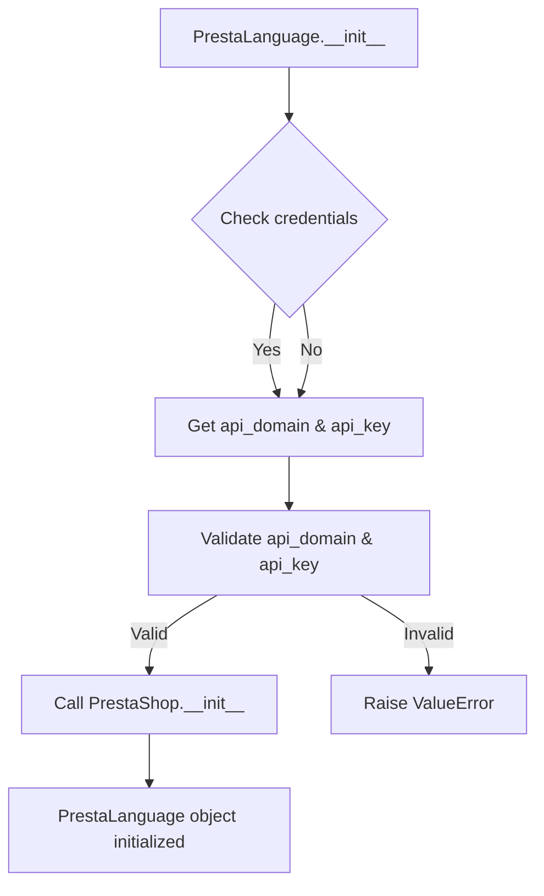

```python
## \file hypotez/src/endpoints/prestashop/language.py
# -*- coding: utf-8 -*-\
#! venv/Scripts/python.exe
#! venv/bin/python/python3.12

"""
.. module: src.endpoints.prestashop 
	:platform: Windows, Unix
	:synopsis:

"""
MODE = 'dev'

...
from types import SimpleNamespace
from .api import PrestaShop
from src import gs
from src.utils import pprint
from .api import PrestaShop  # Redundant import, likely a typo
import header
from src.logger import logger
from src.logger.exceptions import PrestaShopException

from typing import Optional

class PrestaLanguage(PrestaShop):
    """ 
    Класс, отвечающий за настройки языков магазина PrestaShop.

    Пример использования класса:

    .. code-block:: python

        prestalanguage = PrestaLanguage(API_DOMAIN=API_DOMAIN, API_KEY=API_KEY)
        prestalanguage.add_language_PrestaShop('English', 'en')
        prestalanguage.delete_language_PrestaShop(3)
        prestalanguage.update_language_PrestaShop(4, 'Updated Language Name')
        print(prestalanguage.get_language_details_PrestaShop(5))
    """

    def __init__(self, 
                 credentials: Optional[dict | SimpleNamespace] = None, 
                 api_domain: Optional[str] = None, 
                 api_key: Optional[str] = None, 
                 *args, **kwards):
        """Инициализация класса PrestaLanguage.

        Args:
            credentials (Optional[dict | SimpleNamespace], optional): Словарь или объект SimpleNamespace с параметрами `api_domain` и `api_key`. Defaults to None.
            api_domain (Optional[str], optional): Домен API. Defaults to None.
            api_key (Optional[str], optional): Ключ API. Defaults to None.
        """

        if credentials is not None:
            api_domain = credentials.get('api_domain', api_domain)
            api_key = credentials.get('api_key', api_key)

        if not api_domain or not api_key:
            raise ValueError('Необходимы оба параметра: api_domain и api_key.')

        super().__init__(api_domain, api_key, *args, **kwards)


```

**<algorithm>**



**Example:**

If `credentials` is a `SimpleNamespace` with `api_domain` and `api_key`, the flow goes through `Get api_domain & api_key`, `Validate api_domain & api_key` and `Call PrestaShop.__init__`, initializing a `PrestaLanguage` object. If either `api_domain` or `api_key` is missing, a `ValueError` is raised.


**<explanation>**

* **Imports:**
    * `from types import SimpleNamespace`: Imports the `SimpleNamespace` class, likely for handling configuration data.
    * `from .api import PrestaShop`: Imports the `PrestaShop` class from the `api.py` module within the same `prestashop` directory. This is crucial for inheritance and code organization.
    * `from src import gs`: Imports a module named `gs` from the `src` package. The purpose of `gs` remains unclear from the provided code snippet.
    * `from src.utils import pprint`: Imports the `pprint` function from the `utils` module. This likely provides a formatted output for debugging.
    * `from .api import PrestaShop`: Redundant import.  It's likely a typo and should be removed.
    * `import header`: Imports the `header` module.  The functionality of this module remains unknown without further context.
    * `from src.logger import logger`: Imports the `logger` object, enabling logging functionality.
    * `from src.logger.exceptions import PrestaShopException`: Imports a custom exception class, `PrestaShopException`, potentially for handling errors related to PrestaShop API interactions.  This suggests a structured error handling mechanism.
    * `from typing import Optional`: Imports the `Optional` type hint, used for specifying that a parameter can be `None`.

* **Classes:**
    * `PrestaLanguage(PrestaShop)`: This class inherits from `PrestaShop`, likely a base class for interacting with the PrestaShop API.  `PrestaLanguage` extends this functionality specifically for language management.
        * `__init__(...)`: The constructor initializes the `PrestaLanguage` object, taking `credentials`, `api_domain`, and `api_key` as parameters. It handles optional `credentials`, validates the `api_domain` and `api_key` parameters (crucial for API access), and calls the `PrestaShop` constructor.

* **Functions (within `__init__`):**
    * `credentials.get('api_domain', api_domain)`: This function retrieves the value of `api_domain` from the `credentials` dictionary or variable (e.g., `SimpleNamespace`). If `credentials` is missing the `api_domain`, the passed `api_domain` value is used.

* **Variables:**
    * `MODE = 'dev'`: This is a global variable, likely used for runtime configuration (e.g., switching between development and production modes).

* **Potential Errors/Improvements:**

    * **Redundant Import:** The second import of `PrestaShop` from `.api` is unnecessary and should be removed.
    * **Missing Details:** The code snippets are incomplete, missing the definition of the `PrestaShop` class, and the `add_language_PrestaShop`, `delete_language_PrestaShop`, `update_language_PrestaShop`, and `get_language_details_PrestaShop` methods.  These are essential for understanding the class's functionality.
    * **Type Hinting:** Using type hints is good practice, but the type hints for `credentials` (`Optional[dict | SimpleNamespace]`) should be more specific, providing more details regarding the structure of the data if available. This makes the code more readable and maintainable.


**Relationship with other parts of the project:**

The code relies on:

* `src.endpoints.prestashop.api`: Likely contains functions or classes for general PrestaShop API interactions.
* `src.utils`: Likely contains utility functions, such as `pprint`.
* `src.logger` and `src.logger.exceptions`: Handling logging and custom exceptions.

The `gs` module's purpose is unclear without more context.  It's important to know where `gs` fits into the application's structure.