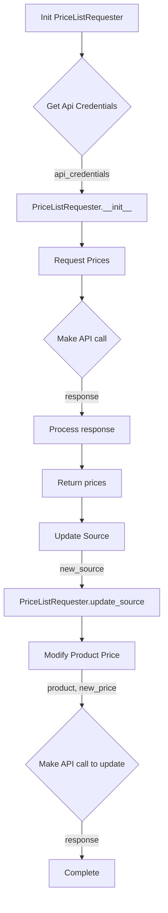

## File hypotez/src/endpoints/prestashop/pricelist.py
# -*- coding: utf-8 -*-\n#! venv/Scripts/python.exe\n#! venv/bin/python/python3.12\n\n"""\n.. module: src.endpoints.prestashop \n\t:platform: Windows, Unix\n\t:synopsis:\n\n"""\nMODE = 'dev'\n\nimport sys\nimport os\nfrom attr import attr, attrs\nfrom pathlib import Path\nfrom typing import Union\n\nimport header\nfrom src import gs\nfrom src.logger import logger\nfrom src.utils.jjson import j_loads, j_loads_ns\nfrom .api import PrestaShop\nfrom types import SimpleNamespace\n\nclass PriceListRequester(PrestaShop):\n    """\n    Класс для запроса списка цен.\n\n    Inherits:\n        PrestaShop\n    """\n\n    def __init__(self, api_credentials):\n        """\n        Инициализирует объект класса PriceListRequester.\n\n        @param api_credentials: Словарь с учетными данными для API,\n                                включая \'api_domain\' и \'api_key\'.\n        """\n        super().__init__(api_credentials['api_domain'], api_credentials['api_key'])\n\n    def request_prices(self, products):\n        """\n        Запрашивает список цен для указанных товаров.\n\n        @param products: Список товаров, для которых требуется получить цены.\n        @return: Словарь, где ключами являются товары, а значениями - их цены.\n                 Например: {\'product1\': 10.99, \'product2\': 5.99}\n        """\n        # Здесь код для отправки запроса на получение цен из источника данных\n        pass\n\n    def update_source(self, new_source):\n        """\n        Обновляет источник данных для запроса цен.\n\n        @param new_source: Новый источник данных.\n        """\n        self.source = new_source\n\n    def modify_product_price(self, product, new_price):\n        """\n        Модифицирует цену указанного товара.\n\n        @param product: Название товара.\n        @param new_price: Новая цена товара.\n        """\n        # Здесь код для изменения цены товара в источнике данных\n        pass\n\n```

```
<algorithm>



Example Data Flow:

* **Init PriceListRequester:** `api_credentials = {'api_domain': 'example.com', 'api_key': 'secretKey'}`
* **Request Prices:** `products = ['product1', 'product2']`
* **API Call (E):**  A request to the PrestaShop API for prices of `product1` and `product2`.
* **Process Response (F):** The response from the API is parsed, extracting prices. E.g., `{'product1': 10.99, 'product2': 5.99}`
* **Return Prices (G):** The processed price data is returned from `request_prices`.
* **Update Source (H):** `new_source = 'new_data_source'`
* **Modify Product Price (J):** `product = 'product1'`, `new_price = 12.99`
* **API call to update (K):** A request to the PrestaShop API to update the price of `product1` to 12.99.


```

<explanation>

**Imports:**

* `sys`, `os`: Standard library modules for system-related operations (likely for environment handling or command-line arguments).
* `attr`:  Provides decorators (`@attr`, `@attrs`) for better attribute management in classes (e.g., data validation, default values).  It enhances class design by imposing constraints on attributes and improving code clarity.  This is a good practice for maintainability.
* `pathlib`: Allows working with file paths in an object-oriented way.  It's typically used for file system interaction.
* `typing.Union`: Enables defining variables that can hold multiple data types (not directly used here, but is good practice).
* `header`: Implies a custom module `header` in the project. The purpose is unclear without examining the file.
* `gs`: likely represents the "global settings" module, which provides configuration parameters.
* `logger`: Implies a custom logging module for handling messages and debugging information in `src.logger`.
* `jjson`: Represents a module for JSON handling, specifically `j_loads` and `j_loads_ns` for loading JSON data.
* `PrestaShop`: A class from a local `api` module which interacts with the PrestaShop API. This means the project likely has a general API handling structure.
* `SimpleNamespace`: A class that creates a namespace object for use with `api` calls, this is an alternative to dictionaries or namedtuples for organizing data.

**Classes:**

* **PriceListRequester(PrestaShop):** This class inherits from the `PrestaShop` class, which suggests a base class for interacting with APIs, likely providing common methods.
    * `__init__(self, api_credentials)`: Initializes the `PriceListRequester` with API credentials (domain and key).  It leverages the base class's initializer.
    * `request_prices(self, products)`: Sends requests to the PrestaShop API to retrieve prices for specified products. The `pass` statement indicates that the implementation for interacting with the API is missing.
    * `update_source(self, new_source)`: Updates the data source for price retrieval, setting the `self.source` attribute.
    * `modify_product_price(self, product, new_price)`: Modifies the price of a specific product in the data source. The implementation is also missing.

**Functions (and methods):**


* **Missing implementation:** The `request_prices`, `update_source`, and `modify_product_price` methods contain placeholder `pass` statements.  Implementations are required to interact with the PrestaShop API and database/source.

**Variables:**

* `MODE = 'dev'`: Indicates the current mode (e.g., development, production). This will control conditional logic if required.

**Potential Errors/Improvements:**

* **Missing API implementation:** The `pass` statements in the methods necessitate implementing the API interactions with the PrestaShop API.
* **Error handling:** The code lacks error handling to catch and report potential exceptions during API calls, such as connection problems, incorrect credentials, or invalid responses.  Thorough error handling is crucial for robustness.
* **Type hinting:** Type hints (`typing.Union`) are present but are not fully utilized; potential improvement by adding better type hinting for input and return values.
* **Testing:**  No tests are included, hindering verification of correctness.
* **Data validation:** Input data for the `request_prices` method (list of products) and `modify_product_price` (prices) needs to be validated to ensure correctness before sending to the API.

**Relationships with other parts of the project:**

* The `PriceListRequester` inherits from `PrestaShop`, indicating a relationship with the `src.endpoints.prestashop.api` module and other modules.
* The `src` package, `gs`, `logger` and `jjson` suggest the existence of other modules and functions, implying there's an overall architecture for handling general data, logging, and JSON operations.   Further inspection of the `src` directory is needed to fully understand the context.

This analysis provides a high-level understanding of the code and its place within the project's structure.  Further analysis of the associated modules and external code is necessary to assess the full system.