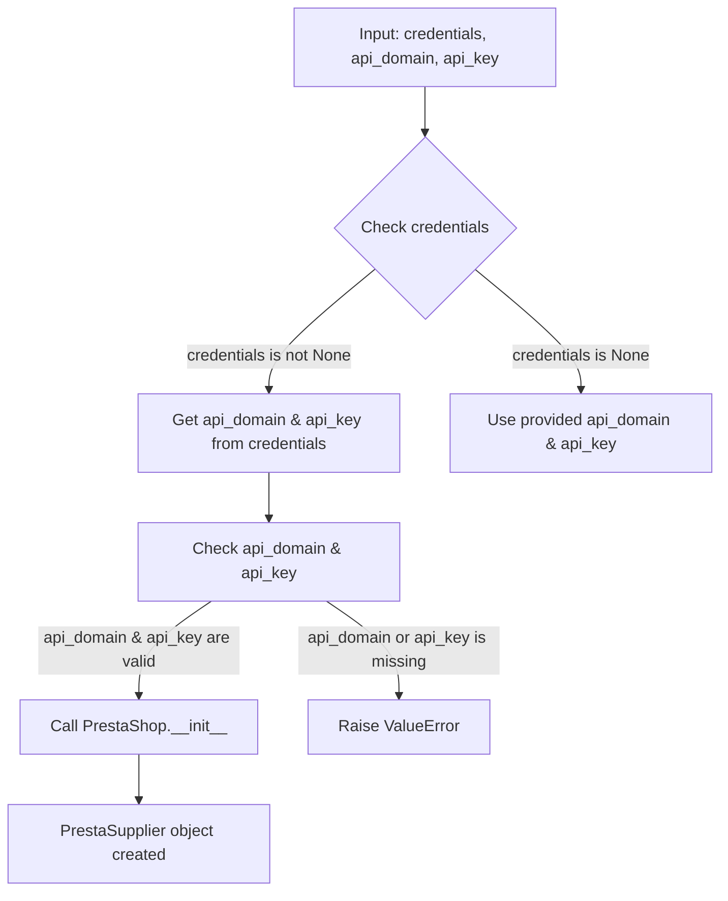

```python
## \file hypotez/src/endpoints/prestashop/supplier.py
# -*- coding: utf-8 -*-\
#! venv/Scripts/python.exe
#! venv/bin/python/python3.12

"""
.. module: src.endpoints.prestashop 
	:platform: Windows, Unix
	:synopsis:

"""
MODE = 'dev'

from types import SimpleNamespace
from typing import Optional
import header
from src import gs
from src.logger import logger
from src.utils import j_loads as j_loads
from .api import PrestaShop


class PrestaSupplier(PrestaShop):
    """Класс для работы с поставщиками PrestaShop."""
    
    def __init__(self, 
                 credentials: Optional[dict | SimpleNamespace] = None, 
                 api_domain: Optional[str] = None, 
                 api_key: Optional[str] = None, 
                 *args, **kwards):
        """Инициализация поставщика PrestaShop.

        Args:
            credentials (Optional[dict | SimpleNamespace], optional): Словарь или объект SimpleNamespace с параметрами `api_domain` и `api_key`. Defaults to None.
            api_domain (Optional[str], optional): Домен API. Defaults to None.
            api_key (Optional[str], optional): Ключ API. Defaults to None.
        """
        
        if credentials is not None:
            api_domain = credentials.get('api_domain', api_domain)
            api_key = credentials.get('api_key', api_key)
        
        if not api_domain or not api_key:
            raise ValueError('Необходимы оба параметра: api_domain и api_key.')
        
        super().__init__(api_domain, api_key, *args, **kwards)

```

**<algorithm>**



**Example:**

* **Input:** `credentials = {'api_domain': 'example.com', 'api_key': 'secretkey'}`
* **Block B:** `credentials` is not `None`
* **Block C:** `api_domain` is set to `example.com`, `api_key` to `secretkey`.
* **Block E:** Both are valid.
* **Block F:** The `__init__` method of the `PrestaShop` class (presumably in `.api` module) is called, initializing the necessary components to connect to the PrestaShop API.
* **Block H:** A `PrestaSupplier` object is created.


**<explanation>**

* **Imports:**
    * `types.SimpleNamespace`:  Used to create a namespace object that allows easy access to parameters like `api_domain` and `api_key` without creating a full dictionary.
    * `typing.Optional`: Allows functions and classes to accept optional arguments.
    * `header`:  Likely a module containing configuration, or potentially for the project's header files or logging configuration.  The precise role needs context.
    * `gs`: Part of the `src` package, probably handling Google Services or similar external services.  Not directly used in this code, but it shows dependency between modules.
    * `logger`:  From `src.logger`: Logging system for the project, allowing developers to log messages and events.
    * `j_loads`: From `src.utils`: Function for parsing JSON data. This shows the importance of the `src.utils` module's functionality.
    * `PrestaShop`:  From `.api` : Represents the PrestaShop API communication class (likely containing methods for interacting with the PrestaShop API).

* **Classes:**
    * `PrestaSupplier`: This class inherits from the `PrestaShop` class.  Its purpose is to encapsulate the specific logic for interacting with PrestaShop suppliers. The `__init__` method initializes the `PrestaSupplier` object, validating that required API parameters are provided (as per the algorithm illustration).  If missing, it raises a `ValueError` to signal an error condition.

* **Functions:**
    * `__init__`:  The constructor of the `PrestaSupplier` class. It takes several arguments for potential initialization including credentials as a dict or `SimpleNamespace`, and API domain & key. This method performs validation checks and then calls the parent class's initializer.  Crucially, it uses the `.get()` method to handle potential missing keys in the `credentials` dict/object, making the code more robust.

* **Variables:**
    * `MODE`: A constant string indicating the current application mode (e.g., 'dev' or 'prod').
    * `credentials`: A variable used to hold data regarding API credentials. Can be either a Python `dict` or `SimpleNamespace` object.
    * `api_domain`, `api_key`: These strings store the domain and API key for connecting to PrestaShop.

* **Potential Errors/Improvements:**
    * **Error Handling:** The `if not api_domain or not api_key` check is good.  However, adding more specific error messages (e.g., "Missing `api_domain` parameter") would improve debugging.  Logging the error with `logger` would further assist in tracing issues.
    * **Dependency Management:** The `header` module's role should be clarified to establish a complete dependency understanding.
    * **Type Hinting:** Using type hints for `api_domain` and `api_key` may be beneficial, especially if they are not always strings.
    * **Docstrings:** While the code has docstrings, enhancing them with parameter validation examples could improve usability.

**Relationships:**

* **Inheritance:** `PrestaSupplier` inherits from `PrestaShop`. This implies a clear relationship, potentially indicating that `PrestaShop` provides a base functionality for interacting with the general PrestaShop API.
* **Dependency:** `PrestaSupplier` depends on `PrestaShop`, which in turn depends on modules (`src.logger`, `src.utils`) providing logging and data handling.  `src.gs` could also have a dependency relationship. This demonstrates a typical layered architecture, where lower-level modules provide services for higher-level classes/functions.