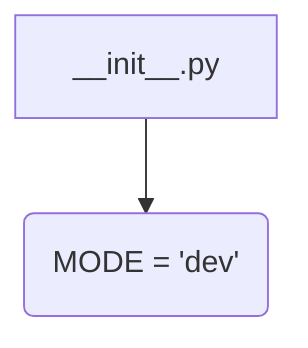

1. **<input code>**:

```python
## \file hypotez/src/fast_api/__init__.py
# -*- coding: utf-8 -*-\
#! venv/Scripts/python.exe
#! venv/bin/python/python3.12

"""
.. module: src.fast_api 
	:platform: Windows, Unix
	:synopsis:

"""
MODE = 'dev'
```

2. **<algorithm>**:



This is a very simple file.  It does not contain any functions or classes.  The code establishes a single variable named `MODE` and assigns it the string value 'dev'.  There's no meaningful algorithm other than defining a constant for the mode of operation.

3. **<explanation>**:

- **Imports**: There are no imports.  This is a very basic Python file that only declares a variable.

- **Classes**: There are no classes.

- **Functions**: There are no functions.

- **Variables**:
    - `MODE`:  A string variable that likely represents a configuration setting. This variable, `MODE`, is used to specify the mode (presumably development) of the application.  In a larger project, this variable would be used in conditional logic to set up different functionalities or configurations based on the mode (`dev`, `test`, or `prod`).

- **Potential Errors or Areas for Improvement**:
    - **No documentation**: While the file has a docstring, it lacks significant documentation on the purpose or use of the `MODE` variable. A more detailed docstring explaining how and where this variable is used would be beneficial.
    - **Missing context**: Without seeing the rest of the project, it's difficult to fully grasp the intended use of the `MODE` variable.  How is it used in other parts of the codebase?  What values other than 'dev' might be possible?  A minimal example would be useful to understand the context.


- **Chain of Relationships**:
    This file, `hypotez/src/fast_api/__init__.py`, likely forms part of a larger project (`hypotez`) which uses FastAPI (which is implied by the directory name).  It's a configuration file, setting a mode. Other files or modules in the `fast_api` package or in other parts of the `hypotez` project could potentially import and use the `MODE` variable.