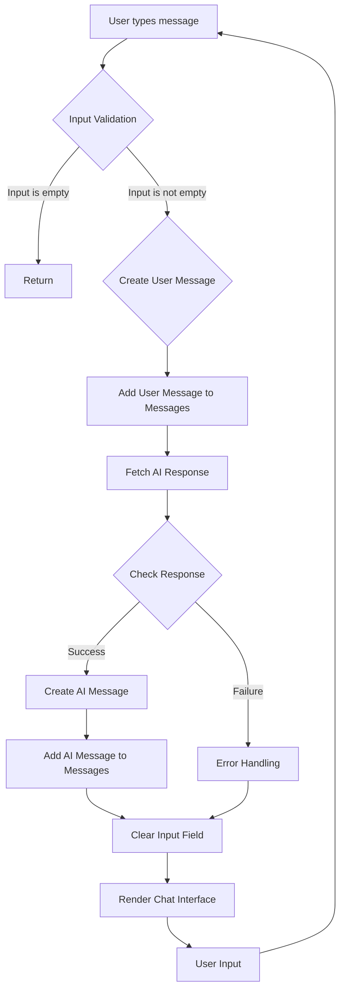

```
function App() {
  const [input, setInput] = React.useState("");
  const [messages, setMessages] = React.useState([]);

  const sendMessage = async () => {
    if (input.trim() === "") return;

    const userMessage = { role: "user", content: input };
    setMessages([...messages, userMessage]);

    try {
      const response = await fetch("http://localhost:8000/api/chat", {
        method: "POST",
        headers: {
          "Content-Type": "application/json"
        },
        body: JSON.stringify({ prompt: input })
      });

      const data = await response.json();
      const aiMessage = { role: "assistant", content: data.response };
      setMessages([...messages, userMessage, aiMessage]);
    } catch (error) {
      console.error("Error:", error);
    }

    setInput("");
  };

  return (
    <div>
      <div className="chat-box" style={{ height: '400px', overflowY: 'scroll', border: '1px solid #ccc', padding: '10px' }}>
        {messages.map((msg, index) => (
          <div key={index} className={msg.role === "user" ? "text-right" : "text-left"}>
            <strong>{msg.role === "user" ? "You" : "AI"}:</strong> {msg.content}
          </div>
        ))}
      </div>
      <div className="input-group mt-3">
        <input
          type="text"
          className="form-control"
          placeholder="Type your message..."
          value={input}
          onChange={(e) => setInput(e.target.value)}
          onKeyDown={(e) => e.key === "Enter" ? sendMessage() : null}
        />
        <button className="btn btn-primary" onClick={sendMessage}>Send</button>
      </div>
    </div>
  );
}

ReactDOM.render(<App />, document.getElementById('chat-app'));
```

2. <algorithm>



**Examples:**

* **Input Validation (B):** If the user types nothing, the `trim()` method checks if the string is empty or contains only whitespace; if it is, the function returns, preventing unnecessary API calls.
* **Fetching AI Response (F):**  A `fetch` request is made to the backend API endpoint `http://localhost:8000/api/chat` with the user's message as the prompt. Example data: `"http://localhost:8000/api/chat", { prompt: "Hello, how are you?" }`
* **Error Handling (I):** If the API request fails, an error is logged to the console and the chat continues, which allows the application to recover from transient errors. Example error: `Error: Network Error`
* **Rendering (L):** The chat interface is updated with the user's message and the AI's response using the `map` function.


3. <explanation>

* **Imports:** This code doesn't import external modules. The assumption is that `React`, `ReactDOM`, and any necessary styling (`bootstrap` is implied based on `className` values such as `btn-primary`)  are in the application's scope. This would be typical for a React application.  Crucially, `fetch` is a built-in JavaScript method for making HTTP requests.

* **Classes:** No classes are used; the functionality is achieved through functions, mainly `App` and `sendMessage`.

* **Functions:**
    * `App`: This is the main component of the application. It manages the state (user input, chat messages), handles sending messages, and renders the chat interface.
    * `sendMessage`: This async function handles sending the user's message to the backend API (`http://localhost:8000/api/chat`), receiving a response, and updating the chat UI.
      * Arguments: None directly, but it uses the current value of `input` and the `messages` state.
      * Return Value: None, but it has a significant side effect—modifying the `messages` state and updating the UI.
      * Example Usage:  A user types "What is the capital of France?", the `sendMessage` function is called, making a fetch request to get the AI's response, and then updates the `messages` state to show the user's and the AI's messages.

* **Variables:**
    * `input`, `setInput`: A React state variable holding the user's input string.  `setInput` is a setter function provided by React.
    * `messages`, `setMessages`: A React state variable holding an array of message objects (user and AI). `setMessages` is a setter function.

* **Potential Errors and Improvements:**

    * **Error Handling:** While the code has a `try...catch` block, more specific error handling is needed to distinguish between different types of errors (e.g., network issues, invalid API response).  Robust error handling is essential for production-level applications.
    * **Backend API:** The code assumes the existence of a backend API at `http://localhost:8000/api/chat`.  The code does not handle potential backend errors like 404, 500, or timeout. Robust error handling for backend requests is needed in `sendMessage`.
    * **Input Validation:** While the `trim()` check is good, more extensive input validation (e.g., checking for malicious input or excessive lengths) is recommended.
    * **Security:** If the backend API is exposed externally, proper security measures, such as input sanitization and appropriate API authentication, should be implemented.

* **Chain of Relationships:**
    * This frontend component (`App.js`) interacts with the backend API (`http://localhost:8000/api/chat`).  The backend API is expected to handle the actual AI processing and return a response.

**In summary:** The code implements a basic chat interface that sends user input to a backend API, receives a response, and displays both in a chat-like fashion.  It's a good starting point but needs improvements in error handling, input validation, and security to be production-ready.