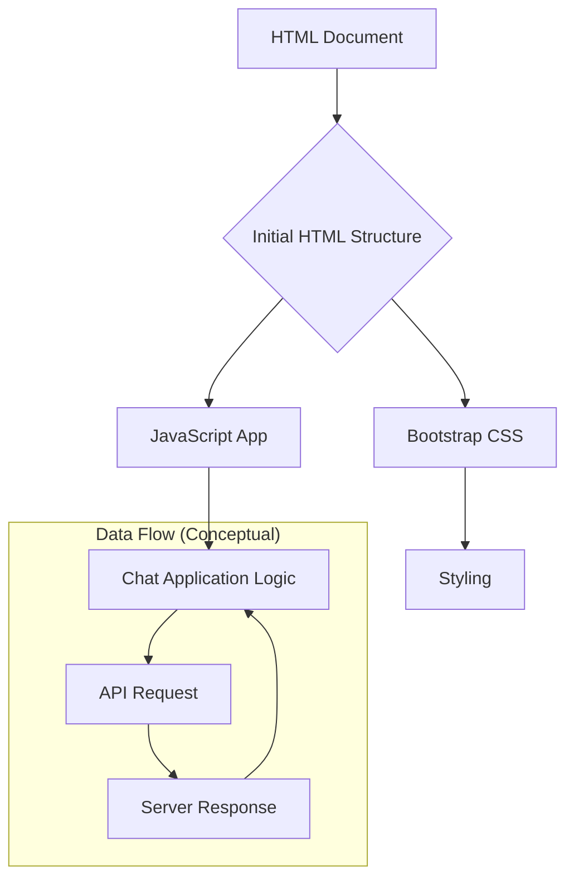

1. <input code>

```html
## \file hypotez/src/fast_api/gemini/frontent/index.html
# -*- coding: utf-8 -*-
#! venv/Scripts/python.exe

""" module: src.fast_api.gemini.frontent """
MODE = 'debug'
<!DOCTYPE html>
<html lang="en">
<head>
    <meta charset="UTF-8">
    <meta name="viewport" content="width=device-width, initial-scale=1.0">
    <title>Chat with Generative AI</title>
    <link rel="stylesheet" href="/static/bootstrap.min.css">
    <style>
        body {
            padding: 2rem;
        }
    </style>
</head>
<body>
    <div class="container">
        <h1>AI Chat Interface</h1>
        <div id="chat-app"></div>
    </div>

    <script type="text/babel" src="/static/app.js"></script>
</body>
</html>
```

2. <algorithm>



3. <explanation>

**Imports:**

There are no Python imports in this HTML file. This is a standard HTML document, which defines the user interface.

**Classes:**

There are no classes defined in this code.  HTML elements are represented by tags, not class structures.

**Functions:**

No functions are present.

**Variables:**

* `MODE = 'debug'`:  A variable defining a mode. This variable is used for conditional logic or configuration, potentially in a larger project.  Its value should be used in server-side code or JavaScript to control behavior in development or production environments.  No current use is apparent in this file fragment, but it's likely used in a server/backend script or client-side script that imports this HTML file.


**Potential Errors/Improvements:**

* **Missing Server Side:** This HTML file is only a frontend template.  It relies on other components (like a backend server and JavaScript client) to handle user interaction and data exchange. The code doesn't provide specifics on how requests are handled or data is exchanged to/from the server.  `"/static/app.js"` is crucial; it will be linked to a JavaScript file implementing the logic for communication with the backend.
* **Dependency Ambiguity:**  The path `/static/app.js` is vague.  It suggests that `app.js` is a static asset. The exact location of these files within the project structure (e.g., is this part of a Flask or FastAPI application?) is not specified, but it will be handled within the environment running the application (Python server or similar).
* **Conceptual Structure:** The code does not specify the relationship between the `HTML`, the `JavaScript` and the `server-side` logic, which would be needed to implement the "AI Chat Interface" functionality. This is a crucial piece to fully understand the project.


**Relationships with other parts of the project:**

This HTML file is part of a larger project. It's dependent on:

* **Server-Side Logic (Python, Flask, FastAPI):**  To handle user interactions, receive and send data. This will be responsible for the actual Gemini API interaction.
* **JavaScript Client-Side (`app.js`):** To receive updates from the server and to handle the UI (Update the contents of `div#chat-app`). The communication between this and the server is essential to the functionality.

The relationships are not shown directly in the code, but implicitly by the presence of `"/static/bootstrap.min.css"` and `"/static/app.js"`, which imply the existence of external assets and scripts expected to be served by the server.