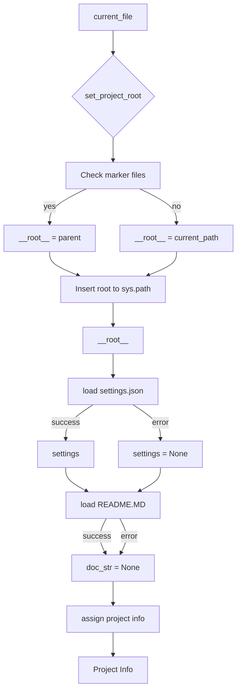

## file hypotez/src/fast_api/header.py
# -*- coding: utf-8 -*-\n#! venv/Scripts/python.exe\n#! venv/bin/python/python3.12\n\n"""\n.. module: src.fast_api \n\t:platform: Windows, Unix\n\t:synopsis:\n\n"""\nMODE = \'dev\'\n\n\nimport sys\nimport json\nfrom packaging.version import Version\n\nfrom pathlib import Path\ndef set_project_root(marker_files=(\'pyproject.toml\', \'requirements.txt\', \'.git\')) -> Path:\n    """\n    Finds the root directory of the project starting from the current file\'s directory,\n    searching upwards and stopping at the first directory containing any of the marker files.\n\n    Args:\n        marker_files (tuple): Filenames or directory names to identify the project root.\n    \n    Returns:\n        Path: Path to the root directory if found, otherwise the directory where the script is located.\n    """\n    __root__:Path\n    current_path:Path = Path(__file__).resolve().parent\n    __root__ = current_path\n    for parent in [current_path] + list(current_path.parents):\n        if any((parent / marker).exists() for marker in marker_files):\n            __root__ = parent\n            break\n    if __root__ not in sys.path:\n        sys.path.insert(0, str(__root__))\n    return __root__\n\n\n# Get the root directory of the project\n__root__ = set_project_root()\n"""__root__ (Path): Path to the root directory of the project"""\n\nfrom src import gs\n\nsettings:dict = None\ntry:\n    with open(gs.path.root / \'src\' /  \'settings.json\', \'r\') as settings_file:\n        settings = json.load(settings_file)\nexcept (FileNotFoundError, json.JSONDecodeError):\n    ...\n\n\ndoc_str:str = None\ntry:\n    with open(gs.path.root / \'src\' /  \'README.MD\', \'r\') as settings_file:\n        doc_str = settings_file.read()\nexcept (FileNotFoundError, json.JSONDecodeError):\n    ...\n\n \n\n__project_name__ = settings.get("project_name", \'hypotez\') if settings  else \'hypotez\'\n__version__: str = settings.get("version", \'\')  if settings  else \'\'\n__doc__: str = doc_str if doc_str else \'\'\n__details__: str = \'\'\n__author__: str = settings.get("author", \'\')  if settings  else \'\'\n__copyright__: str = settings.get("copyrihgnt", \'\')  if settings  else \'\'\n__cofee__: str = settings.get("cofee", "Treat the developer to a cup of coffee for boosting enthusiasm in development: https://boosty.to/hypo69")  if settings  else "Treat the developer to a cup of coffee for boosting enthusiasm in development: https://boosty.to/hypo69"\n```

```
<algorithm>


**Explanation:**

**1. `set_project_root`:**
    * **Purpose:** Finds the root directory of the project.
    * **Input:** A tuple `marker_files` containing files/directories to identify the root (defaults to `pyproject.toml`, `requirements.txt`, `.git`).
    * **Output:** A `Path` object representing the project root.
    * **Workflow:**
        1. Starts from the directory containing the current file (`__file__`).
        2. Traverses upward through parent directories.
        3. Stops at the first parent directory that contains any of the specified marker files.
        4. If the root directory is not already in `sys.path`, it adds it to the beginning of the path.
    * **Example:** If `__file__` is in `/hypotez/src/fast_api/header.py`, and `/hypotez/` contains `pyproject.toml`, `set_project_root` will return `/hypotez/`

**2. Loading `settings.json` and `README.MD`:**
    * **Purpose:** Retrieves project settings and README content.
    * **Input:**
        * `gs.path.root / 'src' / 'settings.json'`: Path to the settings file.
        * `gs.path.root / 'src' / 'README.MD'`: Path to the README file.
    * **Output:**
        * `settings`: A dictionary containing project settings.
        * `doc_str`: The content of the README file.
    * **Workflow:**
        * Tries to open and parse the JSON file. If successful, stores the settings in the `settings` variable.
        * Tries to read the README file. If successful, stores the content in the `doc_str` variable.
        * Handles potential errors (`FileNotFoundError`, `json.JSONDecodeError`) with `...`, meaning no action is taken in case of failure.


**3. Assigning project info:**
* **Purpose:**  Extracts and assigns various project attributes from the settings dictionary.
* **Input:** `settings`, `doc_str`.
* **Output:** Project attributes (`__project_name__`, `__version__`, `__doc__`, `__author__`, `__copyright__`, `__cofee__`).
* **Workflow:**
    * Extracts values from `settings` using `.get()` method to avoid errors if keys are missing. 
    * Default values are provided if the key is not found.


**Explanation of Imports:**

* `sys`: Provides access to system-specific parameters and functions, including the `sys.path` list which is used for import search.
* `json`: Used for encoding and decoding JSON data.
* `packaging.version`: Used for managing and comparing software versions.
* `pathlib`: Provides an object-oriented way of working with files and directories.


**Explanation of Classes (if any):**

There are no classes in this code snippet.


**Explanation of Variables:**

* `MODE`: A string variable with the value 'dev'.
* `__root__`: A `Path` object that stores the root path of the project.
* `settings`: A dictionary containing project settings.
* `doc_str`: A string variable that contains the content of the README file.
* `__project_name__`, `__version__`, `__doc__`, `__details__`, `__author__`, `__copyright__`, `__cofee__`: String variables that hold project metadata.


**Relationship with other parts of the project:**

The code relies on the `gs` module (specifically `gs.path.root`), implying that there is a `gs` module (likely `global_settings`) that provides functions and attributes related to determining and accessing project-wide paths and configurations.


**Potential Errors/Improvements:**

* **Error Handling:** While the `try...except` blocks are good for robustness, consider more specific error handling if needed (e.g., logging the specific error type and message).
* **`gs` Module Dependence:** The code heavily relies on the `gs` module. Ensure the `gs` module is correctly imported and functions as expected.
* **File Existence:** The code assumes that `settings.json` and `README.MD` exist within the project's 'src' folder; a better practice is to include an assertion to check or fail gracefully if the files are not found.
* **Input Validation:**  While `.get()` helps avoid errors when keys are missing, consider adding validation to ensure settings values are in the correct format (e.g., if `version` is expected to be a string representation of a version number, add validation).