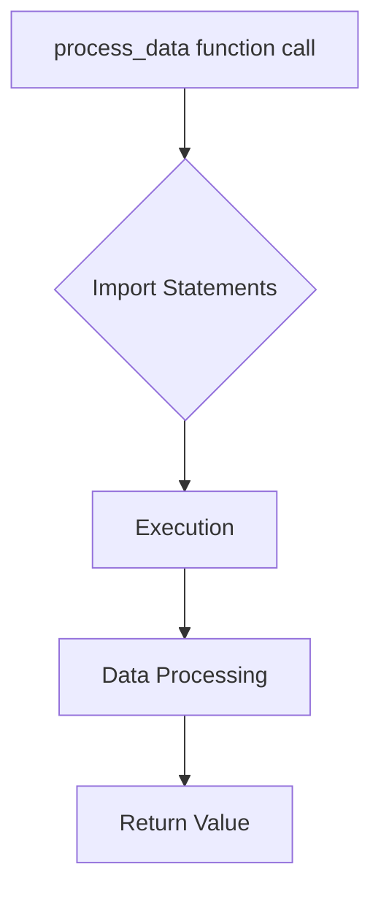

## <input code>
```python
## \file hypotez/src/fast_api/html/process_data.py
# -*- coding: utf-8 -*-\
#! venv/Scripts/python.exe
#! venv/bin/python/python3.12

"""
.. module: src.fast_api.html 
	:platform: Windows, Unix
	:synopsis:

"""
MODE = 'dev'

"""
	:platform: Windows, Unix
	:synopsis:

"""

"""
	:platform: Windows, Unix
	:synopsis:

"""


"""
  :platform: Windows, Unix

"""
"""
  :platform: Windows, Unix
  :platform: Windows, Unix
  :synopsis:
"""MODE = 'dev'
  
""" module: src.fast_api.html """


""" @namespace src.fast_api.html """
from .. import main
from main import process_dataa
```

## <algorithm>



* **Example:**
Assuming `process_dataa` in the `main.py` module takes a string as input and returns its length.

* **Block A:** A function call `process_dataa` is initiated.
* **Block B:** The necessary import statements `from .. import main` and `from main import process_dataa` are executed. This allows access to the `main` module and `process_dataa` function.
* **Block C:** The `process_dataa` function in the `main` module is executed.
* **Block D:** `process_dataa` performs its task (e.g., computing string length).
* **Block E:** The return value (the length of the string) is passed back to the calling function.


## <explanation>

**Imports:**

* `from .. import main`: This imports the `main` module from the parent directory (`..`) relative to `process_data.py`.  Crucially, this indicates a module structure like:
    ```
    hypotez/
        src/
            fast_api/
                html/
                    process_data.py
                main.py  // Located in the parent directory of html
    ```
* `from main import process_dataa`: Imports the `process_dataa` function specifically from the imported `main` module.

**Classes:**

There are no classes defined in this code.

**Functions:**

* The code does not contain any functions that it defines.  It only imports `process_dataa` from `main` (presumably another file in the project), which implies the implementation of the actual logic is elsewhere.

**Variables:**

* `MODE = 'dev'`: A global variable, likely used for configuration settings in a development or production environment (e.g., logging levels, data sources).

**Potential Errors and Improvements:**

1. **Missing Implementation:** The code imports `process_dataa` but does not define it. This suggests the core logic for processing data resides in `hypotez/src/fast_api/main.py`.  The file `process_data.py` serves only as a facilitator for calling this external function.

2. **Lack of Docstrings:**  The code has comments describing the purposes, but lacks comprehensive docstrings.  Proper docstrings (e.g., `def my_function(arg1):  """Docstring explaining the function"""`) would significantly improve understanding.

3. **Redundant Comments:** Many comments are redundant and not very descriptive.

4. **Unclear Context:** The `MODE` variable's use and impact on the application are not clear.

**Relationship to other project parts:**

This script is dependent on the `process_dataa` function within the `main` module. Any change in `main` will impact how this script operates. The data flow would be from whatever process initiates the calling of `process_dataa` in `process_data.py` to the function itself and back to the calling process.  `process_dataa` likely uses data structures or external data sources defined elsewhere within the `src` directory. The exact nature of the data input and the output of `process_dataa` is not provided by the given code snippet, making understanding its complete usage challenging.