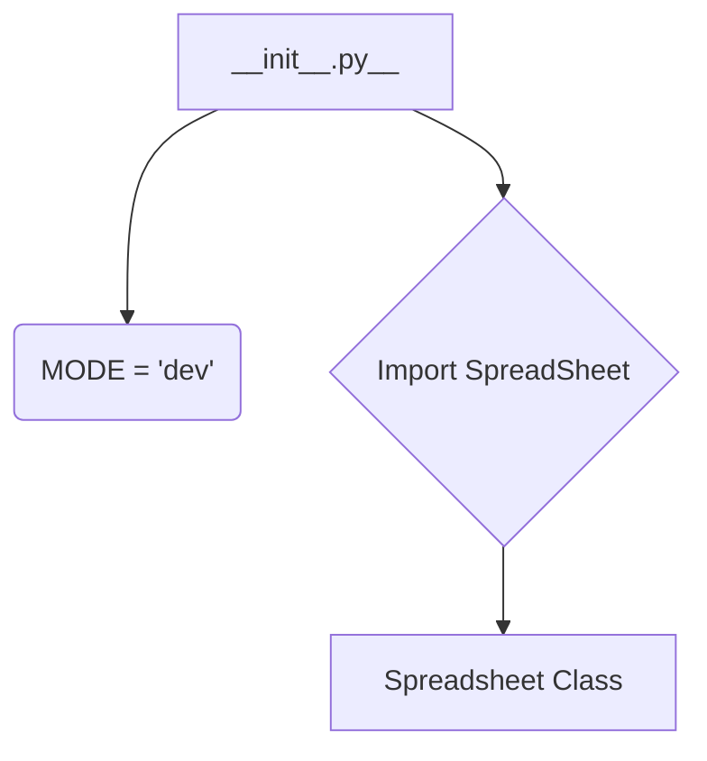

1. **<input code>**

```python
## \file hypotez/src/goog/__init__.py
# -*- coding: utf-8 -*-\
#! venv/Scripts/python.exe
#! venv/bin/python/python3.12

"""
.. module: src.goog 
	:platform: Windows, Unix
	:synopsis:

"""
MODE = 'dev'

from .spreadsheet import SpreadSheet
```

2. **<algorithm>**



* **Block A (__init__.py__):**  Initializes the module.
* **Block B (MODE = 'dev'):** Sets a global variable `MODE` to 'dev'.  This likely defines a runtime mode (e.g., development, production) which might affect other parts of the application.
* **Block C (Import SpreadSheet):** Imports the `Spreadsheet` class from the `spreadsheet.py` module within the `goog` package.
* **Block D (Spreadsheet Class):**  This is not shown in detail as it is defined in `spreadsheet.py`, not this file.  This is the core class, likely handling Google Spreadsheet interactions.


3. **<explanation>**

* **Imports:**
    * `from .spreadsheet import SpreadSheet`: This line imports the `Spreadsheet` class from the `spreadsheet.py` file located in the `hypotez/src/goog` directory.  The `.` before `spreadsheet` indicates a relative import, which is good for maintaining package structure.  This import is crucial; it makes the classes and methods defined in `spreadsheet.py` accessible in this file and potentially other parts of the project using `goog`.  The `spreadsheet.py` file is likely where the actual interactions with Google Sheets are implemented.

* **Classes:**
    * `Spreadsheet`:  This is not directly defined in `__init__.py`, but the import statement implies the existence of a class in `spreadsheet.py` named `Spreadsheet`. This class likely provides methods for interacting with Google Spreadsheets, like creating, reading, writing, and manipulating spreadsheets.


* **Functions:**
    * None. This file doesn't define any functions.

* **Variables:**
    * `MODE = 'dev'`: A string variable set to 'dev'.  This is likely a configuration variable used to determine the behavior of other parts of the application, and would impact the specific settings or functionality.


* **Potential Errors/Improvements:**
    * **Missing docstrings:** While the module has a docstring, the `MODE` variable and the import statement lack docstrings, which would help users understand their purpose.
    * **No error handling:** The import statement doesn't include any error handling (e.g., `try...except` block). If `spreadsheet.py` is not found or if there's an issue importing it, the program might crash.  Adding `try...except` would make the code more robust.
    * **Missing context:** The significance of the `MODE` variable, what `'dev'` represents, and how it affects the application's behavior isn't clear.


* **Relationships with other parts:**
    * This `__init__.py` file acts as an entry point for the `goog` package.  The `spreadsheet.py` file likely contains the logic to interact with Google Sheets APIs. Other parts of the `hypotez` project might use classes and functions from `goog` to access and manipulate Google Sheets.


**In Summary:** This `__init__.py` file is a simple module initializer for the `goog` package.  Its primary function is to import a critical class (`Spreadsheet`) from a supporting file and expose it for use.  To understand the entire workflow and functionality, you need to examine `hypotez/src/goog/spreadsheet.py`.