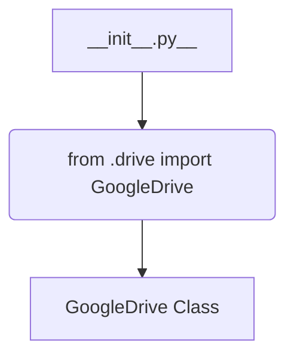

1. **<input code>**:

```python
## \file hypotez/src/goog/drive/__init__.py
# -*- coding: utf-8 -*-\
#! venv/Scripts/python.exe
#! venv/bin/python/python3.12

"""
.. module: src.goog.drive 
	:platform: Windows, Unix
	:synopsis:

"""
MODE = 'dev'


from .drive import GoogleDrive
```

2. **<algorithm>**:



No complex algorithm exists in this file. The initialization module simply imports a class (`GoogleDrive`) from a submodule (`drive`) within the same package (`goog/drive`).

3. **<explanation>**:

* **Imports**:
    * `from .drive import GoogleDrive`: This line imports the `GoogleDrive` class from the `drive.py` file located in the same directory (`hypotez/src/goog/drive/drive.py`).  The `.` prefix indicates a relative import within the current package (`goog.drive`). This is a standard Python practice for organizing modules within a project.  This is a critical relationship. `GoogleDrive` is likely a driver object for interacting with the Google Drive API.

* **Variables**:
    * `MODE = 'dev'`: This variable is likely a configuration flag or a string constant. It suggests that this code might run in either development mode (`dev`) or another mode (e.g., production).  The value should be considered as configuration information for the module, used to steer the behaviour in different execution environments.

* **Classes**:
    * `GoogleDrive`:  This is not defined within this file; it's assumed to be defined in `hypotez/src/goog/drive/drive.py`.  Analysis of `drive.py` would be needed to understand the `GoogleDrive` class attributes (e.g., connection details, API keys, client objects) and methods (e.g., uploading, downloading files, handling authentication).

* **Functions**:
    * There are no functions defined in this file.

* **Potential Errors or Areas for Improvement**:
    * **Missing Documentation:** While the docstring is present, it's quite basic. Adding details about the intended usage, parameters, and return values of the `GoogleDrive` class would greatly enhance maintainability. Adding type hinting would be a considerable improvement.

* **Chain of Relationships**:
    * This module depends on the `GoogleDrive` class.
    * `GoogleDrive` presumably relies on other libraries such as the Google Cloud Python client library for interacting with the Google Drive API.
    * The overall project will likely use this module to manage Google Drive interactions, potentially through other modules that use the API object for specific functions (e.g., file upload).


**In summary**, this Python file is a simple initialization module. It sets a variable to track a configuration mode and imports a class necessary for accessing and managing a Google Drive account.  Detailed understanding of the `GoogleDrive` class's functionality (which this `__init__.py` file assumes exists) is necessary to complete the analysis. A missing `.drive.py` file makes a complete analysis impossible.