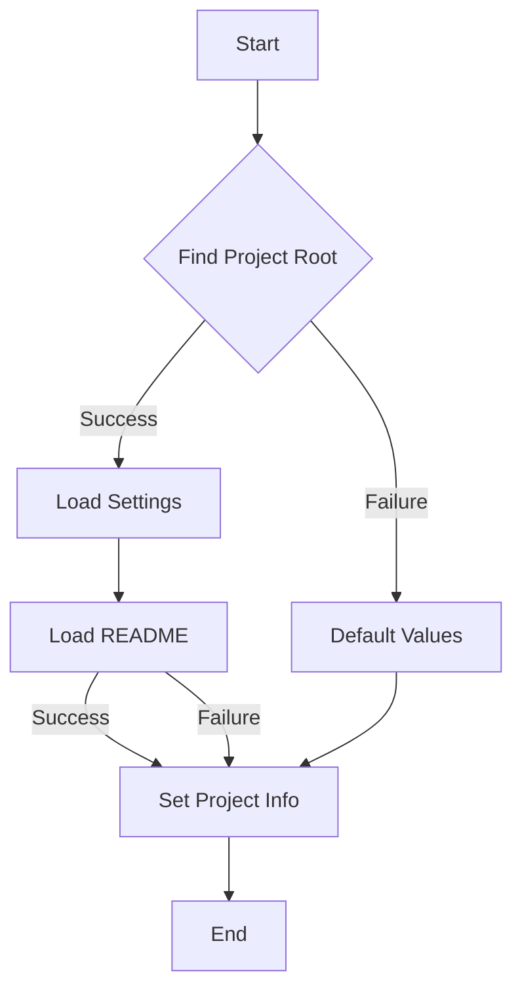

```python
## \file hypotez/src/goog/drive/header.py
# -*- coding: utf-8 -*-
#! venv/Scripts/python.exe
#! venv/bin/python/python3.12

"""
.. module: src.goog.drive 
	:platform: Windows, Unix
	:synopsis:

"""
MODE = 'dev'

import sys
import json
from packaging.version import Version

from pathlib import Path
def set_project_root(marker_files=('pyproject.toml', 'requirements.txt', '.git')) -> Path:
    """
    Finds the root directory of the project starting from the current file's directory,
    searching upwards and stopping at the first directory containing any of the marker files.

    Args:
        marker_files (tuple): Filenames or directory names to identify the project root.
    
    Returns:
        Path: Path to the root directory if found, otherwise the directory where the script is located.
    """
    __root__:Path
    current_path:Path = Path(__file__).resolve().parent
    __root__ = current_path
    for parent in [current_path] + list(current_path.parents):
        if any((parent / marker).exists() for marker in marker_files):
            __root__ = parent
            break
    if __root__ not in sys.path:
        sys.path.insert(0, str(__root__))
    return __root__


# Get the root directory of the project
__root__ = set_project_root()
"""__root__ (Path): Path to the root directory of the project"""

from src import gs

settings:dict = None
try:
    with open(gs.path.root / 'src' / 'settings.json', 'r') as settings_file:
        settings = json.load(settings_file)
except (FileNotFoundError, json.JSONDecodeError):
    ...

doc_str:str = None
try:
    with open(gs.path.root / 'src' / 'README.MD', 'r') as settings_file:
        doc_str = settings_file.read()
except (FileNotFoundError, json.JSONDecodeError):
    ...


__project_name__ = settings.get("project_name", 'hypotez') if settings  else 'hypotez'
__version__: str = settings.get("version", '')  if settings  else ''
__doc__: str = doc_str if doc_str else ''
__details__: str = ''
__author__: str = settings.get("author", '')  if settings else ''
__copyright__: str = settings.get("copyrihgnt", '')  if settings else ''
__cofee__: str = settings.get("cofee", "Treat the developer to a cup of coffee for boosting enthusiasm in development: https://boosty.to/hypo69")  if settings else "Treat the developer to a cup of coffee for boosting enthusiasm in development: https://boosty.to/hypo69"
```

**<algorithm>**



**Example Data Flow:**

1. **Find Project Root (B):**
   - Input: `__file__` (e.g., `hypotez/src/goog/drive/header.py`)
   - Output: `__root__` (e.g., `hypotez`)  
     - Traverses up the directory tree, searching for `pyproject.toml`, `requirements.txt`, or `.git`.

2. **Load Settings (C):**
   - Input: `gs.path.root / 'src' / 'settings.json'`
   - Output: `settings` (e.g., a Python dictionary containing project details).

3. **Load README (E):**
   - Input: `gs.path.root / 'src' / 'README.MD'`
   - Output: `doc_str` (e.g., the contents of the README file).

4. **Set Project Info (F):**
   - Input: `settings`, `doc_str`
   - Output: `__project_name__`, `__version__`, `__doc__`, ...
     - Grabs relevant data from the settings if available; otherwise uses default values.

**<explanation>**

* **Imports:**
    - `sys`: Provides access to system-specific parameters and functions, like manipulating the Python path.
    - `json`: Used for handling JSON data (loading and saving the `settings.json` file).
    - `packaging.version`: Allows for handling and comparing software versions.
    - `pathlib`: A more object-oriented way to work with file paths. This is better than using strings for manipulating paths since it avoids issues with different operating systems and automatically handles path separators.
    - `gs`: This module (`src/gs`) is likely providing a global project context, particularly for determining file paths (e.g., the project root directory), likely defined elsewhere in the `src` package.

* **Classes:** No classes are defined in this file.

* **Functions:**
    - `set_project_root(marker_files)`: This function is crucial for determining the project's root directory, relative to the current file. It takes a tuple of potential marker files (`pyproject.toml`, `requirements.txt`, `.git`) as an argument.
        - **Example:** If `__file__` is `hypotez/src/goog/drive/header.py`, and `pyproject.toml` is found in the `hypotez` directory, the function returns the `hypotez` directory.
        - **Error Handling:**  The function correctly inserts the project root directory into `sys.path` which improves the module search paths.
        - **Return value:** A `Path` object representing the project root.

* **Variables:**
    - `MODE`: A string variable likely representing the development mode (e.g., 'dev', 'prod').
    - `__root__`: A `Path` object holding the root path of the project.
    - `settings`: A dictionary holding project settings loaded from `settings.json`.
    - `doc_str`: A string containing the content from the `README.MD` file.
    - `__project_name__`, `__version__`, `__doc__`, etc.: Variables containing information about the project (name, version, documentation) extracted from the `settings.json`. Using `settings.get()` handles cases where a key might not exist. These variables are common for project metadata.

* **Potential Errors/Improvements:**
    - **Robustness:** The `try...except` blocks for loading `settings.json` and `README.MD` are good practice. However, the `...` in the except block is a placeholder and should be replaced with more specific error handling or logging, depending on the project's needs. Logging errors would provide more information and improve debugging.
    - **Error Handling:** The `try...except` blocks for loading `settings.json` and `README.MD` could be refined to specify the types of exceptions caught (e.g., `FileNotFoundError`, `json.JSONDecodeError`).  This will improve clarity and aid in pinpointing the root cause of a potential error.

* **Relationships:**
   - The code relies heavily on the `gs` module (likely located in the `src` package) to get the project root path.


**In summary:** This file initializes critical project metadata by determining the project root, loading settings from a JSON file, and potentially reading the README. It then makes this information accessible through a collection of variables for use in other modules, especially by using the `gs` module. The `set_project_root` function provides a crucial path manipulation step. Correct error handling and logging improve maintainability. This file effectively acts as a header or configuration file to provide fundamental project details.