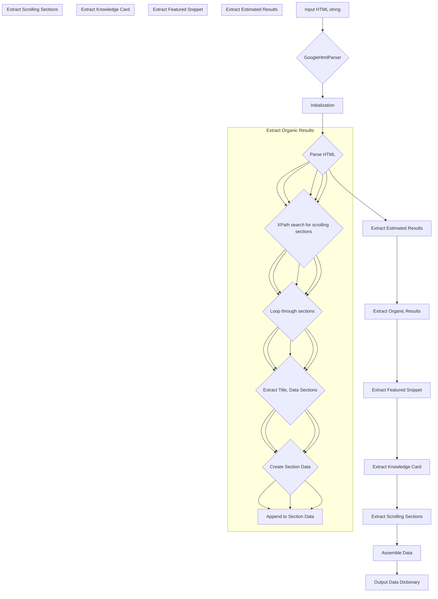

```python
## \file hypotez/src/goog/google_search.py
# -*- coding: utf-8 -*-\n#! venv/Scripts/python.exe
#! venv/bin/python/python3.12

"""
.. module: src.goog 
	:platform: Windows, Unix
	:synopsis:

"""
MODE = 'dev'


from lxml import html


class GoogleHtmlParser:
    """Класс для парсинга HTML с Google Search.

    Парсит HTML страницы поисковой выдачи Google и преобразует её в словарь.
    Работает как с мобильной, так и с десктопной версией HTML.

    Атрибуты:
        tree (html.Element): Дерево документа, полученное через html.fromstring().
        user_agent (str): User agent, использованный для получения HTML Google Search.
    """

    def __init__(self, html_str: str, user_agent: str = 'desktop') -> None:
        """Инициализация парсера.

        Создает дерево документа из строки HTML.

        Args:
            html_str (str): HTML Google Search в виде строки.
            user_agent (str): User agent для получения HTML. Может быть 'mobile' или 'desktop'.

        Returns:
            None
        """
        self.tree = html.fromstring(html_str)
        if user_agent in ['mobile', 'desktop']:
            self.user_agent = user_agent
        else:
            self.user_agent = 'desktop'

    # ... (rest of the code)
```

**<algorithm>**



**Example Data Flow:**

1. **Input:** `<html><body>...</body></html>`
2. **Parsing:** `html.fromstring` converts the string into an HTML tree.
3. **Extraction:** Functions like `_get_estimated_results`, `_get_organic` traverse the tree using XPath expressions to locate specific elements containing the desired data (e.g., result count, title, snippets).
4. **Data Cleaning:**  `_clean` and `_normalize_dict_key` functions preprocess extracted text to remove extraneous characters.
5. **Data Aggregation:**  Results are structured into dictionaries and stored in lists.
6. **Output:** `get_data` returns a dictionary combining all the extracted data.

**<explanation>**

* **Imports:**
    * `from lxml import html`: Imports the `lxml` library, specifically the `html` module, which provides tools for parsing HTML documents. This is a crucial dependency for handling the web scraping aspect of the code.  Relationship with other `src.` packages isn't explicit in the snippet but would likely be within a `src.goog` package, specifically for web scraping tasks related to Google search results.


* **Classes:**
    * `GoogleHtmlParser`: This class encapsulates the logic for parsing Google search results.
        * `__init__`: Initializes the parser by creating an HTML tree from the input `html_str` and handling the user agent for parsing.
        * Other methods (`_clean`, `_normalize_dict_key`, `_get_estimated_results`, `_get_organic`, `_get_featured_snippet`, `_get_knowledge_card`, `_get_scrolling_sections`, `get_data`) perform specific parsing tasks.  These functions work together to extract different types of data from the Google search page.

* **Functions:**
    * `_clean`:  Normalizes a string by removing whitespace.
    * `_normalize_dict_key`: Prepares strings for dictionary keys.
    * `_get_estimated_results`: Extracts the estimated number of search results using XPath.
    * `_get_organic`: Extracts organic search results. This uses XPath expressions (`self.tree.xpath`) to find elements with class 'g' and extracts various elements (title, snippet).  A crucial part is handling potentially varying HTML structures and the existence of "rich snippets".
    * Other methods follow a similar pattern for different result types.
    * `get_data`: Assembles the extracted data into a single dictionary and returns it.  This is the main function for collecting all the different parts of a Google Search Result.

* **Variables:**
    * `MODE`:  A global constant, likely for controlling different development/production modes.
    * `user_agent`:  Controls whether the parser assumes a desktop or mobile version of the Google Search page.  Important for handling the different layouts and structure of pages.
    * Data structures like `organic`, `data` are used to store the extracted data in organized format (lists of dictionaries).

* **Potential Errors/Improvements:**
    * **Robustness:** The code assumes a specific structure of Google search results. If the Google search page structure changes, the XPath expressions might need adjustment, or more robust error handling (e.g., checking for the length of `xpath` results before accessing them) would improve reliability.
    * **Error Handling:**  Adding `try...except` blocks within the functions (e.g., `_get_organic`) to handle potential errors like `IndexError` (if an expected element is missing) would significantly improve robustness.
    * **Efficiency:** The repeated use of `xpath` for different elements could be optimized by pre-fetching data into variables or using a single query if multiple elements are located near each other.

* **Relationships:**
    This code module likely works with other modules within the `hypotez` project to process the results extracted from Google search queries.  The extracted data could be used for further analysis or storage in a database.  The calling code would parse the returned data from `get_data`.

This analysis provides a comprehensive understanding of the `google_search.py` file's functionality and highlights potential areas for improvement.  Additional testing and validation would be required to fully verify the code's behavior in various situations.