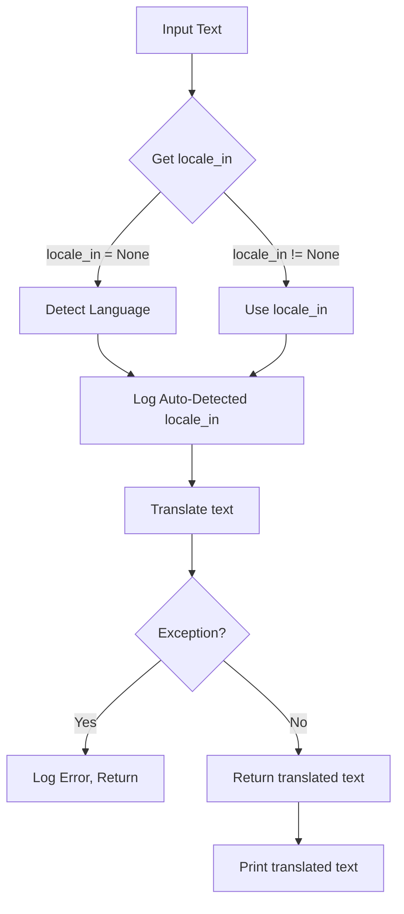

```
## file hypotez/src/goog/gtranslater/__init__.py
# -*- coding: utf-8 -*-\n#! venv/Scripts/python.exe\n#! venv/bin/python/python3.12\n\n"""\n.. module: src.goog.gtranslater \n\t:platform: Windows, Unix\n\t:synopsis:\n\n"""\nMODE = 'dev'\n\n"""\n\t:platform: Windows, Unix\n\t:synopsis:\n\n"""\n\n"""\n\t:platform: Windows, Unix\n\t:synopsis:\n\n"""\n\n"""\n  :platform: Windows, Unix\n\n"""\n"""\n  :platform: Windows, Unix\n  :platform: Windows, Unix\n  :synopsis:\n"""MODE = 'dev'\n  \n""" module: src.goog.gtranslater """\n\n\n""" This module handles language translation using Google Translate API. It includes a function to translate text with automatic language detection for the input text if not specified."""\n\n\n\nfrom googletrans import Translator\nfrom langdetect import detect\nfrom src.logger import logger\n\ndef translate(text: str, locale_in: str = None, locale_out: str = 'EN') -> str:\n    """ Translate text from one language to another using Google Translate.\n\n    @param text: The text to be translated.\n    @param locale_in: The input language code (optional, auto-detected if not provided).\n    @param locale_out: The output language code (default is 'EN').\n    @return: The translated text.\n    """\n    translator = Translator()\n\n    try:\n        if not locale_in:\n            locale_in = detect(text)\n            logger.info(f"Auto-detected input language: {locale_in}")\n\n        result = translator.translate(text, src=locale_in, dest=locale_out)\n        return result.text\n    except Exception as ex:\n        logger.error("Translation failed:", ex)\n        return ""\n\ndef main():\n    text = input("Enter the text to be translated: ")\n    locale_in = input("Enter the source language code (leave blank for auto-detect): ")\n    locale_out = input("Enter the target language code: ")\n\n    translated_text = translate(text, locale_in, locale_out)\n    print(f"Translated text: {translated_text}")\n\nif __name__ == "__main__":\n    main()
```

2. **<algorithm>**



* **Example Input:**
    * `text`: "Hello, world!"
    * `locale_in`: "es" (Spanish)
    * `locale_out`: "fr" (French)
* **Example Data Flow:**
    1. Input `text` ("Hello, world!"), `locale_in` ("es"), `locale_out` ("fr") are passed to the `translate` function.
    2. `locale_in` is not `None`, so it skips the auto-detection step.
    3. The text is translated using Google Translate from Spanish to French.
    4. The translated text is returned.
    5. The translated text is printed.

3. **<explanation>**

* **Imports:**
    * `googletrans`:  Used to interact with the Google Translate API. This library likely provides methods for performing translations.
    * `langdetect`: Used to detect the language of input text. It's assumed this module likely has functions to automatically detect languages within a given string.
    * `src.logger`: A custom logger module (not defined here) for handling log messages.  Crucially, this shows a dependency on another part of the project (`src.logger`). This suggests a structured logging system is used, promoting consistency and maintainability.

* **Classes:**
    * No classes are defined in this module.

* **Functions:**
    * `translate(text: str, locale_in: str = None, locale_out: str = 'EN') -> str`:
        * Takes the text to translate, the input language code (optional), and the output language code (defaulting to English).
        * If `locale_in` is not provided, it automatically detects the language using `langdetect.detect(text)`.
        * Uses `googletrans.Translator()` to create a translator object.
        * Uses `translator.translate()` to perform the translation.
        * Handles potential errors (exceptions) during translation. If an error occurs, it logs the error and returns an empty string.
        * Returns the translated text as a string.
    * `main()`:
        * Prompts the user for the text to translate, the input language, and the output language.
        * Calls the `translate()` function to perform the translation.
        * Prints the translated text to the console.

* **Variables:**
    * `MODE`: A string variable. The value is set to 'dev'.  This variable's use is unclear without knowing the context of the project. It could be a setting or configuration flag.
    * `locale_in`: A string variable used to specify the input language code (optional). It's nullable.
    * `locale_out`: A string variable used to specify the output language code (defaulting to 'EN').
    * `text`: A string variable holding the text to be translated.
    * `translated_text`: A string variable that holds the translated text.

* **Potential Errors/Improvements:**
    * **Error Handling:** While the `try...except` block is good for handling potential errors from Google Translate or `langdetect`, it could be more specific in the error handling.  Knowing *what* exception occurred (e.g., `googletrans.exceptions.APIError` for Google Translate API issues or `langdetect.lang_detect_exception` for language detection problems) would allow for more targeted handling and prevent generic errors.
    * **Input Validation:** The code lacks input validation.  User input for `locale_in` and `locale_out` could contain invalid language codes. Robust input validation could prevent unexpected errors and improve the user experience.
    * **Logging:** The logger is used, which is good. Consider adding more detailed logging information about the translation process, such as the original and translated text, along with timestamps for debugging purposes.  Knowing the level of detail desired in the log (e.g., info for all calls, debug for specific checks) would help optimize logging.

* **Relationships:**
    * This module (`src.goog.gtranslater`) depends on `src.logger` (for logging).  This implies a hierarchical structure within the `src` package or potentially a modular design.  Dependencies should be explicit and well-documented.


**Overall:** The code is well-structured for a basic translation tool. It leverages external libraries to handle the core translation logic and the `try...except` block manages potential errors. Improvement in error handling, input validation, and logging details will lead to a more robust and user-friendly translation tool.