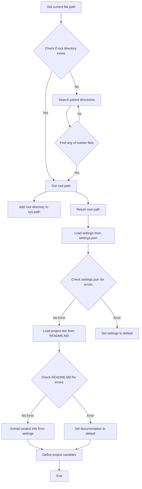

```
## File hypotez/src/goog/header.py
# -*- coding: utf-8 -*-\n#! venv/Scripts/python.exe\n#! venv/bin/python/python3.12\n\n"""\n.. module: src.goog \n\t:platform: Windows, Unix\n\t:synopsis:\n\n"""\nMODE = \'dev\'\n\nimport sys\nimport json\nfrom packaging.version import Version\n\nfrom pathlib import Path\ndef set_project_root(marker_files=(\'pyproject.toml\', \'requirements.txt\', \'.git\')) -> Path:\n    """\n    Finds the root directory of the project starting from the current file\'s directory,\n    searching upwards and stopping at the first directory containing any of the marker files.\n\n    Args:\n        marker_files (tuple): Filenames or directory names to identify the project root.\n    \n    Returns:\n        Path: Path to the root directory if found, otherwise the directory where the script is located.\n    """\n    __root__:Path\n    current_path:Path = Path(__file__).resolve().parent\n    __root__ = current_path\n    for parent in [current_path] + list(current_path.parents):\n        if any((parent / marker).exists() for marker in marker_files):\n            __root__ = parent\n            break\n    if __root__ not in sys.path:\n        sys.path.insert(0, str(__root__))\n    return __root__\n\n\n# Get the root directory of the project\n__root__ = set_project_root()\n"""__root__ (Path): Path to the root directory of the project"""\n\nfrom src import gs\n\nsettings:dict = None\ntry:\n    with open(gs.path.root / \'src\' /  \'settings.json\', \'r\') as settings_file:\n        settings = json.load(settings_file)\nexcept (FileNotFoundError, json.JSONDecodeError):\n    ...\n\n\ndoc_str:str = None\ntry:\n    with open(gs.path.root / \'src\' /  \'README.MD\', \'r\') as settings_file:\n        doc_str = settings_file.read()\nexcept (FileNotFoundError, json.JSONDecodeError):\n    ...\n\n \n\n__project_name__ = settings.get("project_name", \'hypotez\') if settings  else \'hypotez\'\n__version__: str = settings.get("version", \'\')  if settings  else \'\'\n__doc__: str = doc_str if doc_str else \'\'\n__details__: str = \'\'\n__author__: str = settings.get("author", \'\')  if settings  else \'\'\n__copyright__: str = settings.get("copyrihgnt", \'\')  if settings  else \'\'\n__cofee__: str = settings.get("cofee", "Treat the developer to a cup of coffee for boosting enthusiasm in development: https://boosty.to/hypo69")  if settings  else "Treat the developer to a cup of coffee for boosting enthusiasm in development: https://boosty.to/hypo69"
```

2. <algorithm>



**Example:**

If the current file is in `hypotez/src/goog/header.py`, the algorithm will search for `pyproject.toml`, `requirements.txt`, or `.git` in the parent directories (src, hypotez) to determine the project root (`hypotez`).  It will then populate `__root__`, `settings`, `__project_name__`, etc.


3. <explanation>

* **Imports:**
    * `sys`: Used to modify the Python path (`sys.path`).  Crucial for finding modules within the project.  Relationship: Essential for locating and importing modules from other parts of the project.
    * `json`: Used to load the `settings.json` file containing project configuration.  Relationship: Enables the script to interact with configuration data.
    * `packaging.version`: Used to manage project versions (not directly used in this file but could be in other `src` modules) Relationship: likely used for managing version requirements and dependencies.
    * `pathlib`:  Provides object-oriented way of working with paths.  Relationship: Makes the code more organized and avoids string-based path manipulation issues.

* **Classes:** There are no classes defined in this file.

* **Functions:**
    * `set_project_root(marker_files=...)`:  This function is critical for locating the project's root directory from the current file.  Arguments: A tuple of files or directories to search for.  Return Value: The `Path` object to the project root.  Example: If `__file__` is `hypotez/src/goog/header.py`, and the root contains `pyproject.toml`, the function will return `Path("hypotez")`.


* **Variables:**
    * `MODE`: A string defining the application's mode (e.g., 'dev', 'prod').
    * `__root__`: A `Path` object representing the project root directory.  Used extensively within the script.
    * `settings`: A `dict` containing project settings (loaded from `settings.json`).  
    * `doc_str`: A string containing the project documentation (loaded from `README.MD`).
    * `__project_name__`, `__version__`, `__doc__`, etc.: String variables containing project metadata, potentially derived from the `settings` dictionary, or default values.

* **Potential Errors/Improvements:**
    * **Error Handling:** The `try...except` blocks for loading `settings.json` and `README.MD` are good practice, but they could be more specific (e.g., `except json.JSONDecodeError as e`).  A more informative message on `FileNotFoundError` would be preferable.
    * **`gs.path.root`:**  It's unclear what `gs.path.root` is without seeing the `gs` module. This seems to assume a `gs` module exists in the `src` package that contains the root path to the project. (Strong need to look at the `gs` module)
    * **Robustness:** The code assumes `settings.json` and `README.MD` are formatted correctly.  Input validation would improve the function's robustness.
    * **Settings Validation:** The code should validate the structure of the `settings` dictionary to avoid unexpected behavior if the keys are missing or have the wrong type.
    * **Default Values:** Using `settings.get()` is good for default values, but explicitly handling `settings is None` is generally recommended to avoid potential issues.

* **Relationships:**  The code depends on the `src` package, specifically the `gs` module, which handles the path management.  Without seeing `gs`, it's unknown how `gs.path.root` is defined, potentially involving a significant module in this project.  It assumes the existence of `settings.json` and `README.MD` in the project root's `src` directory.


This analysis provides a detailed understanding of the `header.py` file's functionality and its interactions with other parts of the project.  Further analysis of the `gs` module would be necessary to fully understand the project's architecture.