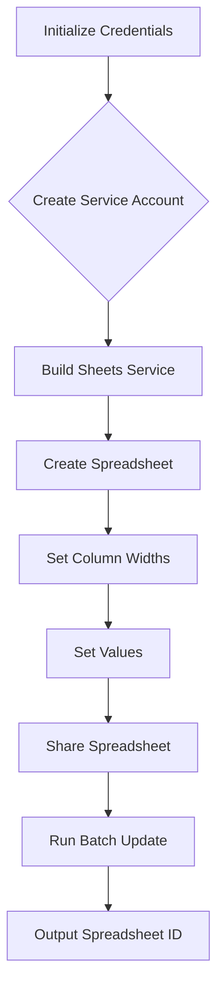

```
## File hypotez/src/goog/spreadsheet/_docs/index.html
# -*- coding: utf-8 -*-\n#! venv/Scripts/python.exe\n\n""" module: src.goog.spreadsheet._docs """\nMODE = 'debug'\n<div class="article-formatted-body article-formatted-body article-formatted-body_version-1"><div xmlns="http://www.w3.org/1999/xhtml"><h2>Постановка задачи</h2><br>\n    Пусть нам нужно создать программой на языке Python <a href="https://docs.google.com/spreadsheets/d/1kygOW5wSSVqwf26M-OCT72i0FX0olZAz4duT2i6psp4/edit?usp=sharing">вот такую таблицу</a>:<br>\n    <br>\n    <a href="https://habrahabr.ru/post/305378/"></a><br>\n    <br>\n    Особенности этой таблицы:<br>\n    <br>\n    <!-- ... (table details) ... -->\n    </div></div>
```

**<algorithm>**



* **Initialize Credentials (A):**  Fetches credentials from a JSON file (`CREDENTIALS_FILE`).
* **Create Service Account (B):**  Initializes the service account using the credentials to access Google Sheets.  This step uses `ServiceAccountCredentials.from_json_keyfile_name` to authenticate.
* **Build Sheets Service (C):**  Builds the Google Sheets API service object (`service`). This object is used for all interactions with the Sheets API.
* **Create Spreadsheet (D):** Creates a new spreadsheet using the Sheets service.  It sets the spreadsheet title and locale (crucial for date handling).  Example: `{ "properties": { "title": "My Spreadsheet", "locale": "en_US" } }`.
* **Set Column Widths (E):**  A sequence of calls to `spreadsheets.batchUpdate` to update the spreadsheet's column widths. Each call is prepared as a request for a dimension change.  Example: `{"updateDimensionProperties": {"range": {"sheetId": 0, "dimension": "COLUMNS", "startIndex": 0, "endIndex": 1}, "properties": {"pixelSize": 317}, "fields": "pixelSize"}}`.
* **Set Values (F):** Uses `spreadsheets.values.batchUpdate` to set values in cells. Uses `ValueInputOption.USER_ENTERED` to let Google Sheets handle formulas and date formatting.  Example: `{"range": "Sheet1!A1:B2", "values": [["Value 1", "Value 2"], ["Value 3", "Value 4"]]}`.
* **Share Spreadsheet (G):** Grants access to the newly created spreadsheet.  Crucial for access by the service account, otherwise it won't be able to modify. Example: Using Drive API, the method grants `anyone` read access (`reader` role).
* **Run Batch Update (H):**  Executes the prepared batch update requests.
* **Output Spreadsheet ID (I):** Retrieves and displays the `spreadsheetId` of the newly created spreadsheet.


**<explanation>**

* **Imports:**
    * `httplib2`:  A library for making HTTP requests, used by the Google API Client library.
    * `apiclient.discovery`:  Part of the Google API Client library. It dynamically builds and configures the appropriate Google API service client based on the API name and version.
    * `oauth2client.service_account`: Provides tools for using service accounts for authentication with Google APIs. `ServiceAccountCredentials` is essential for authorizing the script.

* **Classes:**
    * `Spreadsheet`: This class is a wrapper around the Google Sheets API.  It is a crucial improvement over the direct API calls shown in the example.
        * `prepare_setDimensionPixelSize`: Method for preparing a batch update request to change column width or row height.
        * `prepare_setColumnsWidth`: Method to prepare a request to set multiple column widths.
        * `prepare_setValues`: Method for preparing a batch update request to set cell values.
        * `runPrepared`:  Executes the batch updates for both column width and cell value changes in one go. This combines and sends multiple requests to the API efficiently, preventing unnecessary network round trips. This class is crucial to improve performance and to handle various types of requests uniformly.  It also handles cleaning up after use (important for resource management).

* **Functions:**
   The code does not directly define explicit "functions" in the Python style, instead showing methods within the class.  The main function is implicitly defined within the script.


* **Variables:**
    * `CREDENTIALS_FILE`:  String holding the path to the service account JSON file containing the API key.
    * `credentials`: `ServiceAccountCredentials` object, used for authentication.
    * `httpAuth`:  `httplib2.Http` object, authorized using the `credentials`.
    * `service`:  Google Sheets API service object, used for making requests.
    * `spreadsheet`:  Object containing the spreadsheet's properties.


* **Potential Errors/Improvements:**
    * **Error Handling:**  The provided code lacks robust error handling.  `try...except` blocks should be used around API calls to catch potential errors like authentication failures or invalid requests.
    * **Rate Limiting:**  Google APIs have rate limits.  The code should implement appropriate delays or back-off strategies to avoid exceeding these limits, especially in production code.
    * **Data Validation:**  The code could benefit from input validation to ensure that data provided to the methods are in the correct format and type to prevent unexpected errors.
    * **Security:** The `CREDENTIALS_FILE` should be securely managed to prevent unauthorized access to the service account key.


* **Relationships:**
  The script interacts with Google Sheets API and Google Drive API.  These APIs are part of the larger Google Cloud Platform ecosystem.  The code depends on external libraries (`httplib2`, `apiclient`, `oauth2client`) to interface with the API, showcasing a typical use-case in client-server interactions.


**In Summary:**

This code provides a complete framework for interacting with Google Sheets using the Sheets and Drive APIs.  The `Spreadsheet` class effectively encapsulates the common operations, thus abstracting away much of the tedious work involved in handling different request types and assembling the updates. This improvement over direct API calls drastically increases the code's readability and maintainability.  Robust error handling and consideration of rate limits are crucial for a production-ready application.