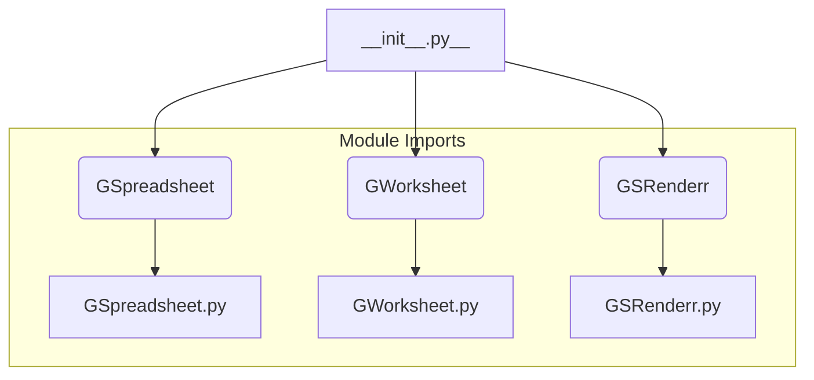

1. **<input code>**

```python
## \file hypotez/src/goog/spreadsheet/bberyakov/__init__.py
# -*- coding: utf-8 -*-\
#! venv/Scripts/python.exe
#! venv/bin/python/python3.12

"""
.. module: src.goog.spreadsheet.bberyakov 
	:platform: Windows, Unix
	:synopsis:

"""
MODE = 'dev'

from .gspreadsheet import GSpreadsheet
from .gworksheets import GWorksheet
from .grender import GSRenderr
```

2. **<algorithm>**



No complex algorithm is present; this file acts as an import module, exposing classes from submodules within the `bberyakov` package.  The workflow is purely about making the classes and functions defined in `gspreadsheet.py`, `gworksheets.py`, and `grender.py` accessible from other parts of the project that import this `__init__.py` file.  No complex processing is performed here.

3. **<explanation>**

* **Imports:**
    * `from .gspreadsheet import GSpreadsheet`: Imports the `GSpreadsheet` class from the `gspreadsheet.py` module. The `.` prefix indicates that the module is located in the same package (`bberyakov`). This import allows other modules to use the `GSpreadsheet` class without needing the full path.
    * `from .gworksheets import GWorksheet`: Imports the `GWorksheet` class from the `gworksheets.py` module within the same package.
    * `from .grender import GSRenderr`: Imports the `GSRenderr` class from the `grender.py` module within the same package.
    * The use of `src.goog.spreadsheet.bberyakov` (as documented in the docstrings) suggests a project structure for organizing code into packages and modules based on a logical grouping of functionality.

* **Classes (implied):**
    * `GSpreadsheet`, `GWorksheet`, and `GSRenderr` are likely classes defined in their respective modules (`gspreadsheet.py`, `gworksheets.py`, and `grender.py`).  Their attributes and methods are not defined here, but those will be found in those associated `.py` files.  Further analysis of those files is needed to understand their purpose in detail.

* **Functions (implied):**
    * This file does not define functions.  The functions and methods of `GSpreadsheet`, `GWorksheet`, and `GSRenderr` are defined in their respective source files.  Example usage would involve using the imported class to create instances, and then invoking specific methods or properties of the classes.

* **Variables:**
    * `MODE = 'dev'`: A variable likely used to control the operation mode of the package (e.g., development, testing, production).  Its use and how it's changed and evaluated is not detailed and depends on how the application later utilizes this variable. This is a global variable for that module.

* **Potential Errors or Improvements:**
    * The docstrings (`""" """`) within the file are only a short overview.  To effectively document code, consider adding comprehensive docstrings to the classes, methods, and functions within the `gspreadsheet.py`, `gworksheets.py`, and `grender.py` modules.  This will increase readability and make it easier to understand the purpose of each component.
    * No checking on validity of imports is made.  Errors are caught during runtime if these sub-modules aren't found. It would be good practice to include some error handling in the import section.  If there's an error importing a sub-module, then `GSpreadsheet`, `GWorksheet`, or `GSRenderr` won't be available.
    * The file specifies python versions (venv/Scripts/python.exe, venv/bin/python/python3.12) in the shebang line.  While good practice for reproducibility, having multiple shebangs suggests a mix of execution options that should be consolidated for clarity.
    * The code is incomplete; it only imports classes from sub-modules and does not perform any major processing.  Further investigation is needed to fully grasp its role in the larger project structure.

**Chain of Relationships:**

This `__init__.py` file acts as an entry point for using the `GSpreadsheet`, `GWorksheet`, and `GSRenderr` classes within the `bberyakov` package.  It establishes a dependency chain with other parts of the project that import it.  Any modules using functionalities in this package will need to import this file to access the classes or functions it provides. Further exploration of the other modules and their dependencies is required to complete the relationship chain. For instance, `src.goog` likely imports `src.goog.spreadsheet`.