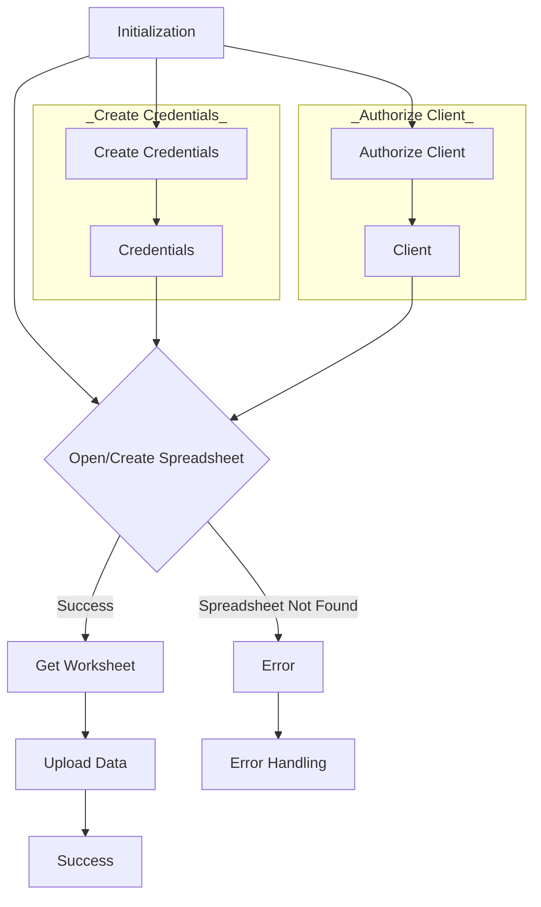

```
## <input code>
```python
# -*- coding: utf-8 -*-
#! venv/Scripts/python.exe
#! venv/bin/python/python3.12

"""
.. module: src.goog.spreadsheet
	:platform: Windows, Unix
	:synopsis: Minimal library for working with Google Sheets.

```python
# Example usage of the class
if __name__ == "__main__":
    from pathlib import Path

    data_file = Path('/mnt/data/google_extracted/your_data_file.csv')  # Replace with actual data file
    sheet_name = 'Sheet1'  # Replace with actual sheet name in Google Sheets

    # Create a new Spreadsheet if spreadsheet_id is not specified
    google_sheet_handler = SpreadSheet(
        spreadsheet_id=None,  # Specify None to create a new Spreadsheet
        sheet_name=sheet_name,
        spreadsheet_name='My New Spreadsheet'  # Name of the new Spreadsheet if spreadsheet_id is not specified
    )
    google_sheet_handler.upload_data_to_sheet()
```
"""
MODE = 'dev'


from pathlib import Path
import gspread
from gspread import Spreadsheet, Worksheet
from oauth2client.service_account import ServiceAccountCredentials
import pandas as pd
from src.logger import logger
from src import gs
from src.utils import pprint


class SpreadSheet:
    """ Class for working with Google Sheets.

    This class provides basic methods for accessing the Google Sheets API, creating and managing spreadsheets,
    and uploading data from a CSV file to Google Sheets.
    """

    # Path to the credentials file for accessing Google Sheets.
    #creds_file = gs.path.root / 'secrets' / 'hypo69-c32c8736ca62.json'

    """ оригинал файла хранится в базе данных вместе с паролями
    @todo организовать копирование файла в прогамно созаданом `tmp`,чтобы не хранить файл в физической директории
    """

    spreadsheet_id: str | None
    spreadsheet_name: str | None
    spreadsheet: Spreadsheet
    data_file: Path
    sheet_name: str
    credentials: ServiceAccountCredentials
    client: gspread.Client
    worksheet: Worksheet
    create_sheet: bool

    def __init__(self,
                 spreadsheet_id: str, *args, **kwards):  # Name of the sheet in Google Sheets
        """ Initialize GoogleSheetHandler with specified credentials and data file.

        @param spreadsheet_id ID of the Google Sheets spreadsheet. Specify None to create a new Spreadsheet.
        @param spreadsheet_name Name of the new Spreadsheet if spreadsheet_id is not specified.
        @param sheet_name Name of the sheet in Google Sheets.
        """
        self.spreadsheet_id = spreadsheet_id
        self.credentials = self._create_credentials()
        self.client = self._authorize_client()

        try:
            self.spreadsheet = self.client.open_by_key(self.spreadsheet_id)
            #logger.debug(f"Opened existing spreadsheet with ID: {self.spreadsheet_id}")
        except gspread.exceptions.SpreadsheetNotFound:
            logger.error(f"Spreadsheet with ID '{self.spreadsheet_id}' does not exist.")
            raise

    # ... (rest of the code)
```

## <algorithm>



**Example:**

If `spreadsheet_id` is `my_spreadsheet_id`:

1. **Initialization:** The `__init__` method is called with `spreadsheet_id = 'my_spreadsheet_id'`.
2. **Create Credentials:** The `_create_credentials` function retrieves credentials from `e-cat-346312-137284f4419e.json`.
3. **Authorize Client:** The `_authorize_client` method uses the credentials to authorize a Google Sheets client.
4. **Open Spreadsheet:** The `client.open_by_key()` method tries to open the spreadsheet.
5. **Success:** If the spreadsheet exists, the `spreadsheet` object is assigned.
6. **Get Worksheet:** The `get_worksheet` method is called, fetching the worksheet with the name specified.
7. **Upload Data:** The `upload_data_to_sheet` method reads data from the CSV file. Converts it to a format suitable for the Google Sheets API.
8. **Update Worksheet:** The `worksheet.update('A1', data_list)` method writes the data.
9. **Success:** The process finishes successfully.

**If the spreadsheet does not exist:**

1. **Initialization:** The `__init__` method is called.
2. **Error Handling (Spreadsheet Not Found):** The exception is caught, an error message is logged, and an exception is raised.

## <explanation>

**Imports:**

- `pathlib`: Provides object-oriented ways of working with filesystems (Path objects).
- `gspread`: The Google Sheets API library. `Spreadsheet` and `Worksheet` are classes from this library.
- `oauth2client.service_account`: Enables authentication using service accounts.
- `pandas`: Used for data manipulation. This is an efficient way to handle large datasets and transforming the data into the required format for Google Sheets API.
- `src.logger`:  Custom logging module, possibly part of a larger project.
- `src.gs`: Likely a module within the same project (`src` package) providing paths or configuration related to Google Services.
- `src.utils`:  Likely a module in the project providing utility functions, such as `pprint`.

**Classes:**

- `SpreadSheet`: Manages interaction with Google Sheets.
    - `spreadsheet_id`, `spreadsheet_name`, `sheet_name`, `data_file`: Attributes for storing relevant information.
    - `credentials`: Stores the authentication credentials.
    - `client`: Authorized client object for interacting with the Google Sheets API.
    - `spreadsheet`: Holds the spreadsheet object returned from the gspread library.
    - `worksheet`: Holds the worksheet object to write data.
    - `__init__`: Initializes the `SpreadSheet` object, including authentication. Important to note the use of try-catch for `SpreadsheetNotFound`.
    - `_create_credentials`: Creates and returns the authentication credentials from a JSON file.
    - `_authorize_client`: Authorizes a client to interact with Google Sheets based on provided credentials. Crucial for security and proper authentication.
    - `get_worksheet`: Retrieves an existing worksheet or creates a new one if it doesn't exist.  Crucial for handling existing worksheets and avoiding errors.
    - `create_worksheet`: Creates a new worksheet with a given title and dimensions.
    - `copy_worksheet`: Copies an existing worksheet to a new one.
    - `upload_data_to_sheet`: The main function to upload data.  It reads the CSV file, prepares the data, and updates the corresponding worksheet.

**Functions:**

- `_create_credentials()`: Creates `ServiceAccountCredentials` from `creds_file`. Error handling is included using `try-except` blocks, which is crucial to ensure the program doesn't crash if the credentials file is not found or there's a problem reading it.  It's also good practice to include logging to track the success or failure of the authentication process.
- `_authorize_client()`: Authorizes the `gspread` client using the `credentials`.
- `upload_data_to_sheet()`: Reads data from the CSV (`data_file`), prepares the data structure, and updates the Google Sheet. Important to handle potential `ValueError` (if the data file is missing) and more generic exceptions for proper error handling.
- `get_worksheet`: Handles cases where the worksheet doesn't exist.

**Variables:**

- `MODE`: A string variable set to 'dev'. This is used for conditional logic and likely used in a development/production environment.
- `data_file`:  Stores the path to the CSV file.  Should be carefully validated to ensure the file exists.
- `sheet_name`: Stores the name of the Google Sheet worksheet to write data to. This must be carefully validated against existing worksheets or appropriate creation logic implemented.
- `creds_file`: Stores the file path to the service account credentials. This should be configurable or passed in as an argument for security best practices.

**Potential Errors/Improvements:**

- **Error Handling:** While the code includes `try-except` blocks, error handling could be more comprehensive.  For instance, it should handle situations where the CSV file has incorrect data formats and other potential errors within the data itself.


- **Data Validation:** The `upload_data_to_sheet` function does not perform any data validation on the CSV file.  It assumes the CSV is correctly formatted. Adding validation steps (checking for required columns, data types, etc.) can prevent unexpected errors.

- **File Path:** Using `/mnt/data/google_extracted/your_data_file.csv` in the example usage directly is not ideal.  The code should accept the file path as an argument, or be configurable to prevent hardcoding file paths. This makes the code more reusable.

- **Security:** Hardcoding the credentials path (`e-cat-346312-137284f4419e.json`) is a security risk.  The code should either load the credentials from a secure location or use environment variables.

- **Code Style:** The docstrings could be improved to be more complete.  Adding type hints for the arguments and return values would improve readability and maintainability.

**Relationship Chain:**

The code interacts with other parts of the project through imports:

```
src.goog.spreadsheet --> src.logger
src.goog.spreadsheet --> src.gs
src.goog.spreadsheet --> src.utils
```

This implies that `src.logger`, `src.gs`, and `src.utils` are components of the same project, providing supporting functionalities (e.g., logging, path management, and utility functions).  The `src` package is critical for maintaining a modular and reusable codebase.