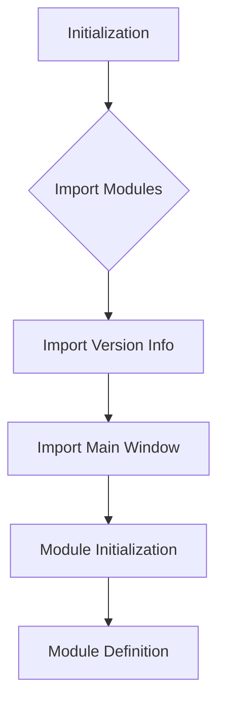

1. <input code>

```python
## \file hypotez/src/gui/openai_trаigner/__init__.py
# -*- coding: utf-8 -*-\
#! venv/Scripts/python.exe
#! venv/bin/python/python3.12

"""
.. module: src.gui.openai_trаigner 
	:platform: Windows, Unix
	:synopsis:

"""
MODE = 'dev'

"""
	:platform: Windows, Unix
	:synopsis:

"""


"""
	:platform: Windows, Unix
	:synopsis:

"""


"""
  :platform: Windows, Unix

"""
"""
  :platform: Windows, Unix
  :platform: Windows, Unix
  :synopsis:
"""MODE = 'dev'
  
""" module: src.gui.openai_trаigner """


""" @namespace src.fast_api """


""" """
...

from packaging.version import Version
from .version import __version__, __doc__, __details__   

from .main_window import AssistantMainWindow
```

2. <algorithm>



**Example Data Flow:**

-  Initialization (A) sets up the basic environment.
-  Import Modules (B) brings in necessary external packages.
-  Import Version Info (C) brings in versioning information from the `version.py` module within the same directory.
- Import Main Window (D) brings in the `AssistantMainWindow` class.
-  Module Initialization (E) does any internal module-level preparation.
-  Module Definition (F) defines the `__init__.py` file as a module, which other parts of the project will import.


3. <explanation>

* **Imports:**
    - `from packaging.version import Version`: Imports the `Version` class from the `packaging` library. This is likely used for version comparison or handling.  This import is relevant because `__init__.py` is used to initialize the module; the code here is initiating a Python module.   It's used for versioning, and is a standard Python library that deals with software versions.
    - `from .version import __version__, __doc__, __details__`: Imports specific variables (`__version__`, `__doc__`, `__details__`) from the `version.py` module within the same directory.  This is a common practice for maintaining module-specific information like version numbers and documentation strings. `version.py` presumably contains metadata related to the `openai_trаigner` module.
    - `from .main_window import AssistantMainWindow`: Imports the `AssistantMainWindow` class from the `main_window.py` module. This suggests `main_window.py` defines the UI elements and logic for the `openai_trаigner` application.

* **Classes:**
    - `AssistantMainWindow`: The `AssistantMainWindow` class likely handles the main application window. This class is part of the `gui` package, responsible for building a graphical user interface related to training OpenAI models.
    - Relationship with other parts of the project: This likely relates to a GUI framework for a larger application (or part of a larger application) that involves training and interacting with OpenAI.

* **Functions (None directly defined in this file):** This `__init__.py` is largely about import statements.  It does not contain executable functions.


* **Variables:**
    - `MODE = 'dev'`: A global variable likely used to define the operating mode of the application (e.g., development, production).


* **Potential Errors or Areas for Improvement:**
    - **Unclear Purpose of Comments:** The majority of multi-line comments (`"""Docstring"""`) are empty or very brief. More detailed explanations of what this module does would be helpful.
    - **Missing `__all__`:** There is no `__all__` variable. This can help to control what's imported from the module; consider adding it.
    - **Redundant comments:**  Comments like `""" module: src.gui.openai_trаigner """` are redundant since the file name already specifies the module's purpose.  Removing these won't break functionality, but it clarifies that the comments are doing very little.

* **Relationship to Other Parts of the Project:**
    - The import statements show relationships: the `openai_trаigner` module relies on `main_window`, which in turn is likely part of a larger GUI structure within the `hypotez` project. The use of `packaging.version` indicates a need for version management in the overall project.

**In summary:** This `__init__.py` file acts as a module initializer for the `openai_trаigner` package within the `gui` part of the `hypotez` project. It imports necessary components, but could benefit from clearer docstrings and a more explicit declaration of what it initializes.