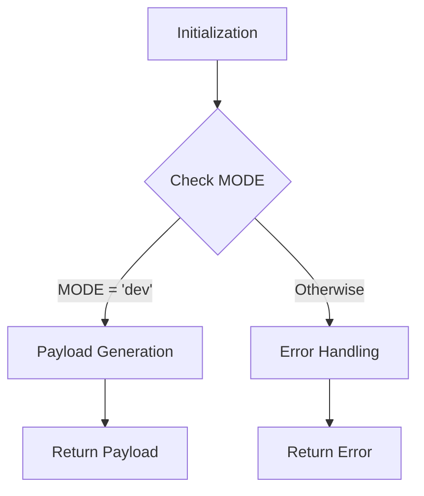

```
## <input code>

```python
## \file hypotez/src/gui/openai_trаigner/payload.py
# -*- coding: utf-8 -*-\
#! venv/Scripts/python.exe
#! venv/bin/python/python3.12

"""
.. module: src.gui.openai_trаigner 
	:platform: Windows, Unix
	:synopsis:

"""
MODE = 'dev'

"""
	:platform: Windows, Unix
	:synopsis:

"""


"""
	:platform: Windows, Unix
	:synopsis:

"""


"""
  :platform: Windows, Unix

"""
"""
  :platform: Windows, Unix
  :platform: Windows, Unix
  :synopsis:
"""MODE = 'dev'
  
""" module: src.gui.openai_trаigner """


```

## <algorithm>



**Example:**

* **A (Initialization):** The script begins execution.
* **B (Check MODE):**  Checks the value of the global variable `MODE`.
* **C (Payload Generation):** Generates the payload (presumably some data structure or object). This is the core logic, but the code does not show how it's done.
* **D (Error Handling):**  Handles cases where `MODE` is not 'dev' (or any other error conditions). The code does not show the implementation.
* **E (Return Payload):** Returns the generated payload.
* **F (Return Error):** Returns an error message or object.


## <explanation>

**Imports:**

There are no imports in this file. This is a file that is likely part of a larger project that will import other modules as needed.  This is very basic code for initialization and possibly setting up the working mode of the script.

**Classes:**

There are no classes defined.

**Functions:**

There are no functions defined.

**Variables:**

* `MODE`: A string variable that likely controls the mode of operation (e.g., 'dev', 'prod').  Its value is set to 'dev' and likely used to conditionally load different modules or configurations.

**Potential Errors/Improvements:**

* **Missing Functionality:** The code lacks the critical logic for generating the payload. It only defines the `MODE` variable without any logic.
* **Lack of Error Handling:**  The `if` statement `MODE = 'dev'` suggests potential error handling (or different modes), but there are no error handling blocks, making the code incomplete.  This is important for robustness. The script should have proper exception handling in place for various scenarios.
* **Docstrings:** The docstrings are present but incomplete. Ideally, more comprehensive explanations of the variables, and parameters are needed.
* **Missing Comments:** The code would benefit from more clarifying comments. The purpose of the payload generation and the possible values of `MODE` could be explained more clearly.
* **Python Style:** The code could be improved by adding appropriate docstrings to better describe the functionality of the `MODE` variable.  The unusual repetition and formatting of the docstrings also need to be fixed.

**Chain of Relationships:**

This file likely interacts with other files in the `hypotez/src/gui/` package to retrieve or use configuration information and to generate and manipulate the OpenAI payload data.  The specific details depend on other components of the project. This script likely interfaces with data generation components within the project.


**Overall:**

The provided code is a rudimentary starting point for a module focused on creating OpenAI payloads.  Critically, it lacks the core logic and implementation details necessary to perform the desired functionality.  Significant additional code is required to define payload generation and error handling.