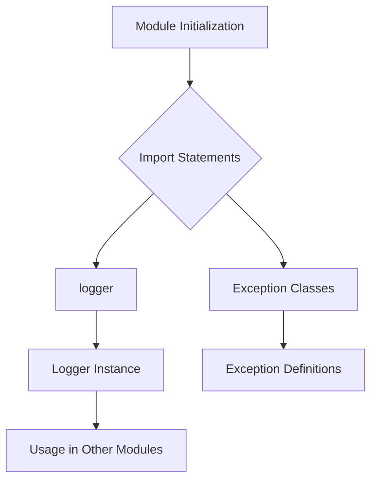

1. **<input code>**

```python
## \file hypotez/src/logger/__init__.py
# -*- coding: utf-8 -*-\
#! venv/Scripts/python.exe
#! venv/bin/python/python3.12

"""
.. module: src.logger 
	:platform: Windows, Unix
	:synopsis:

"""
MODE = 'dev'

from .logger import logger
#from .beeper import Beeper
from .exceptions import ( ExecuteLocatorException, 
                         DefaultSettingsException, 
                         CredentialsError, 
                         PrestaShopException, 
                         PayloadChecksumError
                        )
```

2. **<algorithm>**



**Example Data Flow:**

*   **A (Module Initialization):** The module `hypotez/src/logger/__init__.py` is loaded.
*   **B (Import Statements):**  The script imports necessary components.
*   **C (logger):** The `logger` object (likely a logging instance) is imported from the `hypotez/src/logger/logger.py` module.
*   **D (Exception Classes):** Exception classes like `ExecuteLocatorException`, `CredentialsError`, etc., are imported from the `hypotez/src/logger/exceptions.py` module.
*   **E (Logger Instance):** The `logger` object is made available for use in other parts of the project.
*   **F (Exception Definitions):** The exception classes are defined to handle potential issues in the project.
*   **G (Usage in Other Modules):** These imported components can be used within `hypotez` or other modules that import this `__init__.py` file.


3. **<explanation>**

*   **Imports:**
    *   `from .logger import logger`: Imports the logger object. The `.` indicates a relative import from within the `logger` package. This suggests that there's a `hypotez/src/logger/logger.py` file containing the actual implementation of the logger functionality.  This import makes the logger available for use in other files in the `hypotez/src/logger` package.
    *   `from .exceptions import ...`: Imports several custom exception classes.  These are likely for handling specific errors related to the `logger` or other modules within the package.  The relative import (`from .`) points to a `hypotez/src/logger/exceptions.py` file containing the exception definitions.  The use of a dedicated exception class improves code maintainability and readability.
    *   **Relationship with other packages:** The exceptions and the logger are part of the `logger` package which suggests a modular structure.  The `logger` will likely be used by various other parts of the `hypotez` project to handle logging and error handling.   The presence of multiple specific exceptions suggests a complex program dealing with various scenarios, needing specific exception types.

*   **Classes (implied):**
    *   The imported `ExecuteLocatorException`, `DefaultSettingsException`, etc. are custom exception classes. These are defined in the `exceptions.py` file.


*   **Variables:**
    *   `MODE = 'dev'`: This variable is likely a configuration constant. It might control the logging level or behavior in different modes (development, production, etc.).


*   **Functions (implied):** The code does not directly define any functions. Any functions or methods associated with the `logger` will reside in `hypotez/src/logger/logger.py`

*   **Potential Errors/Improvements:**
    *   **Missing `__init__`**:  It's good practice to include a `__init__.py` to define the package. This module appears to be part of a Python package, but no `__init__.py` (which usually contains imports for other specific module files within this logger package) is included. This may or may not be a code error.
    *   **Uncommented Imports**: The commented-out import `from .beeper import Beeper` suggests a potential feature or module (like a sound notification system) that's either not yet implemented or temporarily unused.


**Chain of Relationships:**

*   `hypotez/src/logger/__init__.py` imports and exposes the `logger` object and exceptions.
*   Other modules in `hypotez` can import `hypotez/src/logger/__init__.py` to utilize the `logger` and related custom exceptions.


**Overall:** The code initializes the `logger` module, making its functionality and custom exception classes available for use in other parts of the project.  The commented-out import suggests potential extensions to the logging system. The modularity, with the use of custom exceptions, suggests a well-structured project architecture for better maintainability and code organization.