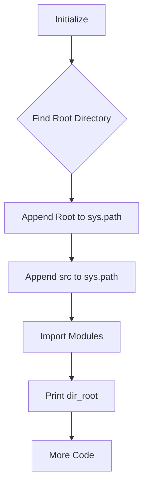

1. **<input code>**:

```python
## \file hypotez/src/logger/_examples/header.py
# -*- coding: utf-8 -*-\n#! venv/Scripts/python.exe\n#! venv/bin/python/python3.12\n\n"""
.. module: src.logger._examples 
	:platform: Windows, Unix
	:synopsis:

"""
MODE = 'dev'

"""
	:platform: Windows, Unix
	:synopsis:

"""


"""
	:platform: Windows, Unix
	:synopsis:

"""


"""
  :platform: Windows, Unix

"""
"""
  :platform: Windows, Unix
  :platform: Windows, Unix
  :synopsis:
"""MODE = 'dev'
  
""" module: src.logger._examples """


import sys
import os
from pathlib import Path

dir_root : Path = Path (os.getcwd()[:os.getcwd().rfind('hypotez')+11])
sys.path.append (str (dir_root) )  # Добавляю корневую папку в sys.path
dir_src = Path (dir_root, 'src')
sys.path.append (str (dir_root) ) 
...

print(dir_root)
# ----------------
from pathlib import Path
import json
import re
# ----------------

from src import gs
from src.suppliers import Supplier
from src.product import Product, ProductFields, ProductFieldsLocators
from src.category import Category
from src.utils import j_dumps, j_loads,   pprint, save_text_file
from src.logger import logger
from src.utils.string import StringFormatter, StringNormalizer, ProductFieldsValidator
...
```

2. **<algorithm>**:



* **Initialize (A):** Sets up the initial environment.
* **Find Root Directory (B):** Determines the path to the `hypotez` root directory using `os.getcwd()` and string manipulation.
* **Append Root to sys.path (C):** Modifies the Python path to include the root directory, enabling modules in the root directory to be imported.
* **Append src to sys.path (D):** Modifies Python path to include 'src' directory allowing modules in src directory to be imported.
* **Import Modules (E):** Imports necessary modules from various parts of the project's structure, including `src`, `src.utils`, etc. 
* **Print dir_root (F):** Prints the determined root directory path to the console for verification.
* **More Code (G):**  Represents the subsequent code that depends on the modules imported in the previous step.


3. **<explanation>**:

* **Imports:**
    * `sys`, `os`, `pathlib`: Standard Python modules for system interaction, file path manipulation, and operating system-related functions, respectively. Critical for file system interaction and environment setup.
    * `json`, `re`: Standard library modules for JSON manipulation and regular expressions. Necessary for handling data formats and text processing.
    * `gs`: This imports a module named `gs` from the `src` package. The specific function and usage are unclear without seeing the implementation of `gs`.  It likely handles a task related to the project, perhaps Google Sheets or other external services.
    * `Supplier`, `Product`, `ProductFields`, `ProductFieldsLocators`, `Category`: These imports from submodules within `src`.  They likely represent classes defining data structures for handling suppliers, products, and categories of products.
    * `j_dumps`, `j_loads`, `pprint`, `save_text_file`: Utilities for JSON encoding/decoding, pretty printing, and file saving. Suggest functionality related to data persistence and manipulation.
    * `logger`: Likely a logging module from `src.logger`. Crucial for tracking operations.
    * `StringFormatter`, `StringNormalizer`, `ProductFieldsValidator`: From `src.utils.string`, suggesting classes for string manipulation tasks, particularly related to `ProductFields`.

* **Classes:**
    * The code snippets show imports for various classes (`Supplier`, `Product`, etc.) but does not contain class definitions themselves. Further code in the project files would describe the role and behavior of these classes.

* **Functions:**
    * The code snippet imports functions `j_dumps`, `j_loads`, `pprint`, and `save_text_file` from `src.utils`. These are probably helper functions for data handling, though without their implementations it's difficult to be precise.

* **Variables:**
    * `dir_root`:  A `pathlib.Path` object representing the root directory of the project.
    * `dir_src`:  A `pathlib.Path` object representing the `src` directory.
    * `MODE`: A string variable likely controlling the operational mode (e.g., 'dev', 'prod').

* **Potential Errors/Improvements:**
    * The code appends the root directory twice to `sys.path`. This is redundant and could lead to import errors if a module exists in multiple locations.  It should be appended only once.
    * The `...` indicates missing code. Understanding the complete code is crucial to analyze potential errors or optimizations.
    * The many empty docstrings might indicate incomplete documentation.

* **Relationships:**
    * The code heavily relies on the `src` package for importing other classes and functions. This suggests a modular design for organization and maintainability.
    * The various classes (`Supplier`, `Product`, `Category`, etc.) likely interact with each other through methods or object references, forming a data model for product information.
    * The `logger` module will integrate with the main program flow for logging important events.
    * Without seeing the full implementations of classes and functions in the `src` package, a precise chain of relationships is impossible.


**Overall:** The code snippet is a header file for a project aiming at using modules under `src` folder. The main action is to prepare the Python environment for import of these modules.  The purpose of the code is to add the project root to Python's search path so that modules in `src` can be imported, which is a common practice in Python for managing dependencies. The `...` in the code suggests that much more functionality is present and involved in the complete program.  A complete analysis requires examining the full codebase.