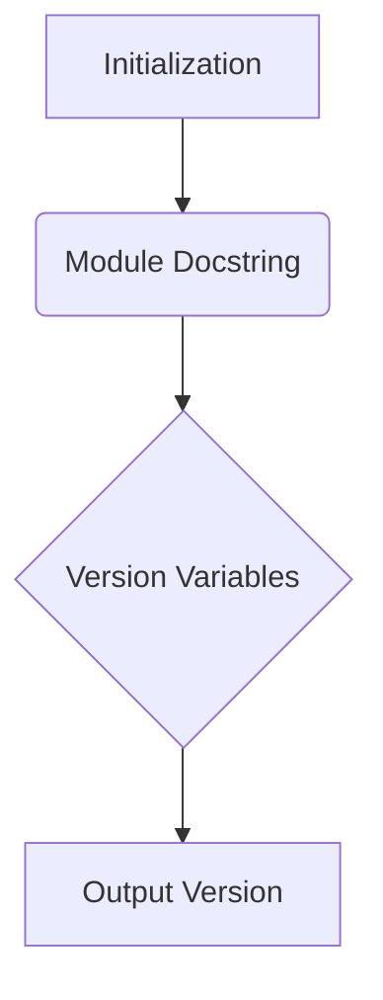

```
## <input code>

```python
## \file hypotez/src/logger/_examples/version.py
# -*- coding: utf-8 -*-\n#! venv/Scripts/python.exe
#! venv/bin/python/python3.12
"""
.. module: src.logger._examples 
	:platform: Windows, Unix
	:synopsis:

"""
MODE = 'dev'

"""
	:platform: Windows, Unix
	:synopsis:

"""


"""
	:platform: Windows, Unix
	:synopsis:

"""


"""
  :platform: Windows, Unix

"""
"""
  :platform: Windows, Unix
  :platform: Windows, Unix
  :synopsis:
"""MODE = 'dev'
  
""" module: src.logger._examples """


"""
- `__version__`: This variable holds the version of the module or package.
- `__name__`: Contains the name of the module. If the script is being run directly, the value will be `"__main__"`.
- `__doc__`: The module's documentation string.
- `__details__`: This variable likely contains additional details about the module, but the exact purpose depends on the specific module or package.
- `__annotations__`: Contains type annotations for variables and functions in the module.
- `__author__`: The name(s) of the author(s) of the module.
"""
__name__:str
__version__="3.12.0.0.0.4"
__doc__:str
__details__:str="Details about version for module or class"
__annotations__

__author__='hypotez '
```

## <algorithm>



* **Initialization (A):** The script initializes.
* **Module Docstring (B):** Reads and parses module-level docstrings. This does not involve data flow in the way of calculating something, it stores the docstrings in memory.
* **Version Variables (C):** Sets and defines various module-level variables: `__version__`, `__doc__`, `__details__`, `__author__`. This section involves only data assignments to variables and doesn't involve data flow between functions.
* **Output Version (D):** No explicit output, but the version information will be available when the file is imported or used in another script.


## <explanation>

* **Imports:** There are no imports in this file. The code is self-contained and likely intended to define module-level attributes that would be used in other modules.

* **Classes:** There are no classes defined in this file.

* **Functions:** There are no functions defined. The file entirely consists of assigning values to module-level variables like `__version__`, `__author__`, etc.

* **Variables:**
    * `__version__`: Stores the version string "3.12.0.0.0.4".
    * `__doc__`: Stores the documentation string for the module (it's an empty string in this case).
    * `__details__`: Stores a string detailing the module's version ("Details about version for module or class").
    * `__annotations__`:  This variable is not assigned any value and represents the module-level annotations, likely to store type hints for functions if any were defined.
    * `__author__`: Stores the author's name ('hypotez ').
    * `MODE`: This is a variable with the string value 'dev'.  This suggests a potential configuration or mode for the application this module is intended for, but it's unclear without further context.

* **Potential Errors/Improvements:**
    * **Redundant Docstrings:** The excessive use of docstrings (`""" ... """`) within the file is likely a stylistic choice rather than a functional error but could be improved by being consolidated into a single, comprehensive docstring for clarity.
    * **Missing Usage:** The code lacks any usage of the module-level variables, which makes it less practical as a standalone script.  Ideally, the file would be imported and used in another part of a larger project.
    * **Type Hints (Annotations):**  Although `__annotations__` is present, it is not used. Utilizing type hints (`__annotations__`) can greatly increase code readability and maintainability.  Ideally, specific types would be associated with variables and functions using type hints.


* **Chain of Relationships:** This file, `version.py`, is part of a project, `hypotez`. It is likely an example file from a subdirectory, `src/logger/_examples`, for a logging package within the larger `hypotez` project. The file defines metadata for the module, providing version information and author details. This information would typically be used by other parts of the `hypotez` project for version management, documentation, or dependency tracking.