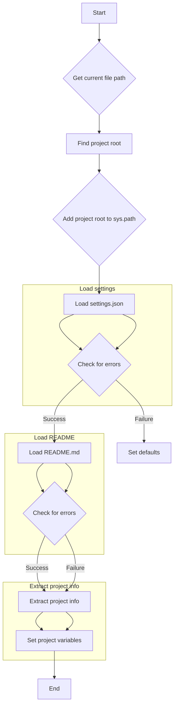

1. **<input code>**

```python
## \file hypotez/src/logger/header.py
# -*- coding: utf-8 -*-\n#! venv/Scripts/python.exe
#! venv/bin/python/python3.12
"""
.. module: src.logger 
	:platform: Windows, Unix
	:synopsis:

"""
MODE = 'dev'

"""
	:platform: Windows, Unix
	:synopsis: Модуль определяющий корневой путь к проекту. Все импорты строятся относительно этого пути.
    :TODO: В дальнейшем перенести в системную переменную"""

import sys
import json
from packaging.version import Version
from pathlib import Path
def set_project_root(marker_files=('pyproject.toml', 'requirements.txt', '.git')) -> Path:
    """
    Finds the root directory of the project starting from the current file's directory,
    searching upwards and stopping at the first directory containing any of the marker files.

    Args:
        marker_files (tuple): Filenames or directory names to identify the project root.
    
    Returns:
        Path: Path to the root directory if found, otherwise the directory where the script is located.
    """
    __root__:Path
    current_path:Path = Path(__file__).resolve().parent
    __root__ = current_path
    for parent in [current_path] + list(current_path.parents):
        if any((parent / marker).exists() for marker in marker_files):
            __root__ = parent
            break
    if __root__ not in sys.path:
        sys.path.insert(0, str(__root__))
    return __root__


# Get the root directory of the project
__root__ = set_project_root()
"""__root__ (Path): Path to the root directory of the project"""

from src import gs

settings:dict = None
try:
    with open(gs.path.root / 'src' /  'settings.json', 'r') as settings_file:
        settings = json.load(settings_file)
except (FileNotFoundError, json.JSONDecodeError):
    ...

doc_str:str = None
try:
    with open(gs.path.root / 'src' /  'README.MD', 'r') as settings_file:
        doc_str = settings_file.read()
except (FileNotFoundError, json.JSONDecodeError):
    ...


__project_name__ = settings.get("project_name", 'hypotez') if settings  else 'hypotez'
__version__: str = settings.get("version", '')  if settings  else ''
__doc__: str = doc_str if doc_str else ''
__details__: str = ''
__author__: str = settings.get("author", '')  if settings  else ''
__copyright__: str = settings.get("copyrihgnt", '')  if settings  else ''
__cofee__: str = settings.get("cofee", "Treat the developer to a cup of coffee for boosting enthusiasm in development: https://boosty.to/hypo69")  if settings else "Treat the developer to a cup of coffee for boosting enthusiasm in development: https://boosty.to/hypo69"
```

2. **<algorithm>**



**Example Data Flow:**

- If `pyproject.toml` is in `/Users/user/project/src/logger`, then `__root__` will be `/Users/user/project`.


3. **<explanation>**

* **Imports:**
    - `sys`: Provides access to system-specific parameters and functions, in this case, manipulating the `sys.path` to allow imports from the project root.
    - `json`: Used for working with JSON data, specifically loading settings from `settings.json`.
    - `packaging.version`: For handling version numbers. Not used directly in the example but useful for project metadata.
    - `pathlib`:  Used for path manipulation, providing a more object-oriented and robust way to work with file paths.
* **Classes:** There are no classes defined.
* **Functions:**
    - `set_project_root(marker_files)`: This function is crucial for finding the project root directory. It takes a tuple of file/directory names as input. It starts from the current file's directory and traverses up the directory tree until it finds a directory containing any of the specified marker files (e.g., `pyproject.toml`, `requirements.txt`, `.git`).  If the root isn't found in the expected location it will raise an error. It then adds the root directory to `sys.path` for easier imports.  
        ```python
        root_dir = set_project_root(('pyproject.toml', 'requirements.txt'))
        ```
* **Variables:**
    - `MODE`: A string variable, likely used for different operating modes (e.g., 'dev', 'prod').
    - `__root__`: A `pathlib.Path` object representing the path to the project root.
    - `settings`: A dictionary, containing project settings (e.g., `project_name`, `version`).
    - `doc_str`: A string variable containing the content of the `README.MD` file.
    - `__project_name__`, `__version__`, `__doc__`, `__details__`, `__author__`, `__copyright__`, `__cofee__`:  String variables holding project metadata extracted from `settings.json`, or defaults if the file is missing or unreadable. 
* **Potential Errors/Improvements:**
    - **Error Handling:** The code uses `try...except` blocks to handle potential `FileNotFoundError` and `json.JSONDecodeError` when reading `settings.json` and `README.MD`. This is good practice but the `...` in the except blocks could be replaced with more informative error handling. For example, logging the error.
    - **Robustness:** The function `set_project_root` is very well written. However, consider adding a check if the marker files actually exist if they are not in the same directory.
    - **Clearer Variable Names:** While the double underscores (`__`) are common for "private" variables, consider more descriptive names for the project metadata variables.
    - **Logging:** Instead of `...` in the exception blocks, consider using a logging framework to record the errors or warnings that occur during file loading. This can be very helpful for debugging or tracking failures.
    - **Dependency Injection:** It would be even better to move `set_project_root` into the module that needs it rather than as a global. It helps to create more specific modules, promotes modularity and also hides the internal implementation detail.

**Relationship with other parts of the project:**

The `src.gs` module (implicitly imported as `gs`) seems to be responsible for defining `gs.path.root`, which is used to construct paths to files like `settings.json` and `README.MD`. This suggests a module (`gs`) managing file paths and resources. The rest of the project should be structured to use this common root path for better consistency, and less redundancy.  The code uses the project's root directory as the import base, so that all modules import correctly without having to change imports.