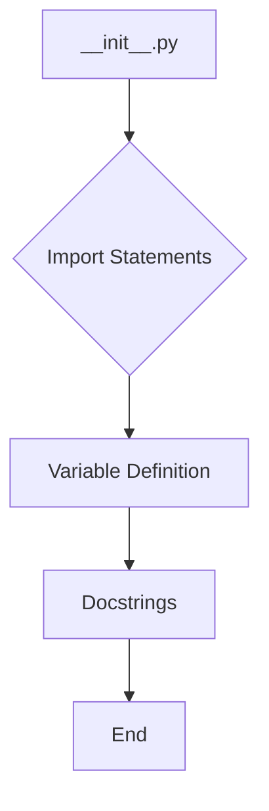

1. **<input code>**

```python
## \file hypotez/src/product/_examples/__init__.py
# -*- coding: utf-8 -*-
#! venv/Scripts/python.exe
#! venv/bin/python/python3.12

"""
.. module: src.product._examples 
	:platform: Windows, Unix
	:synopsis:

"""
MODE = 'dev'

"""
	:platform: Windows, Unix
	:synopsis:

"""


"""
	:platform: Windows, Unix
	:synopsis:

"""


"""
  :platform: Windows, Unix

"""
"""
  :platform: Windows, Unix
  :platform: Windows, Unix
  :synopsis:
"""MODE = 'dev'
  
""" module: src.product._examples """


from packaging.version import Version
from .version import __version__, __doc__, __details__
```

2. **<algorithm>**



* **Import Statements (B):** Import necessary modules.
* **Variable Definition (C):**  Defining `MODE` variable. This could be used as a configuration flag for the module.
* **Docstrings (D):**  Provides documentation about the module's functionality.


3. **<explanation>**

* **Imports:**
    * `from packaging.version import Version`: Imports the `Version` class from the `packaging` library. This is likely used for checking or handling software versions.  The `packaging` library is a general-purpose Python library for interacting with package metadata and versioning. This is likely imported for version-related checks or manipulations within the `product` package.
    * `from .version import __version__, __doc__, __details__`: Imports variables (`__version__`, `__doc__`, `__details__`) from a file named `version.py` within the `_examples` subdirectory. This suggests a structured approach to versioning information, likely storing version details in a separate file.


* **Classes:**  There are no classes defined in this file.

* **Functions:** No functions are present in this file.

* **Variables:**
    * `MODE = 'dev'`: This is a global variable likely used for configuration purposes (e.g., development or production mode).  Its value is a string literal.  This variable is likely being set for internal use within this package.

* **Potential Errors/Improvements:**
    * **Redundant Docstrings:** The file contains numerous docstrings that seem largely redundant or incomplete.  The docstrings should be concise and focused, describing the module's purpose, and perhaps how it fits into the larger project.  They should use standard Sphinx-style docstrings.
    * **Unclear Purpose:** The file appears to be a module initializer for an example or testing section.  While it imports version information, the lack of other logic or functions makes its use case unclear without a wider context (other files in the `_examples` or `product` folder).  Improving clarity in the file's structure or documentation would improve maintainability.
    * **`#!` directives:** The `#!` lines (shebangs) at the top are likely used for specifying the interpreter to run the Python script but are usually unnecessary in a Python module.  These will get ignored when importing the file.  Remove these to be consistent.

* **Relationships to other parts of the project:**
    * The import `from .version import ...` indicates a relationship with a file named `version.py` in the same directory. This implies a hierarchical structure within the `product` package, potentially having versioning information centralized.  This suggests that more files within the `product` and `_examples` directories should be investigated.


**In summary:** This file is a module initializer for an example section and defines a global configuration variable.  The significant redundancy in docstrings and the unclear purpose require further investigation into the surrounding code in the `product` package.