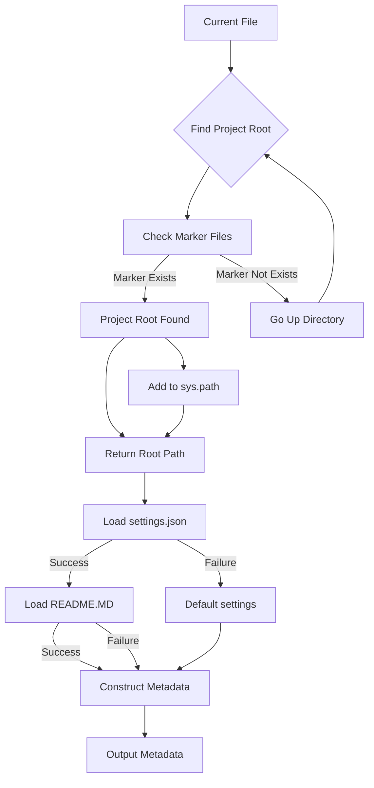

## File hypotez/src/product/header.py
# -*- coding: utf-8 -*-\n#! venv/Scripts/python.exe\n#! venv/bin/python/python3.12\n\n"""\n.. module: src.product \n\t:platform: Windows, Unix\n\t:synopsis:\n\n"""\nMODE = \'dev\'\n\n"""\n\t:platform: Windows, Unix\n\t:synopsis:\n\n"""\n\n"""\n\t:platform: Windows, Unix\n\t:synopsis: Модуль определяющий корневой путь к проекту. Все импорты строятся относительно этого пути.\n    :TODO: В дальнейшем перенести в системную переменную\n\n"""\n\nimport sys\nimport json\nfrom packaging.version import Version\n\nfrom pathlib import Path\ndef set_project_root(marker_files=(\'pyproject.toml\', \'requirements.txt\', \'.git\')) -> Path:\n    """\n    Finds the root directory of the project starting from the current file\'s directory,\n    searching upwards and stopping at the first directory containing any of the marker files.\n\n    Args:\n        marker_files (tuple): Filenames or directory names to identify the project root.\n    \n    Returns:\n        Path: Path to the root directory if found, otherwise the directory where the script is located.\n    """\n    __root__:Path\n    current_path:Path = Path(__file__).resolve().parent\n    __root__ = current_path\n    for parent in [current_path] + list(current_path.parents):\n        if any((parent / marker).exists() for marker in marker_files):\n            __root__ = parent\n            break\n    if __root__ not in sys.path:\n        sys.path.insert(0, str(__root__))\n    return __root__\n\n\n# Get the root directory of the project\n__root__ = set_project_root()\n"""__root__ (Path): Path to the root directory of the project"""\n\nfrom src import gs\n\nsettings:dict = None\ntry:\n    with open(gs.path.root / \'src\' /  \'settings.json\', \'r\') as settings_file:\n        settings = json.load(settings_file)\nexcept (FileNotFoundError, json.JSONDecodeError):\n    ...\n\n\ndoc_str:str = None\ntry:\n    with open(gs.path.root / \'src\' /  \'README.MD\', \'r\') as settings_file:\n        doc_str = settings_file.read()\nexcept (FileNotFoundError, json.JSONDecodeError):\n    ...\n\n \n\n__project_name__ = settings.get("project_name", \'hypotez\') if settings  else \'hypotez\'\n__version__: str = settings.get("version", \'\')  if settings  else \'\'\n__doc__: str = doc_str if doc_str else \'\'\n__details__: str = \'\'\n__author__: str = settings.get("author", \'\')  if settings  else \'\'\n__copyright__: str = settings.get("copyrihgnt", \'\')  if settings  else \'\'\n__cofee__: str = settings.get("cofee", "Treat the developer to a cup of coffee for boosting enthusiasm in development: https://boosty.to/hypo69")  if settings  else "Treat the developer to a cup of coffee for boosting enthusiasm in development: https://boosty.to/hypo69"\n```

```
<algorithm>
**Block Diagram:**



**Example Data Flow:**

1. **Input:** `__file__` points to `/hypotez/src/product/header.py`.
2. **Find Project Root:**  The code iterates up the directory tree, checking for `pyproject.toml`, `requirements.txt`, or `.git`.
3. **Example:** If `.git` exists in `/hypotez`, it's identified as the root.
4. **Add to sys.path:** `/hypotez` is added to the Python path.
5. **Load settings.json:** Reads `/hypotez/src/settings.json` into `settings`.
6. **Example:** `settings` might contain `{"project_name": "MyProject", "version": "1.0.0"}`.
7. **Load README.MD:** Reads `/hypotez/src/README.MD` into `doc_str`.
8. **Example:**  The file contains project documentation.
9. **Construct Metadata:**  Creates variables like `__project_name__`, `__version__`, etc., using data from `settings` and `doc_str`.
10. **Output Metadata:** The script makes the project metadata available for use.

</algorithm>
```

```
<explanation>

**Imports:**

- `sys`: Used for manipulating the Python path (`sys.path`).
- `json`: Used for loading the `settings.json` file.
- `packaging.version`: Potentially used for handling project versions, though it's not directly evident from the code.
- `pathlib`: Provides the `Path` object, crucial for handling file paths in a platform-independent way.

**Classes:**

- No classes are defined in this file.

**Functions:**

- `set_project_root(marker_files=...)`:
    - **Arguments:** A tuple of filenames/directories (`marker_files`) to identify the project root.
    - **Return Value:** A `Path` object representing the root directory, or the current file's directory if no root is found.
    - **Functionality:** Recursively searches up the directory tree from the current file to find a directory containing any of the specified marker files.
    - **Example:**
        - `set_project_root()` called from `/hypotez/src/product/header.py` will search upwards in the directory tree for  `pyproject.toml`, `requirements.txt`, and `.git` to find the root of the project.

**Variables:**

- `MODE`:  A constant string that likely indicates the development mode.
- `__root__`: A crucial variable storing the path to the project root, essential for relative imports.
- `settings`: A dictionary to store project settings loaded from `settings.json`.
- `doc_str`: Stores the content of the `README.MD` file, if found.
- `__project_name__`, `__version__`, etc.: Variables containing project metadata, extracted from `settings` if it's available, otherwise default values are used.

**Potential Errors/Improvements:**

- **Error Handling:**  The `try...except` blocks for loading `settings.json` and `README.MD` are a good start, but should specify the exact exception types in the `except` clause (e.g., `FileNotFoundError` or `json.JSONDecodeError`).  Also, consider using the `typing` module's `Dict[str, str]` type hints in addition to the type hints of the file, to specify the exact types of the loaded `settings` and `doc_str` variables.
- **Robustness:** The code assumes `settings.json` and `README.MD` exist in the `src` directory. Adding a check if `gs.path.root` exists would make the script more robust.


**Relationships with Other Parts:**

- `gs.path.root`: This implies a `gs` module (likely in the `src` package) that provides functions to work with the project's root directory.  This functionality needs to be analyzed in `src/gs.py`.
- `src` package:  The `from src import gs` statement indicates a dependency on the `gs` module.  Understanding the `gs` module is crucial to understand the code's context within the project's structure.
- `settings.json` and `README.MD`: These files hold important metadata about the project. The code extracts relevant data, showcasing how the `header` file connects with these configuration files.


**Overall:**

The code elegantly handles identifying the project root and loading project metadata. The use of `Path` objects and error handling is good practice. However, more robust error handling (e.g., checking if `gs.path.root` exists) and better type hinting will improve the maintainability.