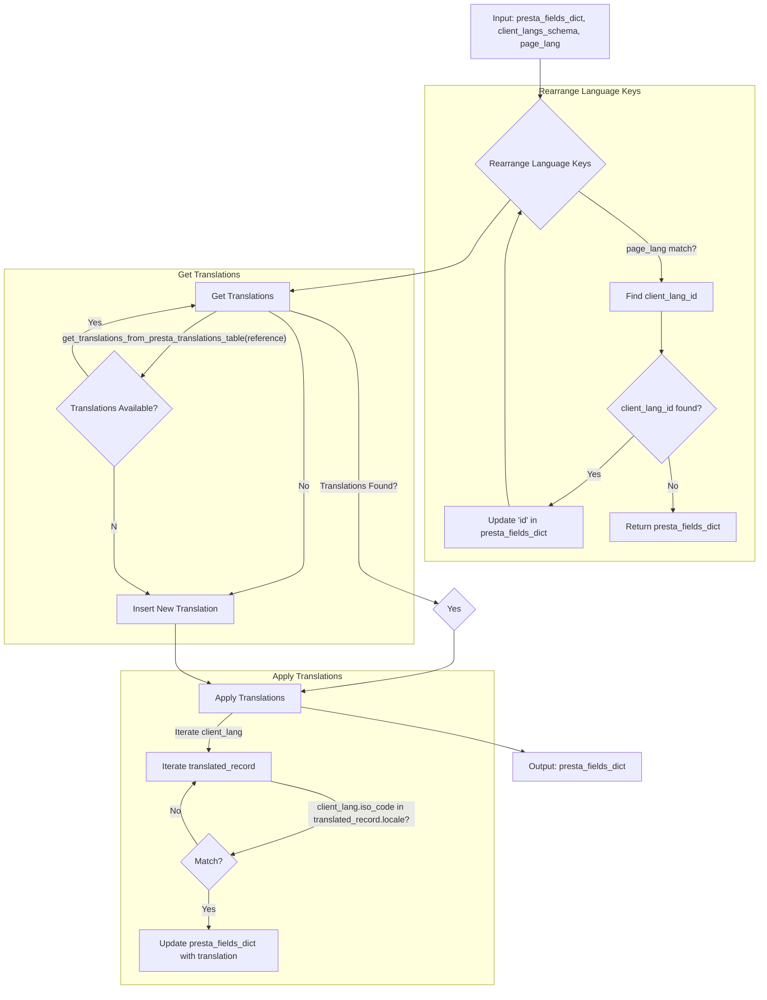

## <input code>
```python
# -*- coding: utf-8 -*-\n#! venv/Scripts/python.exe\n#! venv/bin/python/python3.12\n\n"""\n.. module: src.product.product_fields \n\t:platform: Windows, Unix\n\t:synopsis: Модуль перевода полей товара на языки клиентской базы данных\n\n"""\nMODE = \'dev\'\n\nfrom pathlib import Path\nfrom typing import List\n...\nfrom src import gs\nfrom src.utils import pprint\nfrom src.logger import logger\n#from src.db import ProductTranslationsManager\n#from src.translator import get_translations_from_presta_translations_table\n#from src.translator import insert_new_translation_to_presta_translations_table\nfrom src.logger.exceptions import ProductFieldException\n...\n\ndef rearrange_language_keys(presta_fields_dict: dict, client_langs_schema: dict | List[dict], page_lang: str) -> dict:\n    """Функция обновляет идентификатор языка в словаре presta_fields_dict на соответствующий идентификатор\n    из схемы клиентских языков при совпадении языка страницы.\n\n    Args:\n        presta_fields_dict (dict): Словарь полей товара.\n        page_lang (str): Язык страницы.\n        client_langs_schema (list | dict): Схема языков клиента.\n\n    Returns:\n        dict: Обновленный словарь presta_fields_dict.\n    """\n    client_lang_id = None\n    for lang in client_langs_schema:\n        if lang[\'locale\'] == page_lang or \\\n        lang[\'iso_code\'] == page_lang or  \\\n        lang[\'language_code\'] == page_lang:   # <- оч плохо А если he или IL?\n            client_lang_id = lang[\'id\']\n            break\n\n    if client_lang_id is not None:\n        for field in presta_fields_dict.values():\n            if isinstance(field, dict) and \'language\' in field:\n                for lang_data in field[\'language\']:\n                    lang_data[\'attrs\'][\'id\'] = str(client_lang_id)   # <- Эти айдишники ОБЯЗАТЕЛЬНО строки. Связано с XML парсером\n\n    return presta_fields_dict\n\n\ndef translate_presta_fields_dict (presta_fields_dict: dict, \n                                  client_langs_schema: list | dict, \n                                  page_lang: str = None) -> dict:\n    # ... (rest of the function)\n```

```
## <algorithm>

**Workflow Diagram for `translate_presta_fields_dict`**



**Example Data Flow:**

1. **Input:** `presta_fields_dict` (e.g., {'reference': '123', 'name': {'language': [{'attrs': {'id': 'default'}, 'value': 'Product Name'}]}}) , `client_langs_schema` (e.g., [{'id': 1, 'locale': 'en-US', 'iso_code': 'en'}]), `page_lang` = 'en'.
2. **Rearrange Language Keys:** `rearrange_language_keys` finds `client_lang_id` (1) for 'en'.
3. **Get Translations:** `get_translations_from_presta_translations_table` returns `enabled_product_translations` (e.g., [{'locale': 'en-US', 'name': 'Translated Name'}]).
4. **Apply Translations:** The code iterates over `enabled_product_translations` (for `name`). If a translation for the matching ISO code exists, it updates `presta_fields_dict['name']` to include the translation.
5. **Output:** `presta_fields_dict` is returned with the updated `'id'` and the translated values.


```
## <explanation>

**Imports:**

- `from pathlib import Path`: Used for file path manipulation, but not directly used in the provided code.
- `from typing import List`: Used to specify that `client_langs_schema` can be either a list or a dictionary.
- `from src import gs`: Likely imports functions or classes from a `gs` module within the `src` package.
- `from src.utils import pprint`: Likely imports a `pprint` function for formatted output.
- `from src.logger import logger`: Imports the logging facility from the `src.logger` module.
- `from src.logger.exceptions import ProductFieldException`: Imports a custom exception for handling errors related to product fields.

**Classes (implied):**

- `record`: A class (global variable) potentially used for creating and handling translation records.


**Functions:**

- `rearrange_language_keys(presta_fields_dict, client_langs_schema, page_lang)`: This function finds the `id` of the language specified in `page_lang` within `client_langs_schema` and updates the corresponding `id` in the `presta_fields_dict`. The function is crucial for aligning language identifiers between the source data and the target database.
    - Arguments:
        - `presta_fields_dict`: Dictionary of product fields.
        - `client_langs_schema`: Schema of client languages.
        - `page_lang`: Language of the current page.
    - Returns: Updated `presta_fields_dict`.
- `translate_presta_fields_dict(presta_fields_dict, client_langs_schema, page_lang)`:  This function translates the multi-language fields in `presta_fields_dict` according to the client language schema. It retrieves translations from a database (implied), updates `presta_fields_dict` with translated values if found, and inserts new translations into the database if necessary.
    - Arguments:
        - `presta_fields_dict`: Dictionary of product fields to translate.
        - `client_langs_schema`: Schema of available languages.
        - `page_lang` (optional): Language of the page.
    - Returns: The translated `presta_fields_dict`


**Variables:**

- `MODE`:  A global variable likely controlling the operation mode (e.g., 'dev', 'prod').
- `client_lang_id`: Stores the ID of the client language corresponding to the `page_lang`.

**Potential Errors and Improvements:**

- **Error Handling:** While the code includes a `try...except` block, the error handling is quite rudimentary. Consider more specific exception handling (e.g., `KeyError` if a key doesn't exist) to provide more informative error messages.
- **Language Code Matching:** The code uses `if lang['locale'] == page_lang or lang['iso_code'] == page_lang` for matching language codes. Adding support for `lang['language_code']` would potentially fix issues caused by different conventions, like `he`, `il` for Hebrew.
- **Missing `page_lang`:** The code attempts to retrieve `page_lang` in case of no explicit parameter given; however, the implementation of that logic is missing and could lead to incorrect translations or crashes.
- **Redundancy:** The code has duplicated logic to find the client language ID within `rearrange_language_keys` and `translate_presta_fields_dict`.
- **Unclear Logic:** The function flow and data flow need further clarity by adding comments and/or diagrams. The `if not enabled_product_translations or enabled_product_translations or len(enabled_product_translations) <1` is an unusual conditional statement.


**Relationships with Other Parts of the Project:**

The code interacts with other parts of the project via imports. It relies on functions like `get_translations_from_presta_translations_table` and `insert_new_translation_to_presta_translations_table`, which imply the existence of a database interaction layer (`src.db`) and a translation module (`src.translator`). The use of `src.logger` indicates a logging mechanism.


**Overall:** The code seems to be part of a larger system for translating product fields from a source (PrestaShop) to a target (client database). It correctly updates the language identifier in the `presta_fields_dict`, and attempts to retrieve and apply translations from a database, but needs significant improvements in error handling, language code matching, and overall readability.