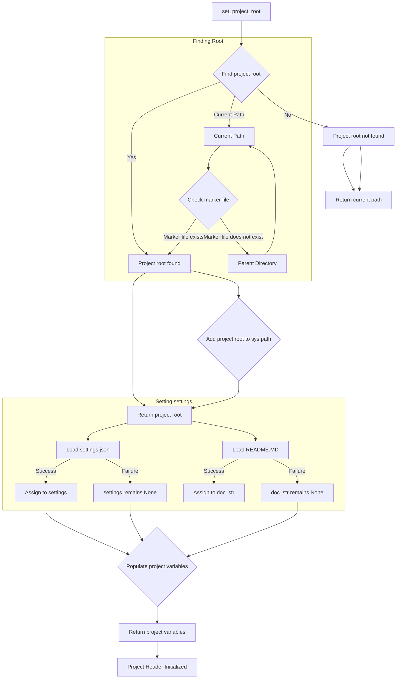

## hypotez/src/scenario/header.py

# -*- coding: utf-8 -*-\n#! venv/Scripts/python.exe\n#! venv/bin/python/python3.12\n\n"""\n.. module: src.scenario \n\t:platform: Windows, Unix\n\t:synopsis:\n\n"""\nMODE = \'dev\'\n\nimport sys\nimport json\nfrom packaging.version import Version\n\nfrom pathlib import Path\ndef set_project_root(marker_files=(\'pyproject.toml\', \'requirements.txt\', \'.git\')) -> Path:\n    """\n    Finds the root directory of the project starting from the current file\'s directory,\n    searching upwards and stopping at the first directory containing any of the marker files.\n\n    Args:\n        marker_files (tuple): Filenames or directory names to identify the project root.\n    \n    Returns:\n        Path: Path to the root directory if found, otherwise the directory where the script is located.\n    """\n    __root__:Path\n    current_path:Path = Path(__file__).resolve().parent\n    __root__ = current_path\n    for parent in [current_path] + list(current_path.parents):\n        if any((parent / marker).exists() for marker in marker_files):\n            __root__ = parent\n            break\n    if __root__ not in sys.path:\n        sys.path.insert(0, str(__root__))\n    return __root__\n\n\n# Get the root directory of the project\n__root__ = set_project_root()\n"""__root__ (Path): Path to the root directory of the project"""\n\nfrom src import gs\n\nsettings:dict = None\ntry:\n    with open(gs.path.root / \'src\' /  \'settings.json\', \'r\') as settings_file:\n        settings = json.load(settings_file)\nexcept (FileNotFoundError, json.JSONDecodeError):\n    ...\n\n\ndoc_str:str = None\ntry:\n    with open(gs.path.root / \'src\' /  \'README.MD\', \'r\') as settings_file:\n        doc_str = settings_file.read()\nexcept (FileNotFoundError, json.JSONDecodeError):\n    ...\n\n \n\n__project_name__ = settings.get("project_name", \'hypotez\') if settings  else \'hypotez\'\n__version__: str = settings.get("version", \'\')  if settings  else \'\'\n__doc__: str = doc_str if doc_str else \'\'\n__details__: str = \'\'\n__author__: str = settings.get("author", \'\')  if settings  else \'\'\n__copyright__: str = settings.get("copyrihgnt", \'\')  if settings  else \'\'\n__cofee__: str = settings.get("cofee", "Treat the developer to a cup of coffee for boosting enthusiasm in development: https://boosty.to/hypo69")  if settings  else "Treat the developer to a cup of coffee for boosting enthusiasm in development: https://boosty.to/hypo69"\n```

```
<algorithm>


```
<explanation>

**1. Imports:**

- `sys`: Provides access to system-specific parameters and functions,  used to modify the Python path (`sys.path`).
- `json`: For encoding and decoding JSON data, used for loading project settings.
- `packaging.version`: Used for handling version numbers (not directly used, but imports suggest a desire for versioning).
- `pathlib`: Provides object-oriented way of working with paths, making path manipulation more robust and readable.

**2. Classes:**

- There are no classes in this file.

**3. Functions:**

- `set_project_root(marker_files=...) -> Path`:
    - **Arguments:** `marker_files`: A tuple of file/directory names to locate the project root. Defaults to `('pyproject.toml', 'requirements.txt', '.git')`.
    - **Return Value:** `Path` object representing the project root directory. If not found, returns the directory of the script itself.
    - **Functionality:**  Recursively checks parent directories starting from the current file's directory until it finds a directory that contains any of the specified marker files. Adds the root directory to `sys.path` for proper module importing. This is crucial for a modular project structure.
    - **Example:** If the script is located in `myproject/src/scenario/`, it will look in `myproject/src`, `myproject`, etc., until it finds one of the marker files.

**4. Variables:**

- `MODE`: A string variable set to 'dev'.  Indicates a development mode which could influence other modules.
- `__root__`: Holds the `Path` object representing the project root.  Initialized in `set_project_root` and used throughout the file.
- `settings`: A dictionary to hold project settings loaded from `settings.json`.  Crucially, it is handled with `try...except` blocks to gracefully handle missing or improperly formatted files.
- `doc_str`: Holds the content of `README.MD`.
- `__project_name__`, `__version__`, `__doc__`, `__details__`, `__author__`, `__copyright__`, `__cofee__`:  String variables derived from the `settings` dictionary (or default values if `settings` is not found or the keys are missing).  Used likely to populate metadata in the project.  The `__cofee__` variable is noteworthy.


**5. Error Handling:**

- The code uses `try...except` blocks to handle potential `FileNotFoundError` and `json.JSONDecodeError` exceptions when reading `settings.json` and `README.MD`. This ensures the program doesn't crash if these files are missing or corrupted. This is good error handling.


**6. Relationships with other parts of the project:**

- The `from src import gs` import suggests a `gs` module (likely in the `src` package) that contains functions or attributes to deal with the project's root directory and possibly the file system. The use of `gs.path.root` strongly suggests this module. This relationship is critical to the modular architecture and should be documented properly.
- The presence of `settings.json` and `README.MD` in the `src` directory indicates they are configuration or documentation files for the project, which should be loaded and used across other modules within the `src` package.
- The `set_project_root` function is a critical utility for resolving relative paths. It is expected that other parts of the `src` package depend on the root directory to find other files and modules.


**Potential Errors or Improvements:**

- The handling of `settings.json` should also validate the structure of the JSON before attempting to access keys.  Deep checks for valid data structures could be added within the `try..except` block to produce more descriptive error messages.
- Consider using a more robust configuration system (like `configparser`) for handling project settings if JSON is not the most appropriate format.
- The use of magic strings like `'pyproject.toml'` and `'settings.json'` should be moved to a constant to allow better maintainability.
-  Use `if settings is not None` (or similar checks) instead of `if settings`.