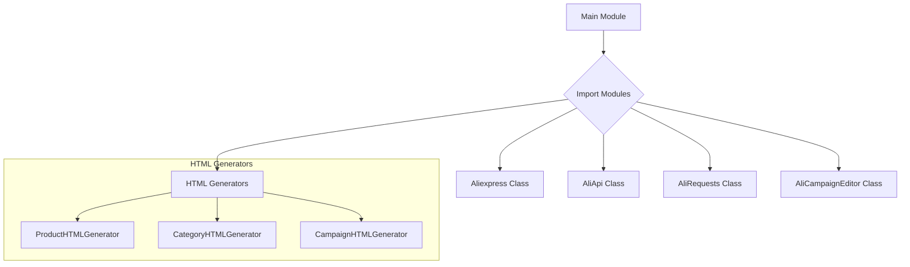

```
## <input code>
# -*- coding: utf-8 -*-\n#! venv/Scripts/python.exe\n#! venv/bin/python/python3.12\n\n"""\n.. module: src.suppliers.aliexpress \n\t:platform: Windows, Unix\n\t:synopsis:\n\n"""\nMODE = 'dev'\n\nfrom .aliexpress import Aliexpress\nfrom .aliapi import AliApi\nfrom .alirequests import AliRequests\nfrom .campaign import AliCampaignEditor\nfrom .campaign.html_generators import ProductHTMLGenerator, CategoryHTMLGenerator, CampaignHTMLGenerator 
```

## <algorithm>



**Data Flow:**

The main module imports various classes from submodules within the `aliexpress` package.  There is no significant data flow *between* imported classes directly in this initialisation file;  the classes defined within the imported modules are responsible for their own internal data handling.

**Example (Conceptual):**

The `Aliexpress` class, when instantiated, will likely contain data related to AliExpress and will be used to interact with the other classes. The `AliApi` class will handle API communication; `AliRequests` will manage requests; `AliCampaignEditor` will work with campaigns; and the HTML generators will create appropriate HTML based on data passed to them.


## <explanation>

* **Imports:**
    * `from .aliexpress import Aliexpress`: Imports the `Aliexpress` class from the `aliexpress.py` file within the same directory.  This implies `Aliexpress` is likely a central class for interacting with the AliExpress platform.
    * `from .aliapi import AliApi`: Imports the `AliApi` class, possibly for handling API interactions with AliExpress.  The `.aliapi` likely contains the implementation details for making API calls.
    * `from .alirequests import AliRequests`: Imports the `AliRequests` class, likely for managing HTTP requests used to communicate with AliExpress and handling things like headers, responses, etc.
    * `from .campaign import AliCampaignEditor`: Imports the `AliCampaignEditor` class, potentially focused on manipulating AliExpress campaigns.
    * `from .campaign.html_generators import ProductHTMLGenerator, CategoryHTMLGenerator, CampaignHTMLGenerator`: Imports classes for generating HTML for products, categories, and campaigns. This structure implies a modular approach where the HTML generation logic is separated for better organization.

* **Classes (implied):**
    * `Aliexpress`, `AliApi`, `AliRequests`, `AliCampaignEditor`, `ProductHTMLGenerator`, `CategoryHTMLGenerator`, `CampaignHTMLGenerator`: The existence of these imports suggests classes with specific responsibilities within the AliExpress interaction pipeline.  Detailed implementations for each are not provided in this file.

* **Variables:**
    * `MODE = 'dev'`: A global variable indicating the execution mode (development).  This is a common practice to change behavior based on the environment.  This variable is likely used for configuration purposes throughout the application.

* **Functions (implied):**
    * No direct functions are defined within this `__init__.py` file. However, functions would likely reside within the classes imported to provide specific logic.  E.g.,  `AliApi` would likely have functions for API calls, `AliRequests` would have functions to make HTTP requests, and the `html_generator` classes would likely have a `generate_html` function.

* **Potential errors or areas for improvement:**

    * **Missing Docstrings:**  While the module docstring is present, ideally, each class and function within the submodules should have detailed docstrings for better understanding and maintainability.
    * **Error Handling:**  The code lacks error handling (e.g., `try...except` blocks) for potential issues during API calls, HTTP requests, or file operations.  These should be added to catch exceptions and provide graceful error handling.  This is important for robust code that does not halt on unexpected errors.
    * **Dependency Management:** While the import statements are straightforward, how these classes interact with each other and where these classes get their data is not explicit.  Adding comments for the flow of data between them would greatly improve readability.
    * **Testing:** The code does not include any unit tests, which are crucial for verifying the functionality of the individual components.  Unit tests could be written to check the responses, inputs, etc.


* **Relationship with other project parts (implied):**
This `aliexpress` module likely interacts with other modules or components within the `hypotez` project, potentially for data storage, processing, or user interface interactions. The precise nature of these relationships will depend on the structure of the rest of the project.  The project structure hints that it deals with information gathering and potentially campaign management.