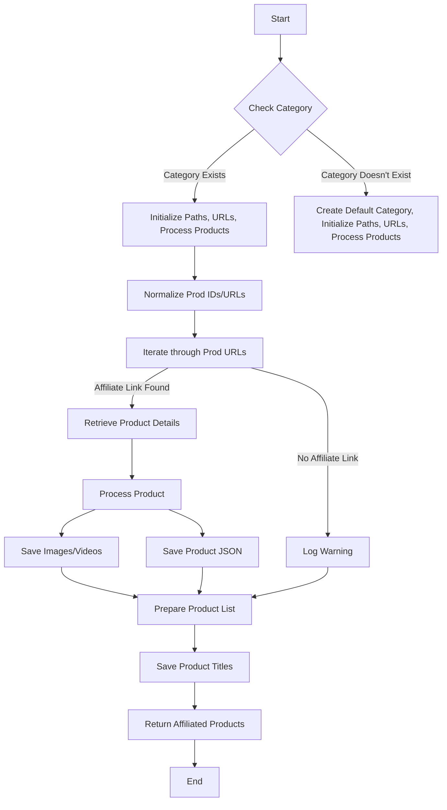

```python
## \file hypotez/src/suppliers/aliexpress/affiliated_products_generator.py
# -*- coding: utf-8 -*-
#! venv/Scripts/python.exe
#! venv/bin/python/python3.12

"""
.. module: src.suppliers.aliexpress 
	:platform: Windows, Unix
	:synopsis:

"""
MODE = 'dev'

import asyncio
from datetime import datetime
import html
from pathlib import Path
from urllib.parse import urlparse
from types import SimpleNamespace
from typing import List

from src.logger import logger
from src import gs
from src.suppliers.aliexpress import AliApi
from src.suppliers.aliexpress.campaign.html_generators import ProductHTMLGenerator, CategoryHTMLGenerator, CampaignHTMLGenerator 
from src.suppliers.aliexpress.utils.ensure_https import ensure_https
from src.product.product_fields import ProductFields as f
from src.utils.image import save_png_from_url 
from src.utils.video import save_video_from_url
from src.utils.file import get_directory_names, get_filenames, read_text_file, save_text_file
from src.utils.jjson import j_loads_ns, j_dumps
from src.utils import pprint
from src.logger import logger


class AliAffiliatedProducts(AliApi):
    """ Class to collect full product data from URLs or product IDs.
    For more details on how to create templates for ad campaigns, see the section `Managing Aliexpress Ad Campaigns`.
    """
    ...
    language:str = None
    currency:str = None
    def __init__(self,
                 language: str | dict = 'EN',
                 currency: str = 'USD',
                 *args, **kwargs):
        """
        Initializes the AliAffiliatedProducts class.
        Args:
            language: Language for the campaign (default 'EN').
            currency: Currency for the campaign (default 'USD').
        """
        ...
        if not language or not currency:
            logger.critical(f"No language, currency !")
            return
        super().__init__(language, currency)
        self.language, self.currency = language, currency


    async def process_affiliate_products(self, prod_ids: list[str], category_root: Path | str) -> list[SimpleNamespace]:
        """
        ... (Docstring is already provided)
        """
        _promotion_links: list = []
        _prod_urls: list = []
        normilized_prod_urls = ensure_https(prod_ids) # Normalizes product IDs/URLs to HTTPS format.
        print_flag = '' # Flag for controlling output formatting

        for prod_url in normilized_prod_urls:
            _links = super().get_affiliate_links(prod_url)
            if _links:
                _links = _links[0]
            if hasattr(_links, 'promotion_link'):
                _promotion_links.append(_links.promotion_link)
                _prod_urls.append(prod_url)
                logger.info(f"found affiliate for {_links.promotion_link}")
                #pprint(f"found affiliate for: {_links.promotion_link}")
            else:
                continue

        if not _promotion_links:
            logger.warning(f'No affiliate products returned {prod_ids=}')
            return

        _affiliated_products: List[SimpleNamespace] = self.retrieve_product_details(_prod_urls)
        if not _affiliated_products:
            return

        affiliated_products_list: list = []
        product_titles = []  # Collect product titles for saving later

        for product, promotion_link in zip(_affiliated_products, _promotion_links):
            product_titles.append(product.product_title)
            product.language = self.language
            product.promotion_link = promotion_link
            image_path = Path(category_root) / 'images' / f"{product.product_id}.png"
            await save_png_from_url(product.product_main_image_url, image_path)
            logger.info(f"Saved image for {product.product_id=}")
            product.local_saved_image = str(image_path)
            if len(product.product_video_url) > 1:
                parsed_url = urlparse(product.product_video_url)
                suffix = Path(parsed_url.path).suffix
                video_path = Path(category_root) / 'videos' / f"{product.product_id}{suffix}"
                await save_video_from_url(product.product_video_url, video_path)
                product.local_saved_video = str(video_path)
                logger.info(f"Saved video for {product.product_id=}")

            # ... (rest of the code remains the same)


            j_dumps(product, Path(category_root) / f'{self.language}_{self.currency}' / f'{product.product_id}.json')
            affiliated_products_list.append(product)

        product_titles_path = category_root / f"{self.language}_{self.currency}" / 'product_titles.txt'
        save_text_file(product_titles, product_titles_path)
        return affiliated_products_list


```

**<algorithm>**



**Example Data Flow:**

* **Input:** `prod_ids = ["url1", "url2"]`, `category_root = Path("./my_category")`
* **B (Check Category):** Checks if a category exists. If so, proceeds to C.  Otherwise, creates a default category and proceeds to D.
* **E (Normalize Prod IDs/URLs):** Converts URLs (if provided) to HTTPS format using `ensure_https`. Example: `http://example.com/product1` becomes `https://example.com/product1`.
* **F (Iterate through Prod URLs):**  Loops through each URL. If `get_affiliate_links` finds an affiliate link for `url1`, it appends to `_promotion_links` and `_prod_urls`.
* **G (Retrieve Product Details):** Retrieves product information for `url1` using `retrieve_product_details`.
* **I (Process Product):** Processes the product details. This involves setting `language`, `promotion_link`, saving the image to `./my_category/images/productID.png`, and saving the video (if available).  Example: Extracts `product_id`, `product_title`, `product_main_image_url`.
* **K (Save Product JSON):** Saves the processed product data as JSON (`./my_category/language_currency/productID.json`).
* **L (Prepare Product List):** Accumulates all processed products into `affiliated_products_list`.
* **M (Save Product Titles):** Saves a list of `product_titles` to `./my_category/language_currency/product_titles.txt`.


**<explanation>**

* **Imports:**  Standard libraries (`asyncio`, `datetime`, `html`, `pathlib`, `urllib.parse`, `typing`, `SimpleNamespace`) provide core functionalities.  `src` packages are imported for modularity, likely for logging, file handling, general utilities, and specific AliExpress API interaction.  This suggests a well-structured project architecture with clear separation of concerns.

* **Classes:**
    * **`AliAffiliatedProducts`:** Inherits from `AliApi`. This class extends the capabilities of `AliApi` to specifically handle affiliate product retrieval, processing, and saving.  The `__init__` method initializes language and currency settings.   `process_affiliate_products` is the core method, orchestrating the entire affiliate product collection, processing, and saving workflow.  Critically, it's asynchronous (`async def`), optimizing for network operations.

* **Functions:**
    * **`process_affiliate_products`:** Takes a list of product IDs/URLs and a directory path as input. It normalizes URLs, retrieves affiliate links, fetches product details, saves images/videos, and saves the product data as JSON files.  Crucially, it handles the case where affiliate links aren't found and logs warnings accordingly.  It also handles saving both image and video files, making this a robust way to scrape product data.

* **Variables:**  Variables like `_promotion_links`, `_prod_urls`, `normilized_prod_urls`, `print_flag`, etc., are used for intermediate storage and control flow.  `category_root` is essential, defining the output directory for campaign data and files.

* **Potential Errors/Improvements:**
    * **Robust Error Handling:** While the code includes a check for `_promotion_links`, adding more specific error handling (e.g., for invalid URLs or API errors within `super().get_affiliate_links` or `self.retrieve_product_details`) is crucial for production-level code.
    * **Input Validation:** Validating `prod_ids` (e.g., checking if URLs are valid) and `category_root` (e.g., ensuring it's a writable directory) would prevent unexpected behaviors or crashes.
    * **Concurrency Considerations:** The `asyncio` framework is used, but the specific implementation of `retrieve_product_details` and potential bottlenecks within `super().get_affiliate_links` should be considered to ensure the scraping doesn't overwhelm the API.
    * **Rate Limiting:** Implementing rate limiting for API calls to avoid exceeding AliExpress' rate limits is a necessary measure to avoid getting blocked.


**Relationship Chain:**

`affiliated_products_generator.py` depends on the `AliApi` class from the `aliexpress` module within the `src.suppliers` package.  This class (or any of its methods called inside) likely interacts with a specific AliExpress API.  The project structure implies further dependencies on utility functions within the `src.utils` package.  Image/video saving also relies on `src.utils.image` and `src.utils.video` modules.  The code is well-structured and modular; the relationships follow a clear dependency tree, making the project easier to maintain and understand.