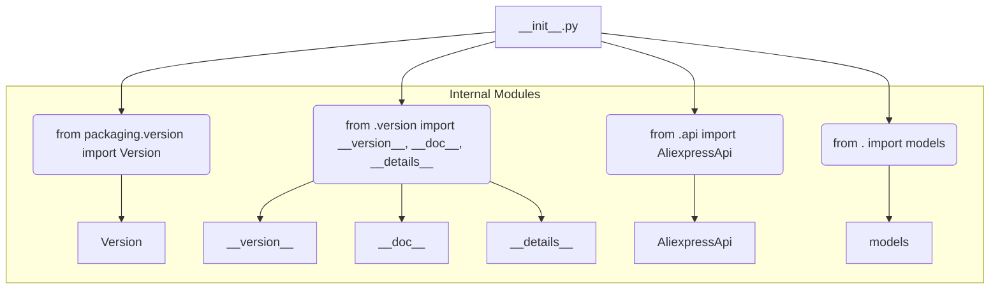

1. **<input code>**:

```python
## \file hypotez/src/suppliers/aliexpress/api/__init__.py
# -*- coding: utf-8 -*-\
#! venv/Scripts/python.exe # <- venv win
## ~~~~~~~~~~~~~\
""" module: src.suppliers.aliexpress.api """
""" Aliexpress API wrapper"""
...

...
from packaging.version import Version
from .version import __version__, __doc__, __details__  
from .api import AliexpressApi
from . import models
```

2. **<algorithm>**:



**Explanation:** This `__init__.py` file is a module initialization file for the `aliexpress` API within the `hypotez` project.  It's crucial for importing the necessary components and defining the module's interface to the rest of the application.

3. **<explanation>**:

* **Imports:**
    * `from packaging.version import Version`: Imports the `Version` class from the `packaging` library. This is likely used for version comparisons or handling semantic versioning of the API or the library itself.  The relationship is external to `src.`.
    * `from .version import __version__, __doc__, __details__`: Imports version information, documentation string, and other details specific to the Aliexpress API from an internal `version.py` file within the `aliexpress/api` package. This creates a modular structure for managing the API's metadata. The `.` indicates that the module is within the same package.
    * `from .api import AliexpressApi`: Imports the `AliexpressApi` class from the `api.py` module.  This class is likely the core class for interacting with the Aliexpress API. Again, the `.` imports from a module within the same package.
    * `from . import models`: Imports the `models` module. This module likely contains classes that represent data structures used in interacting with the Aliexpress API, defining a relationship with it. The `.` again indicates that this module is within the same package.
* **Classes (implied):**
    * `AliexpressApi`: This class is imported but not defined in this file. It would be defined in `api.py` and probably handles the interaction with the actual Aliexpress API (making requests, handling responses, etc.).  Its methods are external to this `__init__.py` file, but are used by the application through this file.
    * `models`:  `models` is a module; likely within it, are classes representing data from the Aliexpress API (e.g., `Order`, `Product`). These classes would hold the data that will be exchanged with the Aliexpress API.
* **Functions (implied):**
    * The code snippets with `...` indicate the presence of functions and/or methods that are not shown but would be contained in the files imported (e.g., in `AliexpressApi`, `models`).
* **Variables (implied):**
    * `__version__`, `__doc__`, `__details__`: These variables likely hold descriptive information about the Aliexpress API module, such as the version number, a documentation string, or detailed information about the functionality of this wrapper.
* **Potential Errors/Improvements:**
    * The `#! venv/Scripts/python.exe # <- venv win` comment suggests a Windows environment setup, using a virtual environment (`venv`). It's essential to keep this path correct for when the program runs and for running tests (e.g., `./venv/Scripts/python`).   
    * Missing documentation:  While the docstrings are present, a thorough documentation of the `AliexpressApi` class and the `models` would greatly enhance usability and maintainability.
    * Testing is crucial for any API wrapper.  Add assertions and tests to confirm correct functionality and handling of various API responses.

**Chain of Relationships:**

The `hypotez` project likely has a structure where `src.suppliers.aliexpress.api` is a package responsible for interacting with the Aliexpress API. The `models` module provides representations of data related to the Aliexpress API. The `AliexpressApi` class in `api.py` handles the actual communication with the Aliexpress API.  Other parts of `hypotez` (e.g., a business logic layer or a main application) would use the functions from this package.