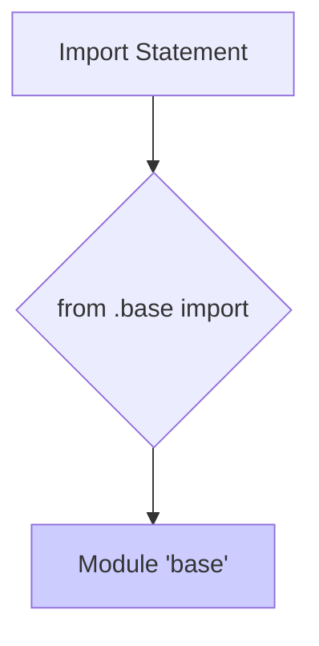

1. **<input code>**

```python
## \file hypotez/src/suppliers/aliexpress/api/_examples/iop/__init__.py
# -*- coding: utf-8 -*-\
#! venv/Scripts/python.exe # <- venv win
## ~~~~~~~~~~~~~\
""" module: src.suppliers.aliexpress.api._examples.iop """
from .base import 
```

2. **<algorithm>**



**Data Flow:** The `__init__.py` file imports classes and functions from the `base` module within the same directory. There's no data flow *within* this file; it's purely an import declaration.

3. **<explanation>**

* **Imports:** The code imports items from a module named `base` within the same directory (`./base`).  This is a standard Python approach for organizing related code into modules within a package structure. The `from .base import` statement imports everything (using `*`) from the `base` module. This is potentially problematic for larger projects, as it could lead to naming conflicts and unclear dependencies.  This module is likely part of a larger project structure within the `hypotez` project, under the `suppliers`, `aliexpress`, and `api` folders.  The `_examples` folder suggests this file holds example code for interacting with AliExpress's API.

* **Classes (implied):** The statement `from .base import *` imports all defined classes and functions from `base.py`.  Without seeing `base.py`, we can't describe specific classes, attributes, or methods. The code provided does not define any classes or functions in this file.

* **Functions (implied):** Similar to classes, the imported functions from `base.py` are not specified here.

* **Variables (implied):**  No variables are defined in the current file. Any variables used will reside in the `base.py` module.

* **Potential Errors/Improvements:** The use of `from .base import *` is a significant potential point of error. In larger projects, it obscures the precise dependencies and can lead to unintentionally overriding names from other modules. It makes debugging and understanding the code's behavior more difficult.  A better approach would be to explicitly import only the necessary parts from `base.py`, e.g., `from .base import MyClass, my_function`.


* **Relationship with other parts of the project:** This `__init__.py` file serves as an entry point to the `iop` subpackage within the `aliexpress` supplier module (likely part of a project focused on interacting with different e-commerce APIs, with various supplier interactions).  It depends heavily on the contents of `base.py` for its functionality.   This likely sits within a larger project structure focused on various suppliers' APIs, like Amazon, eBay, etc.