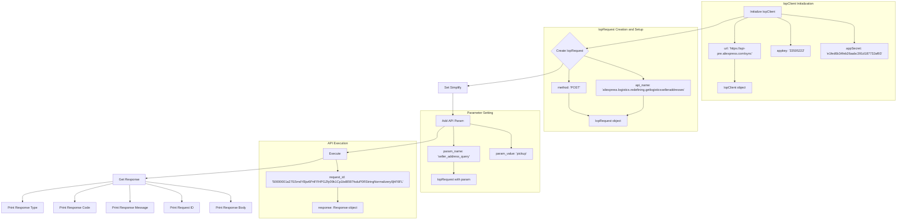

```
## <input code>
```python
## \file hypotez/src/suppliers/aliexpress/api/_examples/iop/test_get.py
# -*- coding: utf-8 -*-\
#! venv/Scripts/python.exe # <- venv win
## ~~~~~~~~~~~~~\
""" module: src.suppliers.aliexpress.api._examples.iop """

import iop

# params 1 : gateway url
# params 2 : appkey
# params 3 : appSecret
client = iop.IopClient('https://api-pre.aliexpress.com/sync', '33505222', 'e1fed6b34feb26aabc391d187732af93')

# create a api request set GET mehotd
# default http method is POST
request = iop.IopRequest('aliexpress.logistics.redefining.getlogisticsselleraddresses', 'POST')
request.set_simplify()
# simple type params ,Number ,String
request.add_api_param('seller_address_query', 'pickup')

response = client.execute(request, "50000001a27l15rndYBjw6PrtFFHPGZfy09k1Cp1bd8597fsduP0RStringNormalizery0jhF6FL")

# response type nil,ISP,ISV,SYSTEM
# nil ：no error
# ISP : API Service Provider Error
# ISV : API Request Client Error
# SYSTEM : Iop platform Error
print(response.type)

# response code, 0 is no error
print(response.code)

# response error message
print(response.message)

# response unique id
print(response.request_id)

# full response
print(response.body)
```

```
## <algorithm>
```


**Example:**  If the `seller_address_query` parameter had a different value like `"store"` , the `D` block would use that value in the API call. The `response` object will contain the result of the API call, including error information or the requested data.


```
## <explanation>
```

**1. Imports:**

*   `import iop`: This line imports the `iop` module, which likely contains classes and functions related to interacting with the AliExpress API. The `iop` module likely provides abstractions for API interactions, request/response handling, and common error types.  We need to look into the `iop` module's implementation to see if the structure is well organized, robust and scalable.

**2. Classes:**

*   **`IopClient`**: This class is used to interact with the AliExpress API.  The provided code instantiates an `IopClient` object with the API gateway URL, app key, and app secret.  This object likely manages the communication details, including API keys, and handles the transmission and reception of data.  It also likely handles error conditions. Further research would be required to determine the full extent of its functionalities (e.g., rate limiting, retries, error handling).

*   **`IopRequest`**: This class likely encapsulates details of the API request. The example code creates an `IopRequest` with the API endpoint name and method (POST in this case). It also has a `set_simplify()` method.  Understanding the function of this method will help understand the output and data structure of the response.  Also research error handling mechanisms of this object.

**3. Functions:**

*   **`client.execute(request, "50000000...")`**:  This is a method call of the `IopClient` object that takes the `IopRequest` object and an additional parameter. This function likely performs the HTTP request (POST in this case), handles the API call, and returns a `response` object. The additional parameter passed may be a request id or other relevant data for tracking and tracing.

**4. Variables:**

*   `client`: An instance of the `IopClient` class, containing API connection information.
*   `request`: An instance of the `IopRequest` class, containing the API request details.
*   `response`: An object containing the results of the API call, holding information about the request's success/failure.


**5. Potential Errors/Areas for Improvement:**

*   **Error Handling**: While the code prints response details, robust error handling would be beneficial.  The `response` object should be checked for error conditions (e.g., `response.code != 0`) before proceeding. This is necessary to avoid unexpected program behavior.
*   **Parameter Validation**: The `add_api_param`  method likely performs validation (checking data types) of the parameters. Verify that the validation logic is correct and thorough to ensure correct operation.
*   **Input Sanitization**: In case the `seller_address_query` parameter value comes from user input,  it should be sanitized to prevent potential security vulnerabilities (e.g., SQL injection or cross-site scripting).
*   **Logging**: Adding logging statements would provide valuable context during debugging and monitoring.


**Relationships with Other Project Parts:**

The code relies on the `iop` module which is a dependency.  The `iop` module and likely `aliexpress` module encapsulates the interactions with the API, handling authentication, and request/response management, thus decoupling this code from low-level network interactions. Understanding the overall architecture of the `iop` module is crucial to appreciate the code's place within the larger system.