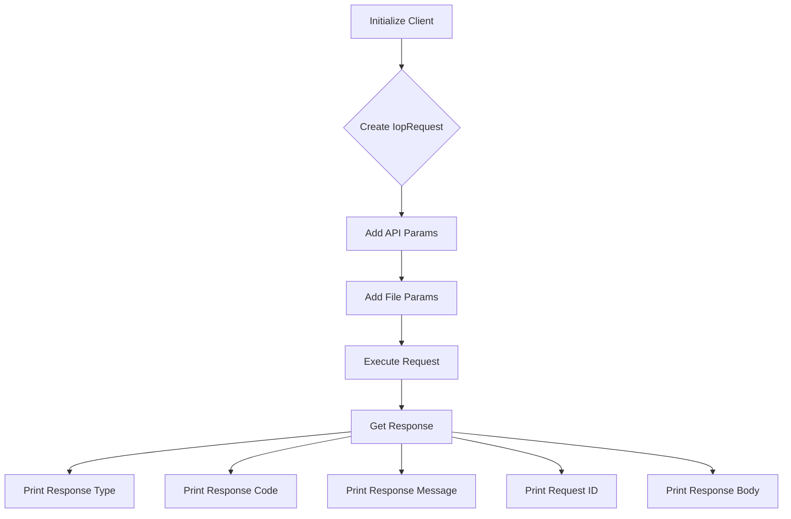

## <input code>
```python
## \file hypotez/src/suppliers/aliexpress/api/_examples/iop/test_upload.py
# -*- coding: utf-8 -*-
#! venv/Scripts/python.exe # <- venv win
## ~~~~~~~~~~~~~
""" module: src.suppliers.aliexpress.api._examples.iop """
# # -*- coding: utf-8 -*-
#
# import iop
#
# # params 1 : gateway url
# # params 2 : appkey
# # params 3 : appSecret
# client = iop.IopClient('https://api.taobao.tw/rest', '${appKey}', '${appSecret}')
#
# # create a api request
# request = iop.IopRequest('/xiaoxuan/mockfileupload')
#
# # simple type params ,Number ,String
# request.add_api_param('file_name','pom.xml')
#
# # file params, value should be file content
# request.add_file_param('file_bytes',open('/Users/xt/Documents/work/tasp/tasp/pom.xml').read())
#
# response = client.execute(request)
# #response = client.execute(request,access_token)
#
#
# # response type nil,ISP,ISV,SYSTEM
# # nil ：no error
# # ISP : API Service Provider Error
# # ISV : API Request Client Error
# # SYSTEM : Iop platform Error
# print(response.type)
#
# # response code, 0 is no error
# print(response.code)
#
# # response error message
# print(response.message)
#
# # response unique id
# print(response.request_id)
#
# # full response
# print(response.body)
#
```

```
## <algorithm>
```


**Example Data Flow:**

* **A[Initialize Client]:** `client = iop.IopClient('https://api.taobao.tw/rest', '${appKey}', '${appSecret}')` initializes an `IopClient` object with the API endpoint, app key, and app secret.  This creates a connection to the external service.
* **B{Create IopRequest}:** `request = iop.IopRequest('/xiaoxuan/mockfileupload')` creates an `IopRequest` object, defining the specific API endpoint for file upload.
* **C[Add API Params]:** `request.add_api_param('file_name','pom.xml')` adds a parameter for the file name.
* **D[Add File Params]:** `request.add_file_param('file_bytes',open('/Users/xt/Documents/work/tasp/tasp/pom.xml').read())` adds the file content as a parameter.  File content from the specified `pom.xml` is read and passed.
* **E[Execute Request]:** `response = client.execute(request)` sends the request to the API endpoint, and retrieves a `response` object containing the API's result.
* **F[Get Response]:**  The response contains attributes like `type`, `code`, `message`, `request_id`, and `body`.
* **G-K[Print Response Attributes]:** The script then prints the essential attributes of the response.

```
## <explanation>

**Imports:**

* `iop`: This is likely a custom module or package (`src.suppliers.aliexpress.api._examples.iop`) containing classes and functions for interacting with a specific API (presumably Alibaba's iop).  Its role is crucial for all the API interactions.

**Classes:**

* `IopClient`: This class likely manages the communication with the external API service.  It's likely to have methods like `execute()` for sending requests.  It takes the gateway URL, app key, and app secret as parameters during initialization.
* `IopRequest`: This class represents a request to the external API.  It likely has methods for adding parameters (both simple and file-based), allowing the construction of complex requests.  Critically, it creates a request object with all necessary information.

**Functions:**

* `IopClient.execute()`: This method takes an `IopRequest` object and an optional `access_token` as input and sends the request to the API.  It's crucial for initiating the API call. It returns the response object from the external service.

**Variables:**

* `client`: An instance of the `IopClient` class, representing the connection to the API.
* `request`: An instance of the `IopRequest` class, holding the details of the API request.
* `response`: Contains the results of the API call, including status codes, error messages, and the full response data.

**Potential Errors/Improvements:**

* **Hardcoded Paths:** The path to the `pom.xml` file (`/Users/xt/Documents/...`) is hardcoded. This makes the script non-portable.  It should use a more dynamic way to locate and handle file paths. For example, using a relative path or getting the filename from an argument.
* **Error Handling:**  The code lacks robust error handling. If the API call fails, the script might crash.  Adding `try...except` blocks around the `client.execute()` call would handle potential exceptions and give user feedback.
* **Security Considerations:** The use of `'${appKey}'` and `'${appSecret}'` as placeholders for API keys is insecure. Never hardcode sensitive information directly in your code.  Use environment variables or configuration files to store API keys securely.
* **Missing `access_token` handling:** The code comments mentions an `access_token` as optional parameter in `client.execute()`, but the code is not using it.

**Relationships:**

The `iop` module likely forms part of a larger project (`hypotez`) dealing with external API integrations.  It's likely part of a supplier API (`aliexpress`) and may communicate with other parts of `hypotez` to process the response or perform subsequent actions. This example only shows the API interaction; the downstream handling of the data is not included.