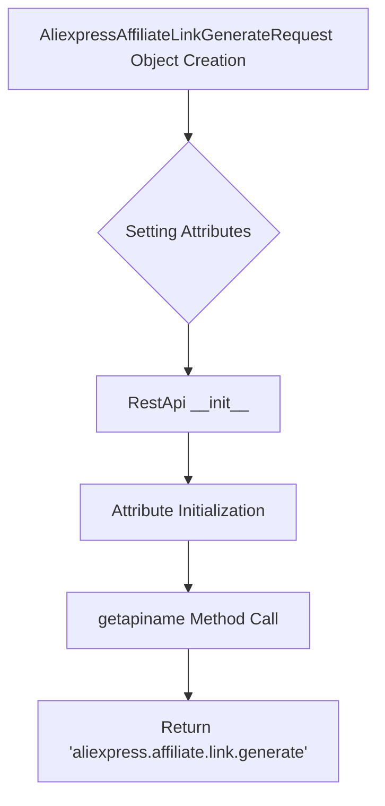

**1. <input code>**

```python
## \file hypotez/src/suppliers/aliexpress/api/_examples/rest/AliexpressAffiliateLinkGenerateRequest.py
# -*- coding: utf-8 -*-\n#! venv/Scripts/python.exe # <- venv win
## ~~~~~~~~~~~~~\n""" module: src.suppliers.aliexpress.api._examples.rest """
'''
Created by auto_sdk on 2020.03.09
'''
from ..base import RestApi
class AliexpressAffiliateLinkGenerateRequest(RestApi):
	def __init__(self, domain="api-sg.aliexpress.com", port=80):
		RestApi.__init__(self,domain, port)
		self.app_signature = None
		self.promotion_link_type = None
		self.source_values = None
		self.tracking_id = None

	def getapiname(self):
		return 'aliexpress.affiliate.link.generate'
```

**2. <algorithm>**



**Example:**

```python
# Example usage
request = AliexpressAffiliateLinkGenerateRequest(domain="api-sg.aliexpress.com", port=80)
request.app_signature = "my_app_signature"
request.promotion_link_type = "type_A"
api_name = request.getapiname()
print(api_name)  # Output: aliexpress.affiliate.link.generate
```

**3. <explanation>**

* **Imports:**
   - `from ..base import RestApi`: Imports the `RestApi` class from a parent directory (`../base`). This indicates a hierarchical structure in the project, where `AliexpressAffiliateLinkGenerateRequest` inherits from a base class responsible for general API interactions. The `..` part specifies moving up two directory levels in the file system.

* **Classes:**
   - `AliexpressAffiliateLinkGenerateRequest(RestApi)`: This class is likely a subclass of a more generic `RestApi` class (e.g. handling common API communication tasks). Its purpose is to encapsulate the specific details for generating affiliate links on AliExpress.

    - `__init__(self, domain="api-sg.aliexpress.com", port=80)`:  The constructor initializes the object with the AliExpress API domain and port. `RestApi.__init__(self, domain, port)` part calls the base class initialization method and probably sets up necessary connection parameters for communication.
    - `app_signature`, `promotion_link_type`, `source_values`, `tracking_id`: These are instance variables used to store data required for generating the affiliate link request. They are initialized to `None` in the constructor but need to be filled by external users of the class before using the API.  These attributes are crucial to the generation of the API request.

    - `getapiname(self)`: This method returns the API name (`'aliexpress.affiliate.link.generate'`) for the API call.  This is part of an API method naming scheme.  Crucial to generating the appropriate API request.

* **Functions:**
   -  No functions other than the method `getapiname` are present.

* **Variables:**
   - `domain`:  A string representing the domain of the AliExpress API (`api-sg.aliexpress.com`).
   - `port`:  An integer representing the port number (80).
    - `app_signature`, `promotion_link_type`, `source_values`, `tracking_id`: Instance variables used to store relevant values, critical for affiliate link generation.

* **Potential Errors/Improvements:**
    - **Missing API Logic:** The code doesn't actually implement the affiliate link generation logic itself.  `RestApi` class is likely responsible for sending the HTTP request to generate and retrieve the link given the inputs to the object (like `app_signature`).
    - **Parameter Validation:**  The code doesn't validate the inputs to `__init__` (e.g., whether `domain` is a valid URL) or the values of  `app_signature`, `promotion_link_type`, `source_values`, `tracking_id`. Adding validation would prevent unexpected behavior.
    - **Error Handling:** The code lacks error handling (e.g., connection errors, invalid API responses).  A try/except block in the caller would improve robustness.

* **Chain of Relationships:**
   - The `AliexpressAffiliateLinkGenerateRequest` class inherits from `RestApi`. `RestApi` class is likely responsible for making HTTP calls to the AliExpress API.

   - This class is part of the supplier module for AliExpress, making it a part of the overall project that connects to third-party API's to supply data.

   - The class is intended to be used to generate an affiliate link, indicating an overall project need to perform transactions with AliExpress' services.


This analysis provides a detailed understanding of the code's functionality, potential issues, and its role within the larger project structure. Remember to examine the `RestApi` class to understand the full implementation of the API communication.