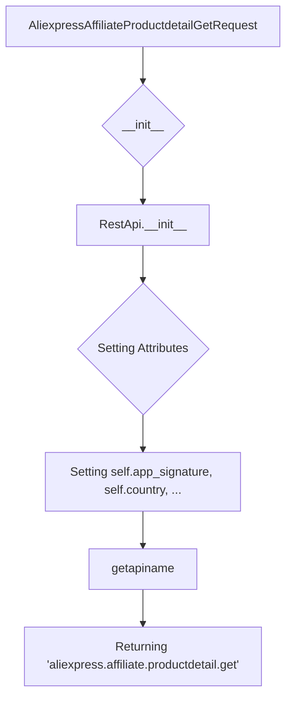

```
## <input code>
```python
## \file hypotez/src/suppliers/aliexpress/api/_examples/rest/AliexpressAffiliateProductdetailGetRequest.py
# -*- coding: utf-8 -*-\
#! venv/Scripts/python.exe # <- venv win
## ~~~~~~~~~~~~
""" module: src.suppliers.aliexpress.api._examples.rest """

'''
Created by auto_sdk on 2021.05.17
'''
from ..base import RestApi
class AliexpressAffiliateProductdetailGetRequest(RestApi):
	def __init__(self, domain="api-sg.aliexpress.com", port=80):
		RestApi.__init__(self,domain, port)
		self.app_signature = None
		self.country = None
		self.fields = None
		self.product_ids = None
		self.target_currency = None
		self.target_language = None
		self.tracking_id = None

	def getapiname(self):
		return 'aliexpress.affiliate.productdetail.get'
```

## <algorithm>



**Example Data Flow (for __init__):**

```
Input: domain = "api-sg.aliexpress.com", port = 80
Execution of RestApi.__init__:  (This is assumed to be a superclass method.  Further implementation details are hidden)
Execution of setting attributes:
    self.app_signature = None
    self.country = None
    self.fields = None
    self.product_ids = None
    self.target_currency = None
    self.target_language = None
    self.tracking_id = None

Output: An initialized AliexpressAffiliateProductdetailGetRequest object.
```

## <explanation>

**Imports:**

- `from ..base import RestApi`: This line imports the `RestApi` class from the `src.suppliers.aliexpress.api.base` module.  The `..` indicates a move up two directory levels in the package structure. This suggests a hierarchical design for the API, where `RestApi` provides a base implementation for making REST API requests. This is important for code reuse and organization.

**Classes:**

- `AliexpressAffiliateProductdetailGetRequest(RestApi)`: This class inherits from `RestApi`.  This is a common design pattern to create a specialized class building on a more general one.  It extends the functionality of `RestApi` specifically for AliExpress affiliate product detail requests.
    - `__init__(self, domain="api-sg.aliexpress.com", port=80)`:  The constructor initializes the object with default domain and port. Crucially, it calls the `RestApi`'s constructor (`RestApi.__init__(self, domain, port)`), delegating the base initialization tasks to the superclass.  This is a form of inheritance, making the code DRYer.
        - `self.app_signature`, `self.country`, etc.: These are instance variables (attributes) to hold parameters for the AliExpress affiliate product detail API call.  These variables will be set by external code, and are meant to be populated with specific data relevant to the request.
    - `getapiname(self)`: This method returns the API endpoint name ('aliexpress.affiliate.productdetail.get').  This is crucial for identifying the specific API call to be made.

**Functions:**

- There are no user-defined functions (other than the method `getapiname`) but `RestApi.__init__` is implicitly used.  Note that `__init__` is a special function in object-oriented programming that initializes an object.  Further details depend on the implementation of `RestApi` class, which is not provided.

**Variables:**

- `domain`, `port`: These are class variables (or possibly constants). They are set in the `__init__` method, and influence the API URL constructed in the `RestApi` class.
- `self.app_signature`, `self.country`, ...: These are instance variables storing parameters for the AliExpress affiliate API call.

**Potential Errors/Improvements:**

- **Missing Error Handling:** The code lacks error handling.  What happens if the API call fails?  The `RestApi` class should likely include mechanisms to handle errors (e.g., network issues, invalid responses).
- **Parameter Validation:** Input parameter validation is missing.  The class doesn't validate the inputs.  What if `product_ids` is empty or malformed?  Validation logic should be added to prevent unexpected behavior.
- **Documentation:** While the docstring is present, adding more detailed docstrings to methods would enhance readability.
- **Dependency on `RestApi`:** The `RestApi` class must be defined elsewhere.  The code assumes that class has been defined in the `hypotez/src/suppliers/aliexpress/api/_examples/rest/` folder (as indicated by the import).

**Relationships:**

This code is part of a larger project that utilizes the AliExpress affiliate API.  The `RestApi` class is likely part of a general API client library, enabling requests to various APIs.   The `AliexpressAffiliateProductdetailGetRequest` class is specialized to handle requests specific to product detail information from AliExpress.  The interaction with `RestApi` is likely focused on managing the request, while the specific implementation details for data handling will likely be in subsequent layers of the application (not shown in this snippet).