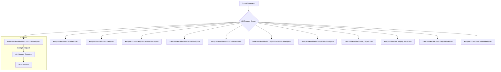

## <input code>
```python
## \file hypotez/src/suppliers/aliexpress/api/_examples/rest/__init__.py
# -*- coding: utf-8 -*-\
#! venv/Scripts/python.exe # <- venv win
## ~~~~~~~~~~~~~\
""" module: src.suppliers.aliexpress.api._examples.rest """
from .AliexpressAffiliateProductSmartmatchRequest import AliexpressAffiliateProductSmartmatchRequest
from .AliexpressAffiliateOrderGetRequest import AliexpressAffiliateOrderGetRequest
from .AliexpressAffiliateOrderListRequest import AliexpressAffiliateOrderListRequest
from .AliexpressAffiliateHotproductDownloadRequest import AliexpressAffiliateHotproductDownloadRequest
from .AliexpressAffiliateProductdetailGetRequest import AliexpressAffiliateProductdetailGetRequest
from .AliexpressAffiliateHotproductQueryRequest import AliexpressAffiliateHotproductQueryRequest
from .AliexpressAffiliateFeaturedpromoProductsGetRequest import AliexpressAffiliateFeaturedpromoProductsGetRequest
from .AliexpressAffiliateFeaturedpromoGetRequest import AliexpressAffiliateFeaturedpromoGetRequest
from .AliexpressAffiliateProductQueryRequest import AliexpressAffiliateProductQueryRequest
from .AliexpressAffiliateCategoryGetRequest import AliexpressAffiliateCategoryGetRequest
from .AliexpressAffiliateOrderListbyindexRequest import AliexpressAffiliateOrderListbyindexRequest
from .AliexpressAffiliateLinkGenerateRequest import AliexpressAffiliateLinkGenerateRequest
```

```
## <algorithm>


**Explanation:**

This Python file (`__init__.py`) appears to be a module that imports several other classes, presumably representing API requests for interacting with the AliExpress affiliate API. Each imported class (`AliexpressAffiliateProductSmartmatchRequest`, etc.) likely defines the structure and logic for making a particular type of API request (e.g., retrieving product details, generating affiliate links).


```
## <explanation>

### Imports:

The file imports several classes (more precisely, it imports *names* that are *defined* in several other `.py` files) residing in the same directory. This suggests a modular design. The `.` before the class names indicates that they are being imported from submodules within the current directory (`.`). This grouping makes the code organized, allowing each class to represent a specific API request type.

### Classes (implied):

The `from ... import ...` statements imply that in files within the `./` subdirectory, there are classes corresponding to each API request type.

These classes likely have methods to:

*   Set parameters for the request (e.g., product IDs, order IDs).
*   Construct the API request (e.g., format data, build URLs).
*   Send the API request.
*   Handle responses (parsing JSON data, error handling).

### Functions (implied):

No functions are explicitly defined in this file. However, the imported classes likely have functions for setting parameters, making requests, and processing responses.

### Variables (implied):

No variables are declared directly in this module. Variables related to API requests would be attributes of the imported classes.

### Potential Errors or Areas for Improvement:

*   **Error Handling:**  While the code imports the request classes, the process of handling errors during API requests (e.g., network issues, invalid responses) isn't shown. Robust error handling is crucial for real-world applications. Consider using `try...except` blocks in the functions (within the imported classes) to catch exceptions.


### Relationships with other parts of the project:


The project likely has other modules that use these API request classes.  For example, a part of the code likely makes calls to these API requests to gather data for presentation to a user, or integration with a different application. This `__init__.py` file acts as an entry point for utilizing these API capabilities.  The classes and functions contained within these other modules would communicate with this file to facilitate interactions with the AliExpress affiliate API.