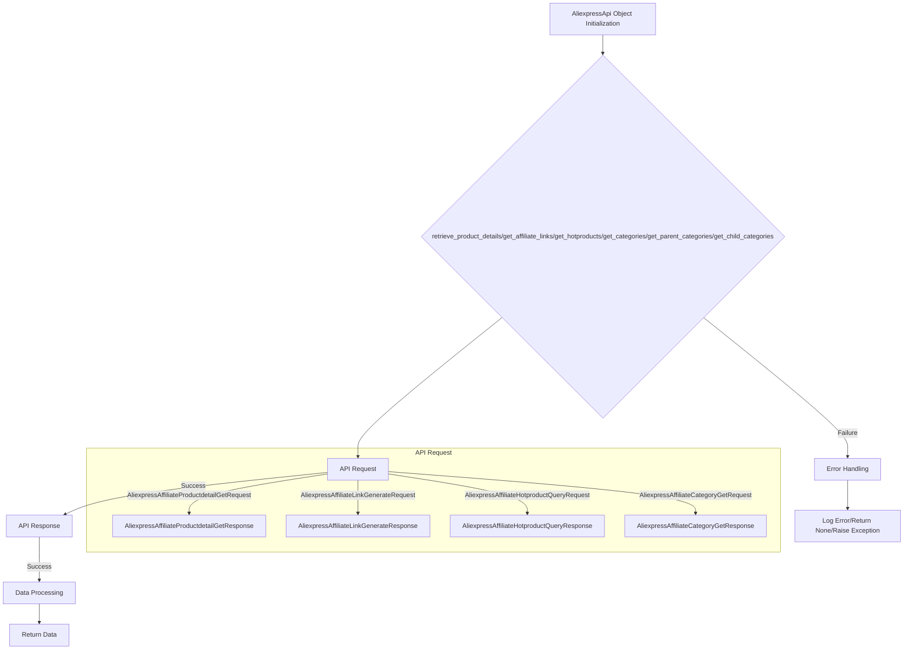

## File hypotez/src/suppliers/aliexpress/api/api.py
# -*- coding: utf-8 -*-\n#! venv/Scripts/python.exe # <- venv win\n## ~~~~~~~~~~~~~\n""" module: src.suppliers.aliexpress.api """\n""" AliExpress API wrapper for Python\n\nA simple Python wrapper for the AliExpress Open Platform API. This module allows\nto get product information and affiliate links from AliExpress using the official\nAPI in an easier way.\n"""
...
...
from typing import List, Union

from src.logger import logger
from src.utils import pprint

from .models import (
                    AffiliateLink as model_AffiliateLink,
                    Category as model_Category,
                    ChildCategory as model_ChildCategory,
                    Currency as model_Currency,
                    HotProductsResponse as model_HotProductsResponse,
                    Language as model_Language,
                    LinkType as model_LinkType,
                    Product as model_Product,
                    ProductType as model_ProductType,
                    SortBy as model_SortBy)

from .errors.exceptions import CategoriesNotFoudException
from .helpers.categories import filter_child_categories, filter_parent_categories
from .skd import setDefaultAppInfo
from .skd import api as aliapi
from .errors import ProductsNotFoudException, InvalidTrackingIdException
from .helpers import api_request, parse_products, get_list_as_string, get_product_ids


class AliexpressApi:
    """Provides methods to get information from AliExpress using your API credentials.

    @param key (str): Your API key.
    @param secret (str): Your API secret.
    @param language (str): Language code. Defaults to EN.
    @param currency (str): Currency code. Defaults to USD.
    @param tracking_id (str): The tracking id for link generator. Defaults to None.
    """

    def __init__(self,
        key: str,
        secret: str,
        language: model_Language,
        currency: model_Currency,
        tracking_id: str = None,
        app_signature: str = None,
        **kwargs):
        self._key = key
        self._secret = secret
        self._tracking_id = tracking_id
        self._language = language
        self._currency = currency
        self._app_signature = app_signature
        self.categories = None
        setDefaultAppInfo(self._key, self._secret)


    # ... (rest of the code)
```

```
<algorithm>
**Workflow Diagram:**



**Examples:**

* **Initialization (A):** `AliexpressApi(key="your_key", secret="your_secret", language=model_Language.EN, currency=model_Currency.USD)`
* **`retrieve_product_details` (B to F):** `api.retrieve_product_details(product_ids=["productID1", "productID2"])` -> Retrieves product details based on provided IDs.
* **`get_affiliate_links` (B to F):** `api.get_affiliate_links(links=["link1", "link2"])` -> Generates affiliate links for provided URLs.  Requires tracking_id.
* **Error Handling (G to H):** If the API request fails or returns an empty response (e.g., no products found), an error is logged (using `logger`) and an appropriate response (e.g., None, or a custom exception) is returned.

**Data Flow:**

The code receives inputs (e.g., product IDs, links) through the methods. These are processed using helper functions (e.g., `get_list_as_string`, `parse_products`) and converted into API requests. The API requests are sent, and the responses are parsed. The processed data is returned to the caller.  If an error occurs, an appropriate message is logged, and the exception is caught, or the function returns None.


</algorithm>
```

```
<explanation>

**Imports:**

* `from src.logger import logger`: Imports a logging module from a `src` package. This is likely used for handling logs.
* `from src.utils import pprint`: Imports utility functions (e.g., pretty printing) from a `src` package.
* `from .models import ...`: Imports models used to define the structure of the API data.  These are likely data classes or Pydantic models. (Crucial!)
* `from .errors.exceptions import ...`: Imports custom exceptions for handling errors during API calls.
* `from .helpers.categories import ...`: Imports functions for managing categories, likely filtering operations.
* `from .skd import setDefaultAppInfo, api as aliapi`: Imports functions from the `skd` package, probably for setting up API credentials (`setDefaultAppInfo`) and getting the `aliapi` module for interaction with the AliExpress API.
* `from .errors import ...`: Imports custom exceptions.
* `from .helpers import ...`: Imports utility functions.


**Classes:**

* `AliexpressApi`:  A class that wraps the AliExpress API.
    * `_key`, `_secret`: Private attributes to store API credentials.
    * `_tracking_id`, `_language`, `_currency`:  Private attributes holding critical parameters for the API.
    * `categories`: A cached list of categories (for efficiency).
    * `__init__`: Initializes the API object with credentials, language, and currency. Important: Sets the default app information with `setDefaultAppInfo()`.
    * `retrieve_product_details`, `get_affiliate_links`, `get_hotproducts`, `get_categories`, `get_parent_categories`, `get_child_categories`: Methods that handle interactions with the AliExpress API, calling `api_request` to perform the actual API calls.


**Functions:**

* `api_request`: Likely a function that handles the actual API request and response handling.  Crucial for error management!
* `parse_products`: Parses product information received from the API.
* `get_list_as_string`: Converts a list to a string, likely for API request parameterization.
* `get_product_ids`: likely takes a string or a list of strings and normalizes into a list of product IDs.


**Variables:**

* `product_ids`, `links`, `category_ids`: Variables holding input data for the API calls.
* `fields`, `country`, `link_type`, etc.: Variables controlling aspects of the API call.
* `request`: Instance of a request class from the `aliapi` module, holding parameters to be passed to the actual API call.


**Potential Errors/Improvements:**

* **Error Handling:**  While the code uses `try...except` blocks, it would be much more robust to catch *specific* exceptions (e.g., `ApiRequestException`, `ProductsNotFoundException`).  Returning `None` when no products are found is not optimal.  Raising meaningful exceptions helps debugging and using them in the calling functions.
* **`get_categories` & `self.categories`:** The code caches categories in `self.categories`. However, there's no mechanism to clear this cache if credentials change, leading to stale data in subsequent requests.
* **Data Validation:** Input validation (e.g., ensuring `product_ids` are valid IDs) could prevent unexpected behavior.
* **Logging:**  Using a structured logging library would make the logs more readable.  The current use is basic and could be significantly improved by using `logging` or a similar library.
* **Type Hints:**  Type hints are good, but consider if some values could be nullable. For example, `category_ids` could be `None`, but the code assumes a value.
* **Dependency Management:** The code assumes access to `aliapi` which needs to be defined or imported.
* **Code Organization:**  The code is organized well with the methods for each task.


**Relationship with Other Parts:**

The code interacts with `src.logger` (logging), `src.utils` (utilities), `.models` (API data models), `.errors` (custom exceptions), `.helpers` (helper functions), and `.skd` (AliExpress SDK), indicating a clear modular architecture.  The structure is organized to support API interaction.