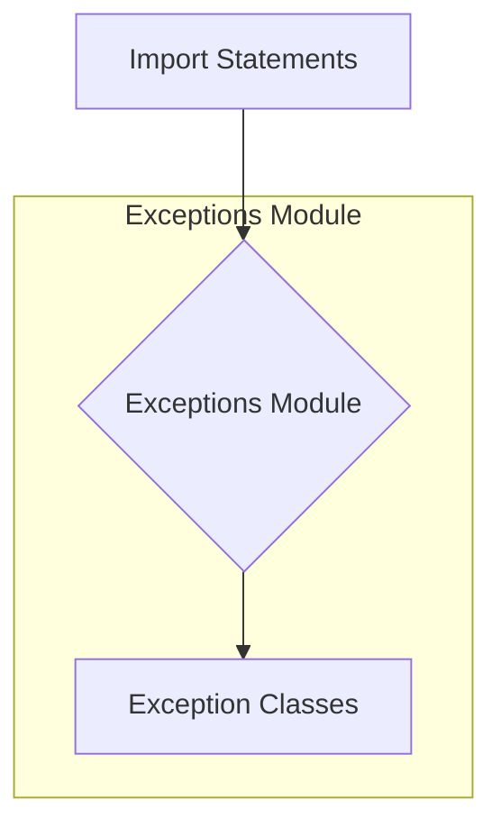

```## \file hypotez/src/suppliers/aliexpress/api/errors/__init__.py
# -*- coding: utf-8 -*-\n#! venv/Scripts/python.exe # <- venv win\n## ~~~~~~~~~~~~~\n""" module: src.suppliers.aliexpress.api.errors """\nfrom .exceptions import *\n
```

**<algorithm>**



**Example:**

This module likely imports exception classes defined in a file named `exceptions.py` within the same directory (`./exceptions.py`).  These exception classes are specific to the AliExpress API interactions.


**<explanation>**

* **Imports:**
    * `from .exceptions import *`: This line imports all names (classes, functions, etc.) defined in the `exceptions.py` file located in the same directory (`./exceptions.py`). The `.` prefix indicates a relative import, crucial for organizing modules in a package structure.  This imports all the custom exception classes which are probably subclasses of Python's built-in `Exception` class. This suggests a way to handle potential errors that can arise when working with the AliExpress API.


* **Classes (implied):**
    * The `*` in the import statement indicates that all classes defined in `exceptions.py` are being imported.  These classes likely represent specific error conditions when interacting with the AliExpress API.  For example, `AliExpressAPIError`, `InvalidCredentialsError`, `RequestTimeoutError`, etc. Each of these could have custom attributes (e.g., error codes, detailed messages) and methods that aid in handling and reporting the errors.

* **Functions (implied):**
    * No functions are explicitly defined in this file.  Functions handling API interactions would likely reside in other files within the `aliexpress/api` folder, and would invoke these custom exception classes when errors are encountered.

* **Variables (implied):**
    * No variables are defined in this file.

* **Relationships:**
    * This module is part of a larger project (`hypotez`) focused on interacting with various suppliers' APIs.  The specific API interaction logic would be in other files (e.g., `aliexpress/api/client.py` or `aliexpress/api/requests.py`).  Whenever errors occur during the interactions, this file provides specific `Exception` classes to better diagnose the problem.


* **Potential Errors/Improvements:**
    * **Lack of specific error handling:** The code only imports errors, it doesn't implement any specific error handling logic itself. This error handling would likely be handled in the functions that use the API client (e.g., to determine how to respond to different kinds of errors).
    * **Docstrings:** Adding docstrings to the exception classes in `exceptions.py` will enhance usability and understanding of error conditions.
    * **Import Efficiency:** Importing specific classes instead of `*` would be more efficient, keeping the namespace tidy. This will aid in maintaining the codebase in the future when multiple API sources are added.

**Chain of Relationships:**

The `hypotez` project interacts with the AliExpress API; the `aliexpress/api` module handles interactions; `aliexpress/api/errors` module defines custom exception classes that are used to report the issues that may occur when dealing with API requests and responses.  This hierarchy facilitates structuring and handling errors within a comprehensive, module-based structure. The chain of execution flows from the functions within `aliexpress/api`, which would call the relevant API resources, and, if an error is encountered, these functions may raise exceptions handled by the calling methods within the `aliexpress/api` modules, which would allow for robust error propagation to other parts of the `hypotez` application.