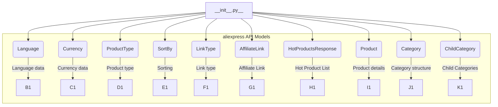

1. **<input code>**

```python
## \file hypotez/src/suppliers/aliexpress/api/models/__init__.py
# -*- coding: utf-8 -*-\
#! venv/Scripts/python.exe # <- venv win
## ~~~~~~~~~~~~~\
""" module: src.suppliers.aliexpress.api.models """
from .languages import Language
from .currencies import Currency
from .request_parameters import ProductType, SortBy, LinkType
from .affiliate_link import AffiliateLink
from .hotproducts import HotProductsResponse
from .product import Product
from .category import Category, ChildCategory
```

2. **<algorithm>**



This code acts as a module initializer. It imports various modules (or classes defined within modules) related to AliExpress API models. The algorithm is a single-step process of importing necessary components.


3. **<explanation>**

* **Imports:** The code imports modules from subdirectories within the `src.suppliers.aliexpress.api.models` directory.  This suggests a package-based project structure for organizing and maintaining code related to data models and types for interacting with the AliExpress API.

    * `Language`, `Currency`, `ProductType`, `SortBy`, `LinkType`, `AffiliateLink`, `HotProductsResponse`, `Product`, `Category`, `ChildCategory`: These are likely classes or constants representing data structures and enums used for handling various aspects of AliExpress data.  The `.` before the import names indicates these modules likely reside in subdirectories (e.g., `languages.py`, `currencies.py`, etc.) within the same level of the current directory. This promotes modularity and organization.

* **Classes (implied):**  The import statements indicate the existence of classes like `Language`, `Currency`, `ProductType`, `SortBy`, `LinkType`, etc. within respective `.py` files. These classes likely define attributes (data members) and methods (functions) for handling and representing the data corresponding to their respective concepts (e.g., different language codes, currency symbols, product types, sorting criteria).  Without the `.py` files themselves, the full class structures are unknown.


* **Functions (implied):** No functions are defined directly within this `__init__.py` file.  However, the imported classes likely have methods used for interacting with and manipulating the data.

* **Variables (implied):**  Import statements do not define variables directly. Variables are likely defined inside the imported modules (`languages.py`, `currencies.py`, etc.), representing things like language codes, currency codes, or enum values.

* **Potential Errors/Improvements:**

    * **Docstrings:**  While there's a docstring for the module, it would be beneficial to include detailed docstrings for each imported class to explain their purpose, attributes, and methods.
    * **Type Hinting:** Using type hints (e.g., `from typing import List`) would improve the readability and maintainability of these classes, especially as the project grows. Type hints will help static analysis tools to better understand and validate the code.


* **Relationship Chain:** This file's purpose is to provide access points for other modules in the project, probably `aliexpress_api.py` (or similar), that need to interact with AliExpress API data by working with these data models.  The classes defined in the imported modules are likely used elsewhere in the `hypotez` project to parse, manipulate, or transmit data to/from the AliExpress API.


In summary, this `__init__.py` file serves as an entry point for accessing various data models related to AliExpress APIs in a well-organized project structure, encouraging code reuse and modularity. The detailed models and their interactions are present in the imported sub-modules.