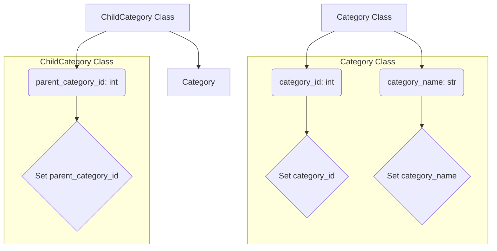

1. **<input code>**

```python
## \file hypotez/src/suppliers/aliexpress/api/models/category.py
# -*- coding: utf-8 -*-
#! venv/Scripts/python.exe # <- venv win
## ~~~~~~~~~~~~
""" module: src.suppliers.aliexpress.api.models """
class Category:
    category_id: int
    category_name: str


class ChildCategory(Category):
    parent_category_id: int
```

2. **<algorithm>**



**Example Data Flow:**

*   A `Category` object might be instantiated with `category_id = 123` and `category_name = "Electronics"`.
*   A `ChildCategory` object might inherit from this `Category` and be instantiated with `category_id = 456`, `category_name = "Smartphones"`, and `parent_category_id = 123`.


3. **<explanation>**

*   **Imports:** There are no `import` statements. This file defines classes for representing categories and child categories within the AliExpress API.

*   **Classes:**
    *   **`Category`:** This class represents a general category. It has two attributes:
        *   `category_id`: An integer representing the unique identifier of the category.
        *   `category_name`: A string representing the name of the category.
    *   **`ChildCategory`:** This class inherits from `Category`, adding a new attribute:
        *   `parent_category_id`: An integer representing the ID of the parent category this child category belongs to.  This shows a hierarchical relationship between categories.

*   **Functions:** There are no functions defined.  The code only defines classes and their attributes.

*   **Variables:**
    *   `category_id`, `category_name`, and `parent_category_id` are attributes of the respective classes. Their types are explicitly declared using type hints (e.g., `category_id: int`). These are used to store data associated with categories.

*   **Potential Errors/Improvements:**
    *   **Missing constructor:** The `Category` and `ChildCategory` classes lack constructors (e.g., `__init__`).  This means you'll have to create `Category` objects like this: `cat1 = Category(123, "Electronics")`.  Adding the constructor is good practice.
    *   **Validation:**  While type hints are good, there's no validation to ensure `category_id` and `parent_category_id` are valid integers.  Adding checks to ensure they are positive integers is a good idea.
    *   **Missing `__repr__` and `__str__` methods:** It would be beneficial to add `__repr__` and `__str__` methods to these classes.  This allows for a more informative output when a `Category` or `ChildCategory` object is printed or used in debugging.

*   **Relationship to other parts of the project:** This module, `hypotez/src/suppliers/aliexpress/api/models/category.py`, is likely part of a larger project for interacting with the AliExpress API.  It defines data structures for representing category information. Other parts of the project would likely use these classes to interact with the API to fetch, create, and update category information.  The `src.` prefix indicates a package structure, and the context of the full project would reveal how `aliexpress.api.models` would be used. For example, controllers or services might utilize these models to handle business logic related to AliExpress categories.


**Example using improved class structure:**


```python
class Category:
    def __init__(self, category_id, category_name):
        self.category_id = category_id
        self.category_name = category_name

class ChildCategory(Category):
    def __init__(self, category_id, category_name, parent_category_id):
        super().__init__(category_id, category_name)
        self.parent_category_id = parent_category_id
```