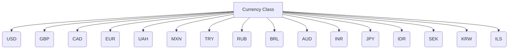

1. **<input code>**

```python
## \file hypotez/src/suppliers/aliexpress/api/models/currencies.py
# -*- coding: utf-8 -*-\n#! venv/Scripts/python.exe # <- venv win
## ~~~~~~~~~~~~~\n""" module: src.suppliers.aliexpress.api.models """
class Currency:
    USD = 'USD'
    GBP = 'GBP'
    CAD = 'CAD'
    EUR = 'EUR'
    UAH = 'UAH'
    MXN = 'MXN'
    TRY = 'TRY'
    RUB = 'RUB'
    BRL = 'BRL'
    AUD = 'AUD'
    INR = 'INR'
    JPY = 'JPY'
    IDR = 'IDR'
    SEK = 'SEK'
    KRW = 'KRW'
    ILS = 'ILS'
```

2. **<algorithm>**



This is a simple class definition.  There's no algorithm in the traditional sense as it's just defining constants.


3. **<explanation>**

* **Imports:** There are no imports. This file defines a class and its constant members.

* **Classes:**
    * **`Currency`:** This class defines a set of constants representing different currency codes (e.g., 'USD', 'EUR').  These are class-level variables, not instance variables.  This is a common approach for defining a set of possible values, frequently used for input validation or data consistency.  The class does not include any methods.  It essentially acts as an enumeration.


* **Functions:** There are no functions in this file.

* **Variables:**
    * All the variables `USD`, `GBP`, etc., are string literals representing currency codes. They are essentially named constants, belonging to the `Currency` class.

* **Potential Errors/Improvements:**
    * **Immutability:** The `Currency` class is good as constants in terms of data integrity.  No accidental modification is possible.

    * **Type Hinting:**  Consider adding type hints for better code readability and maintainability. For example `USD: str = 'USD'`  or creating an `enum` for a more robust type of constant.

    * **Docstrings:** Adding docstrings to the class would improve readability, showing the purpose of the `Currency` class, and what its variables represent.


* **Relationships with other parts of the project:** This file likely serves as a model for handling currency information in the `aliexpress` supplier API. It's likely used elsewhere in the `hypotez` project to define and validate currency values for transactions or other data related to AliExpress products.  For instance, later functions may call this class to verify an input currency string, or use this set as a reference for a database.  Without more context, further relationships are speculative.


**In summary:** This file defines a simple, well-suited class for storing currency codes within a larger project. It's easy to understand and maintain, which is key to the code's overall efficiency and usefulness for input validation and data management.  The constant nature of the values (strings representing currencies) is good for reliability. The lack of dynamic behavior is expected in a definition of a set of possible values.