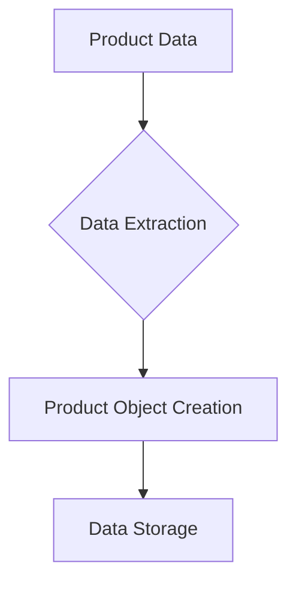

## <input code>
```python
## \file hypotez/src/suppliers/aliexpress/api/models/product.py
# -*- coding: utf-8 -*-\
#! venv/Scripts/python.exe # <- venv win
## ~~~~~~~~~~~~~\
""" module: src.suppliers.aliexpress.api.models """
from typing import List


class Product:
    app_sale_price: str
    app_sale_price_currency: str
    commission_rate: str
    discount: str
    evaluate_rate: str
    first_level_category_id: int
    first_level_category_name: str
    lastest_volume: int
    hot_product_commission_rate: str
    lastest_volume: int
    original_price: str
    original_price_currency: str
    product_detail_url: str
    product_id: int
    product_main_image_url: str
    product_small_image_urls: List[str]
    product_title: str
    product_video_url: str
    promotion_link: str
    relevant_market_commission_rate: str
    sale_price: str
    sale_price_currency: str
    second_level_category_id: int
    second_level_category_name: str
    shop_id: int
    shop_url: str
    target_app_sale_price: str
    target_app_sale_price_currency: str
    target_original_price: str
    target_original_price_currency: str
    target_sale_price: str
    target_sale_price_currency: str
```

## <algorithm>



* **Data Extraction (B):**  Extracted data from an AliExpress API likely containing product information (e.g., using a library like `requests`). This step involves parsing the API response and extracting the relevant details.  Example: `aliexpress_api.get_product_details(product_id)` returns a dictionary of data.

* **Product Object Creation (C):** Creates instances of the `Product` class, populating attributes with the data extracted in step (B). This step involves mapping the extracted data to the corresponding attributes of the `Product` class. Example: `product_data = aliexpress_api.get_product_details(product_id)`  `product = Product(**product_data)`

* **Data Storage (D):** The populated `Product` object is likely stored in a database (e.g., PostgreSQL) or a data structure for further processing or analysis.  Example: `database.insert_product(product)`


## <explanation>

**Imports:**

* `from typing import List`: This import statement is used to specify the type hinting for the `product_small_image_urls` attribute in the `Product` class.  It's a standard Python import for type hints.  This improves code readability, maintainability, and enables static analysis.  It is not directly related to any specific `src.` package.

**Classes:**

* **`Product`:** This class represents a product from AliExpress.  Its primary role is to encapsulate data related to a single product.

    * **Attributes:** The class defines numerous attributes (e.g., `app_sale_price`, `product_title`, `shop_id`) to store various product details. All attributes are typed as `str`, `int`, or `List[str]`, reflecting the data types of the corresponding information.  Critically, the `List[str]` type for `product_small_image_urls` clearly indicates that this attribute holds a list of strings. The redundancy of the `lastest_volume` attribute is suspicious; there should be only one variable.


    * **Methods (absent):**  The class currently does not define any methods.  Adding methods like `get_price_in_currency(currency)` would allow more complex data manipulations or retrieval without modifying the original data.

**Functions (absent):** There are no functions defined in this code snippet.

**Variables (absent):** There are no global variables.

**Potential Errors/Improvements:**

* **Redundant `lastest_volume`:** The attribute `lastest_volume` is declared twice, which is a potential bug.  This needs to be corrected to a single definition.


* **Data Validation:** The code lacks data validation (e.g., checking for null values, or correct formatting for numeric values).  Adding validation to ensure the data has the expected type and format could prevent errors later on.


* **Type Hinting Completeness:**  The type hints are good but could be more complete. The attributes' types could be more specific (e.g. `float` or `Decimal` for monetary values).


* **Missing `__init__` method:** A `__init__` method is missing.  It's essential for object initialization and setting the initial values of attributes to prevent unexpected behavior.


* **Relationships with other parts of the project:** This `Product` model is part of a larger system dealing with suppliers' data, likely needing to integrate with data persistence (database interaction). It represents a particular product and is used to retrieve, manage, and store data related to an individual AliExpress product. The relationship is with the database to store the products and potentially the APIs to retrieve the initial product data.


**Chain of Relationships:**

1.  `aliexpress_api` (external library) ->  `Product` data (this code)
2. `Product` -> database (to be used by another part of the system).

This code snippet lays the foundation for a data model for AliExpress products. It's crucial to expand it with methods, a constructor, and error handling to build a robust class.  The missing `__init__` method and data validation are especially important to ensure data integrity.