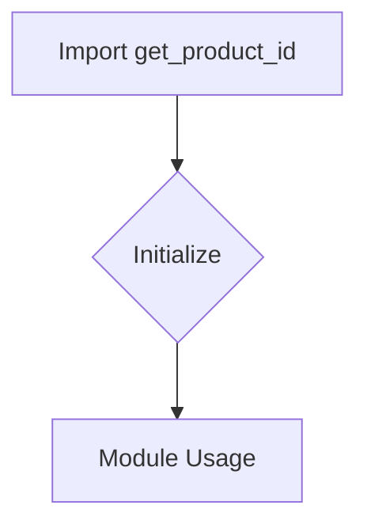

```
## <input code>
```python
## \file hypotez/src/suppliers/aliexpress/api/tools/__init__.py
# -*- coding: utf-8 -*-\
#! venv/Scripts/python.exe # <- venv win
## ~~~~~~~~~~~~~\
""" module: src.suppliers.aliexpress.api.tools """
from .get_product_id import get_product_id
```

## <algorithm>



**Explanation of Blocks:**

* **Import `get_product_id`:**  This step imports the `get_product_id` function from the `get_product_id.py` file within the `src.suppliers.aliexpress.api.tools` subdirectory.

* **Initialize:** No explicit initialization takes place in this module. It simply imports the function.

* **Module Usage:**  The `get_product_id` function is available for use in other modules or scripts that import this `__init__.py` file.


**Data Flow Examples (Conceptual):**

1.  A client code imports `src.suppliers.aliexpress.api.tools`.
2.  The client code then calls the `get_product_id` function, potentially passing arguments (e.g., product URLs) relevant to fetching a product ID from AliExpress.
3.  The `get_product_id` function, defined in `get_product_id.py`, will handle the actual API interaction with AliExpress.
4.  The `get_product_id` function returns the product ID to the client code.


## <explanation>

**Imports:**

* `from .get_product_id import get_product_id`: This line imports the `get_product_id` function from the `get_product_id` module. The `.` indicates that the module being imported is located within the same package as this `__init__.py`. This is standard Python practice for organizing code into modules and packages.

**Classes:**

* There are no classes defined in this `__init__.py` file.

**Functions:**

* There are no functions defined in this `__init__.py` file, just an import statement. The `get_product_id` function is defined and used in another Python file, `get_product_id.py`.


**Variables:**

* There are no variables defined in this file.


**Potential Errors/Areas for Improvement:**

* **Missing Docstrings:** While the `""" module: src.suppliers.aliexpress.api.tools """` docstring is present, it does not document the functionality of the file.  It would be beneficial to add a docstring for the `__init__.py` file that describes what modules/functions are exposed by this package.

* **Missing `get_product_id.py` analysis:** This analysis only covers the `__init__.py` file. A follow-up analysis of the `get_product_id.py` file would be required for a comprehensive understanding of the entire toolset.


**Relationship to Other Parts of the Project:**

* This `__init__.py` file acts as an entry point for interacting with the AliExpress API-related functionalities within the `hypotez` project.  Other parts of the project (e.g., potentially scraper modules or the main application script) would import this `__init__.py` file in order to access the functions for fetching product IDs.


**In Summary:**

This `__init__.py` file serves as a module initializer for the AliExpress API tools.  Its sole purpose is to make the `get_product_id` function available for use in other parts of the project.  A more detailed analysis is needed to understand the actual implementation of `get_product_id` to complete the picture. The `#! venv/Scripts/python.exe # <- venv win` line is a shebang, specifying the interpreter to use for the Python script.  This is common in Windows environments to ensure proper execution with virtual environments.