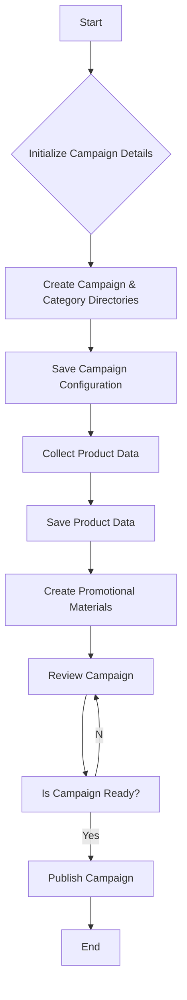

1. <input code>
```
<pre>
+-------------------------+
| Start                   |
| Создание рекламной      |
| кампании                |
+-----------+-------------+
            |
            v
+-----------+---------------+
| Initialize Campaign Name, |
| Language, and Currency    |
+-----------+---------------+
            |
            v
+-----------+-------------+
| Create Campaign and     |
| Category Directories    |
+-----------+-------------+
            |
            v
+-----------+-----------------
| Save Campaign Configuration |
+-----------+-----------------
            |
            v
+-----------+-------------+
| Collect Product Data    |
+-----------+-------------+
            |
            v
+-----------+-------------+
| Save Product Data       |
+-----------+-------------+
            |
            v
+-----------+------------------+
| Create Promotional Materials |
+-----------+------------------+
            |
            v
+-----------+-------------+
| Review Campaign         |
+-----------+-------------+
            |
            v
+-----------+-------------+
| Is Campaign Ready?      |
+-----------+-------------+
   | Yes / No
   v      v
+-----------+-------------+
| Publish Campaign        |
+-----------+-------------+
   |
   v
+-----------+-------------+
| End                     |
| Создание рекламной      |
| кампании                |
+-------------------------+
</pre>
```

2. <algorithm>



**Example Data Flow:**

* **B (Initialize Campaign Details):**  Input: "Campaign Name: Summer Sale", "Language: English", "Currency: USD". Output:  Campaign object initialized with these attributes.
* **C (Create Campaign & Category Directories):** Input: Campaign object. Output: Campaign & category directory structures created in the filesystem/database.
* **D (Save Campaign Configuration):** Input: Campaign object. Output: Saved campaign configuration to database/file.
* **E (Collect Product Data):** Input: List of product IDs, API Key, filters. Output: Product data fetched from AliExpress API.
* **F (Save Product Data):** Input: Product data. Output: Product data stored in database/file.
* **G (Create Promotional Materials):** Input: Campaign object, product data. Output: Promotional materials (banners, descriptions) generated.
* **I (Is Campaign Ready?):** Input: Review of campaign components. Output: "Yes" or "No".
* **J (Publish Campaign):** Input: "Yes" from Is Campaign Ready?. Output: The campaign is deployed/published on the platform.


3. <explanation>

**Imports:**  No imports are shown in the code snippet.  The pseudocode likely uses functions and libraries from other parts of the `hypotez` project.  It should import the necessary APIs for interacting with the AliExpress platform, potentially libraries for creating/managing directories, and databases.

**Classes:** No specific classes are defined.  The code appears to be a high-level algorithm, describing an object-oriented approach implied rather than explicitly stated.  Objects (like `Campaign`, `Product`) will likely be implemented elsewhere in the project for managing the campaign, products, and related objects.  A `Campaign` class would have methods such as `setName()`, `setCurrency()`, `addProduct()`.

**Functions:** The pseudocode outlines the sequence of functions, but doesn't show function signatures or implementation details. For instance, `Initialize Campaign Details` could be a function receiving campaign parameters and creating an object, or a series of actions within a class.  `Collect Product Data` describes an API call.

**Variables:** Campaign name, language, currency, product data are variables used in the algorithm.  These variables should have appropriate types and are likely to be attributes of the `Campaign` and `Product` objects.

**Potential Errors/Improvements:**

* **Error Handling:** The algorithm lacks error handling.  If data collection fails, the campaign might not be saved/published.  Error handling (e.g., checking API responses, handling invalid inputs) should be implemented within functions.  Log files are vital to record such failures.
* **Validation:** The algorithm lacks input validation steps.  Ensure campaign details and product data are valid to prevent invalid data being used.  This is critical for the quality of the published campaign.
* **Scalability:** The approach for product data collection may not scale well if the volume is extremely high. Consider pagination or asynchronous operations to manage potentially huge datasets.
* **Dependency Injection:** Consider using dependency injection to manage the external services. This will make the code more testable and maintainable.
* **Clearer Separation of Concerns:** The pseudocode doesn't clearly delineate the different layers (e.g. data access, business logic, presentation layer). A structured approach with clear separation would be beneficial.


**Relationships with other parts of the project:**

The `aliexpress` package would interact with other packages in the `src` directory, especially for:

* **Data persistence**: Potentially an `src.database` package or functions to handle data storage.
* **AliExpress API interaction**: A package in the `src.apis` directory handling the communication protocol.
* **Promotional material generation**: A package handling the specific logic for creating the promotional materials (banners, etc).
* **Campaign configuration**: A package in the `src.config` folder to handle file/database configuration related to AliExpress campaigns.

This algorithm provides a good starting point, but needs refinement and implementation details to become a usable campaign creation process within the `hypotez` project.