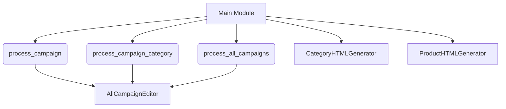

## <input code>
```python
## \file hypotez/src/suppliers/aliexpress/campaign/__init__.py
# -*- coding: utf-8 -*-
#! venv/Scripts/python.exe
#! venv/bin/python/python3.12

"""
.. module: src.suppliers.aliexpress.campaign 
	:platform: Windows, Unix
	:synopsis:модули управления рекламной кампанией Aliexpress

"""
MODE = 'dev'


from .ali_campaign_editor import AliCampaignEditor
#from .gsheet import AliCampaignGoogleSheet
from .prepare_campaigns import  process_campaign, process_campaign_category, process_all_campaigns
#from .ali_campaign_editor_jupyter_widgets import JupyterCampaignEditorWidgets
from .html_generators import CategoryHTMLGenerator, ProductHTMLGenerator
```

```
## <algorithm>



**Explanation:**

The `__init__.py` file serves as a module initializer for the `aliexpress/campaign` subpackage. It imports essential classes and functions from submodules within the same package to facilitate organization and reuse.  The workflow involves these key steps:

* **Initialization:** The `__init__.py` file initializes the `MODE` variable (likely for development/production configurations).
* **Importation:** It imports necessary classes and functions, making them accessible within this package.
* **Campaign Processing:**  `process_campaign`, `process_campaign_category`, and `process_all_campaigns` likely handle different stages of campaign management (creating, editing, summarizing campaigns). Data flows through these functions to ultimately leverage the `AliCampaignEditor` to make changes to campaigns and/or perform actions on campaigns, then the generated HTML (for presentation/report generation) is created by `CategoryHTMLGenerator` and `ProductHTMLGenerator`.
* **Editor Usage:** Data are used/manipulated by `AliCampaignEditor`, potentially including campaign details, targets, and settings.


```
## <explanation>

**Imports:**

- `from .ali_campaign_editor import AliCampaignEditor`: Imports the `AliCampaignEditor` class from the `ali_campaign_editor.py` module within the same directory. This class likely handles interaction with the Aliexpress campaign management API or a local data store.  The `.` indicates a relative import, referencing a module within the same package.
- `from .prepare_campaigns import process_campaign, process_campaign_category, process_all_campaigns`: Imports functions from the `prepare_campaigns.py` module. These functions likely handle the bulk of the campaign-related processing logic.
- `from .html_generators import CategoryHTMLGenerator, ProductHTMLGenerator`: Imports classes used for generating HTML output for campaign data (e.g., category lists, individual product information).


**Classes:**

- `AliCampaignEditor`:  Handles the interaction with the Aliexpress campaign management system.  Its methods likely involve setting up campaigns, updating data, and checking for errors.


**Functions:**

- `process_campaign`, `process_campaign_category`, `process_all_campaigns`: These are likely functions to fetch, prepare, and process Aliexpress campaign data.  Without further context, it's difficult to provide concrete examples of their usage. They are likely to take campaign data as input and modify it using the `AliCampaignEditor`.

**Variables:**

- `MODE`: This variable is likely a string that controls the behavior of the code in different modes (e.g., development mode, production mode).


**Potential Errors/Improvements:**

- **Missing `AliCampaignGoogleSheet` and `JupyterCampaignEditorWidgets` imports:**  The commented-out imports suggest that the codebase intended to integrate with Google Sheets and Jupyter widgets for interactive campaign editing but currently doesn't.
- **Error Handling:** The code lacks clear error handling.   When working with external APIs or files, including `try...except` blocks to handle potential exceptions (e.g., network issues, file not found) is crucial.
- **Docstrings:** While the module-level docstring is good, consider adding docstrings to functions and classes to clarify their purpose, arguments, and return values.
- **Data Validation:**  Consider data validation to ensure the integrity of the input data to prevent unexpected behavior or crashes.


**Relationship with other parts of the project:**

The `aliexpress/campaign` package likely interacts with other parts of the project, such as data providers, reporting modules, and potentially user interfaces. The `AliCampaignEditor` is the central point for interacting with the Aliexpress campaign management system, and the various processing functions utilize its features.  The `html_generators` module probably generates data for presentation, which might be used by a dashboard or reporting component. The `prepare_campaigns` functions likely connect to data sources (potentially databases) to get information about campaigns, categories, and products.