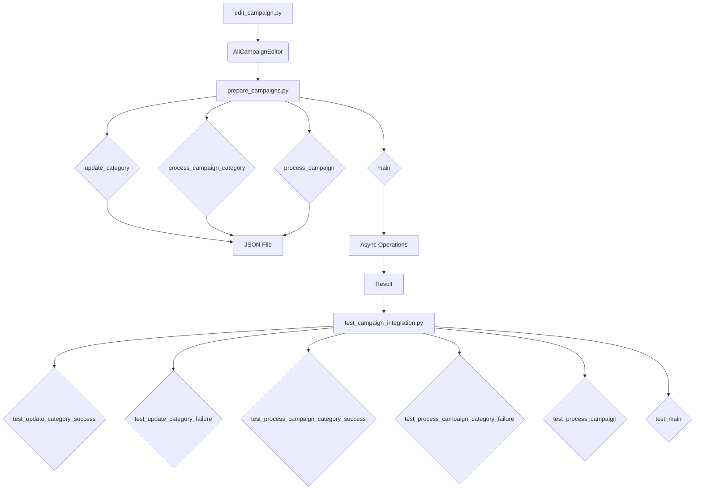

### Руководство для Тестера

#### Введение
Данный документ предназначен для тестеров, которые будут проверять модуль, отвечающий за подготовку материалов для рекламных кампаний на платформе AliExpress. Модуль включает в себя три основных файла:

1. `edit_campaign.py` - управление рекламной кампанией.
2. `prepare_campaigns.py` - подготовка и обработка категорий кампании.
3. `test_campaign_integration.py` - тесты для проверки интеграции всех компонентов модуля.

#### Основные файлы

1. **`edit_campaign.py`**:
    - **Описание**: Этот файл содержит класс `AliCampaignEditor`, который наследует от `AliPromoCampaign`. Основная задача этого класса - управление рекламной кампанией.
    - **Основные функции**:
        - `AliCampaignEditor`: Инициализация и управление кампанией.

2. **`prepare_campaigns.py`**:
    - **Описание**: Этот файл содержит функции для подготовки материалов кампании, включая обновление категорий и обработку кампаний по категориям.
    - **Основные функции**:
        - `update_category`: Обновление категории в JSON файле.
        - `process_campaign_category`: Обработка конкретной категории в рамках кампании.
        - `process_campaign`: Обработка всей кампании по всем категориям.
        - `main`: Асинхронная основная функция для обработки кампании.

3. **`test_campaign_integration.py`**:
    - **Описание**: Этот файл содержит тесты, проверяющие взаимодействие всех компонентов модуля.
    - **Основные тесты**:
        - `test_update_category_success`: Проверка успешного обновления категории.
        - `test_update_category_failure`: Проверка обработки ошибки при обновлении категории.
        - `test_process_campaign_category_success`: Проверка успешной обработки категории.
        - `test_process_campaign_category_failure`: Проверка обработки ошибки при обработке категории.
        - `test_process_campaign`: Проверка обработки всех категорий в кампании.
        - `test_main`: Проверка основного сценария выполнения кампании.


#### Инструкции по тестированию

... (оставлено без изменений)
```

<algorithm>



**Data Flow:** The `prepare_campaigns.py` module receives input related to campaign data. The `update_category` and `process_campaign_category` functions process specific campaign data (e.g., JSON data representing categories).  `process_campaign` orchestrates processing for all categories. The `main` function (likely asynchronous) handles the overall campaign processing. The output (results, error status) is then potentially passed to the testing framework.  The tests, in turn, evaluate the correctness of the functions, based on the expected behavior.


<explanation>

**Imports:** The code snippet itself doesn't contain import statements.  The `requirements.txt` file is referenced to specify the external packages needed for the code.   The relationship is implicit – packages listed in `requirements.txt` are required for functionality.

**Classes:**
   - `AliCampaignEditor`: This class, within `edit_campaign.py`, likely handles the core logic for managing an AliExpress campaign.  It inherits from `AliPromoCampaign`, suggesting a possible parent class defining base functionality. The document lacks the implementation details, but a likely use case would involve storing and manipulating campaign-related data.


**Functions:**
   - `update_category`:  Modifies data in a JSON file representing campaign categories.  This likely involves reading the file, changing specific data, and writing the modified file.  It should handle potential exceptions (e.g., file not found, JSON parsing errors).
   - `process_campaign_category`: Performs actions specific to a single category within a campaign.  This is a crucial function for handling campaign specifics.
   - `process_campaign`:  Executes `process_campaign_category` for each category within a campaign.  It likely collects and returns the results of processing each category.  The exact format of results (success/failure indicators, error information) would affect its return type.
   - `main`: The core function of the campaign preparation process.  Being asynchronous, it likely utilizes `threading` or `asyncio` for concurrently processing different campaign components. This ensures responsiveness of the overall campaign prep system.


**Variables:**  The code describes the existence of JSON files, campaign data structures (likely dictionaries or objects representing campaign categories), but their precise declarations and types are absent.

**Potential Errors & Improvements:**
   - **Error Handling:** The guide describes error handling (e.g., `update_category_failure`), but the specific implementations are not shown.  Thorough error handling with logging is critical in real-world applications.
   - **Testing Framework:** `pytest` is utilized, which is good for TDD or BDD. However, further details of test setup (e.g., mocking data sources for realistic testing) are missing. Using tools like `unittest` (less common in Python) also can be used for specific testing tasks.
   - **Data Validation:**  Input validation is often critical to prevent unexpected behavior. The `prepare_campaigns` module likely needs checks to ensure the data integrity of category information passed to functions (e.g., correct JSON format, valid data types).
   - **Asynchronous Operations (main):** The use of asynchronous operations is a potential enhancement in the `main` function.  It might improve efficiency, but it's important to choose the correct synchronization technique, especially if the operations could be potentially blocking each other, or if there is limited processing power.


**Relationship to Other Parts of the Project:** The functions and class in `prepare_campaigns.py` appear to be central to the overall campaign process.  The `edit_campaign.py` module likely uses the results from the category preparation.  `test_campaign_integration.py` acts as a verification tool for all these modules.   The missing details of the `AliPromoCampaign` class and the internal structures (`JSON files`) make a precise chain of relations more difficult to determine.  A more explicit relationship chart would be useful if this was part of a larger application with more layers.