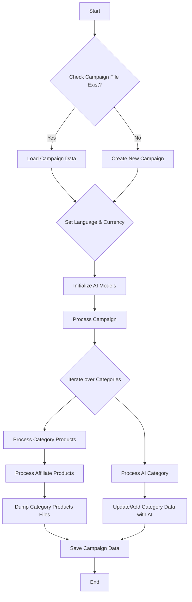

```python
## File: hypotez/src/suppliers/aliexpress/campaign/ali_promo_campaign.py
# -*- coding: utf-8 -*-\
#! venv/Scripts/python.exe
#! venv/bin/python/python3.12

"""
.. module: src.suppliers.aliexpress.campaign 
	:platform: Windows, Unix
	:synopsis: AliPromoCampaign


## AliPromoCampaign

### Назначение:
Модуль предназначен для управления рекламными кампаниями на платформе AliExpress, включая обработку данных о категориях и товарах, создание и редактирование JSON-файлов с информацией о кампаниях, а также использование AI для генерации данных о кампаниях.


### Описание:
Класс `AliPromoCampaign` позволяет загружать и обрабатывать данные рекламных кампаний, управлять категориями и товарами, а также использовать ИИ для генерации описаний и других данных. Модуль поддерживает различные языки и валюты, обеспечивая гибкость в настройке кампаний.


### Примеры:
Пример инициализации рекламной кампании:

    >>> campaign = AliPromoCampaign("new_campaign", "EN", "USD")
    >>> print(campaign.campaign_name)

Пример обработки всей кампании:

    >>> campaign = AliPromoCampaign("new_campaign", "EN", "USD")
    >>> campaign.process_campaign()

Пример обработки данных о товарах в категории:

    >>> campaign = AliPromoCampaign("new_campaign", "EN", "USD")
    >>> products = campaign.process_category_products("electronics")

Пример заполнения данных категорий с использованием AI:

    >>> campaign = AliPromoCampaign("new_campaign", "EN", "USD")
    >>> campaign.process_ai_category("Electronics")
"""
MODE = 'dev'
import header
import asyncio
import time
import copy
import html
from pathlib import Path
from types import SimpleNamespace
from typing import List, Optional, Dict
import header
from src import gs
from src.suppliers.aliexpress import campaign
from src.suppliers.aliexpress.affiliated_products_generator import AliAffiliatedProducts
from src.suppliers.aliexpress.utils import locales
from src.ai import GoogleGenerativeAI, OpenAIModel
from src.suppliers.aliexpress.campaign.html_generators import (
    ProductHTMLGenerator,
    CategoryHTMLGenerator,
    CampaignHTMLGenerator,
)
from src.logger import logger
from src.utils.file import get_filenames, read_text_file, get_directory_names
from src.utils.jjson import j_dumps, j_loads_ns, j_loads
from src.utils.convertors import csv2dict
from src.utils.file import save_text_file
from src.utils import pprint
from src.suppliers.aliexpress.utils.extract_product_id import extract_prod_ids
from src.logger import logger
# ... (rest of the code)
```

**<algorithm>**:



**Example Data Flow:**

* **Input:** `campaign_name="SummerSale", language="EN", currency="USD"`
* **B (Check):**  Checks if `SummerSale_EN.USD.json` exists.
* **B (No):** Creates a new campaign and builds the JSON data structure for the campaign.  This involves creating the `category` directory structure, generating product JSON files, and AI-generated information.
* **E (Set):** Sets `self.language` to "EN" and `self.currency` to "USD".
* **F (Initialize AI):** Initializes AI model instances based on the chosen AI model.
* **I (Process):** Retrieves product IDs from `sources.txt` and `HTML` files within a category directory like `electronics`.
* **K (Process Affiliate):**  `AliAffiliatedProducts` processes the product IDs to get the affiliated product details and populates `products` list.
* **L (Dump):** Saves the processed `products` data as separate JSON files in the `category/electronics` directory.
* **J (Process AI Category):** Fetches product titles from `product_titles.txt` in the category, prepares a prompt for the AI model, and calls the AI to generate category details.
* **M (Update):** Updates the `self.campaign.category.electronics` SimpleNamespace with the generated data.
* **N (Save):** Saves updated `self.campaign` (with the AI-generated data) in the campaign folder.

**<explanation>**:

* **Imports**: The code imports various modules needed for file handling, asynchronous operations, JSON manipulation, locale support, AI model integration, and logging. These imports often come from `src` packages, indicating a modular design for the project. `gs` likely interacts with Google Services.  Relationships with other parts of the project (other `src` packages) are evident in the import statements, showcasing a cohesive architectural structure for the program.

* **Classes:**
    * `AliPromoCampaign`: This class manages the entire AliExpress campaign.
        * `__init__`: Initializes the campaign, loading existing data or creating a new one.  Crucially, it handles the creation of a new campaign, processing categories, generating product information and ai parameters.
        * `_models_payload`: Initializes AI models.
        * `process_campaign`: Iterates through campaign categories and handles product processing for each category.
        * `process_ai_category`: This function is crucial for interacting with and leveraging AI models to generate campaign descriptions and other data for categories.
        * `process_category_products`: This method handles processing of product data from sources (HTML or text files) within a category to gather affiliated product information and save to JSON.
        * `dump_category_products_files`: Saves products data in the campaign's JSON files. This method takes the campaign, product name and list of products to save these files.
        * `set_categories_from_directories`: Extracts category information from the file directory structure.
        * `generate_output`: Generates various output files like JSON, text, and HTML for the campaign's products and categories.
        * `generate_html`: Generates HTML representation of the category for better display.
        * `generate_html_for_campaign`: Generates HTML for the entire campaign.

* **Functions:**
    * `read_sources`: Extracts product IDs from HTML files and `sources.txt` within the category.
    * `process_affiliate_products`:  Processes affiliate products.
    * `_process_category`: A nested function for processing AI category data.
    * `save_product_titles`, `save_promotion_links`: Save lists of titles and promotion links.
    * The functions are well-documented, with clear parameter descriptions and return values.

* **Variables**:  Variables like `language`, `currency`, `base_path`, `campaign` use `SimpleNamespace` for attribute-like access to data; this is a flexible approach for structured data. `products` is a crucial variable holding product data.

* **Potential Errors/Improvements**:
    * **Error Handling:** The code has error handling (`exc_info=False`), but more robust error handling (logging specific errors and recovery attempts) is advisable for production environments. More detailed error messages, especially in the `process_ai_category` and `process_category_products` functions, are beneficial for debugging and troubleshooting.
    * **Concurrency/Asynchronicity:** The use of `asyncio` in `process_category_products` is good, but the handling of concurrency should be carefully considered when working with potentially large datasets.
    * **AI Model Selection and Fallbacks:** The code currently selects `gemini` for AI, but lacks a mechanism for handling AI failures or switching between models.  A `try...except` block for `self.gemini.ask()` could prevent program crashes if the AI model is unavailable.
    * **Data Validation:**  More validation (e.g., checking that product IDs are valid, checking for the existence of necessary files) would improve the code's robustness.
    * **Code Duplication**: Functions like `generate_html` and similar functions for saving data have very similar logic; this can be streamlined by creating a helper function to handle common tasks like file saving or loading in a reusable way.


**Relationships with Other Parts**:

The code heavily relies on other modules in the `src` package, specifically for Google services, AI interactions, data handling, file operations, and the `pprint` function.  This suggests the code is part of a larger project. This is consistent with the usage of `src.utils` functions, which points to a clear project structure leveraging a common set of utility functions. The existence of a `gs` object (likely a Google Services module) indicates an integration with Google Drive.  The calls to AI models `Gemini` or `OpenAI` point to the existence of an AI module for campaign data processing.  The imports show clear relationships with the `aliexpress` supplier module and its associated utilities.