```
## File hypotez/src/suppliers/aliexpress/campaign/gsheets_check_this_code.py
# -*- coding: utf-8 -*-\n#! venv/Scripts/python.exe\n#! venv/bin/python/python3.12\n\n"""\n.. module: src.suppliers.aliexpress.campaign \n\t:platform: Windows, Unix\n\t:synopsis: Редактор рекламной кампании через гугл таблицами\n\n"""\nMODE = \'dev\'\n\n\nimport time\nfrom types import SimpleNamespace\nfrom src.webdriver import Driver, Chrome, Firefox, Edge\nfrom gspread.worksheet import Worksheet\nfrom src.goog.spreadsheet.spreadsheet import SpreadSheet\nfrom src.suppliers.aliexpress.campaign.ali_campaign_editor import AliCampaignEditor\nfrom src.utils import j_dumps\nfrom src.utils import pprint\nfrom src.logger import logger\n\n\nfrom src.ai.openai import translate\nfrom types import SimpleNamespace\nfrom typing import Optional, List, Dict\nfrom gspread_formatting import (\n    cellFormat, \n    textFormat, \n    numberFormat, \n    format_cell_range,\n    set_column_width,\n    set_row_height,\n    Color\n)\nfrom src.goog.spreadsheet.spreadsheet import SpreadSheet\nfrom src.webdriver import Driver, Chrome\nfrom src.utils import pprint\nfrom src.logger import logger\n\nclass AliCampaignGoogleSheet(SpreadSheet):\n    # ... (rest of the code)
```

**<algorithm>**



**<explanation>**

```mermaid
graph TD
    A[Initialize AliCampaignGoogleSheet] --> B{Get spreadsheet ID};
    B -- Spreadsheet ID: '1nu4mNNFMzSePlggaaL_QM2vdKVP_NNBl2OG7R9MNrs0' --> C[Initialize SpreadSheet];
    C --> D[Initialize AliCampaignEditor];
    D --> E[Clear contents];
    E --> F[Set campaign worksheet];
    F --> G[Set categories worksheet];
    G --> H[Get Google Sheet URL];
    H --> I[Open Google Sheet in browser];
    subgraph Delete Products Worksheets
        I --> J[Get all worksheets];
        J --> K{Worksheet Title in excluded_titles?};
        K -- Yes --> L[Skip];
        K -- No --> M[Delete worksheet by ID];
        M --> N[Log success];
    end
    subgraph Set Campaign Worksheet
        N --> O[Get 'campaign' worksheet];
        O --> P[Prepare data for vertical writing];
        P --> Q[Batch update worksheet];
        Q --> R[Log success];
    end
    subgraph Set Products Worksheet
        R --> S[Get category and products];
        S -- Category found --> T[Copy 'product' worksheet];
        S -- No Category --> U[Log warning];
        T --> V[Prepare product data];
        V --> W[Update worksheet with products];
        W --> X[Format product worksheet];
        W --> Y[Log success];
    end
    subgraph Set Categories Worksheet
        Y --> Z[Get 'categories' worksheet];
        Z --> AA[Clear worksheet];
        AA --> AB[Prepare category data];
        AB --> AC[Check for required attributes];
        AC -- True --> AD[Update worksheet with categories];
        AC -- False --> AE[Log warning];
        AD --> AF[Format categories worksheet];
        AF --> AG[Log success];
    end
    subgraph Get Categories
        AG --> AH[Get 'categories' worksheet];
        AH --> AI[Get all records];
        AI --> AJ[Log success];
        AJ --> AK[Return data];
    end

```

* **Imports**: The code imports necessary modules for various functionalities:
    * `time`: For potential time-related operations (not directly used in this code).
    * `types.SimpleNamespace`: A lightweight object for holding structured data.
    * `src.webdriver`, `Chrome`, `Firefox`, `Edge`:  Likely for browser automation using Selenium. These objects represent different webdriver types for interacting with web pages.
    * `gspread.worksheet`: A class for interacting with Google Sheets worksheets.
    * `src.goog.spreadsheet.spreadsheet`: A custom class or module for high-level interactions with Google Spreadsheets.  This implies that other functions and classes for interacting with Google Spreadsheets exist in `src.goog.spreadsheet`.
    * `src.suppliers.aliexpress.campaign.ali_campaign_editor`: Likely a class or module specific to handling AliExpress campaign data, residing in the appropriate source package for AliExpress campaign data.
    * `src.utils.j_dumps`: Likely a utility function for JSON serialization, potentially for logging or data transfer.
    * `src.utils.pprint`: A pretty printer for data output, used for debugging and displaying data structures in a readable format.
    * `src.logger`: A custom logger module for structured logging.
    * `src.ai.openai`: A potential import related to AI tasks, likely translation or other similar AI functionalities.
    * `typing`: Provides type hints.
    * `gspread_formatting`: For formatting Google Sheets cells, rows, and columns.

* **Classes**:
    * `AliCampaignGoogleSheet`: This class extends `SpreadSheet` from `src.goog.spreadsheet`. It handles interactions with Google Sheets specifically related to AliExpress campaigns.
        * `spreadsheet_id`:  The ID of the Google Sheet spreadsheet being used.
        * `spreadsheet`: An instance of the `SpreadSheet` class, representing the current spreadsheet.
        * `worksheet`: Instance of gspread.worksheet for working with specific worksheets.
        * `driver`: An instance of a webdriver (e.g., Chrome) for controlling the browser.
        * `__init__`:  Initializes the class with campaign data and initializes the internal `SpreadSheet` object with the `spreadsheet_id`.  Crucially, it initializes an `AliCampaignEditor` instance to likely access the campaign and category data.
        * `clear`: Clears data by deleting all product worksheets, handling potential exceptions to improve robustness.
        * `delete_products_worksheets`: Deletes all worksheets except those explicitly excluded, important for maintaining a clean structure.
        * `set_campaign_worksheet`: Writes campaign data (like name, title, etc.) to the 'campaign' worksheet in a vertical format.
        * `set_products_worksheet`: Writes product data from a `SimpleNamespace` to a worksheet, handling potential exceptions.
        * `set_categories_worksheet`: Writes category data to the 'categories' worksheet. This includes the category name, title, description, tags, and product count.  Crucially, it checks for required attributes on the `SimpleNamespace` object to avoid errors.
        * `get_categories`: Retrieves category data from the 'categories' worksheet.
        * `set_category_products`: Writes product data into a worksheet.


* **Functions**: Detailed explanation of selected functions:
    * `set_campaign_worksheet`:  Accepts a `SimpleNamespace` object (`campaign`) containing the campaign data.  Writes the header and values vertically in the 'campaign' worksheet of the Google Sheet.
        * Example input: `campaign = SimpleNamespace(name='Example Campaign', title='Campaign Title', ...)`.


* **Variables**:
    * `MODE`: A string, likely a configuration variable (`'dev'` in this case), determining the mode of operation.
    * `excluded_titles`: A set of worksheet titles to exclude when deleting worksheets.

* **Potential Errors and Improvements**:
    * **Error Handling:** The code includes `try...except` blocks to handle potential exceptions during sheet operations (e.g., deleting worksheets). This is very good practice.  Exceptions in `clear` and `set_products_worksheet` functions would be particularly important to address.
    * **Data Validation:** The code could benefit from more robust validation of the input data (`SimpleNamespace` objects) to prevent unexpected behavior or errors. For instance, checking for the existence of required attributes.
    * **Data Integrity:** The code assumes that the `category` and `products` data are properly structured.  More thorough validation or input sanitation (e.g., checking for null values) is recommended.
    * **Efficiency:** For very large datasets, consider using batch updates or pagination techniques in the `set_products_worksheet` function to avoid loading the entire dataset into memory at once.
    * **Readability:** While the comments are good, even more descriptive variable names (e.g., `category_data`) could significantly improve readability.  In some cases, the comments refer to parameters that are not apparent within the function signature.


**Relationships with Other Parts of the Project**:

The code interacts with other parts of the project (likely located in `src`):

- `src.webdriver`: Used for browser automation, implying functions to control a browser instance.
- `src.goog.spreadsheet.spreadsheet`: This module contains classes for interaction with the Google Sheet API, which is a critical dependency.
- `src.utils`: Contains utility functions (e.g., data serialization, printing).
- `src.logger`: Handles logging functionalities.
- `src.ai.openai`: Implies AI functionality possibly used in other areas of the project.
- `src.suppliers.aliexpress.campaign.ali_campaign_editor`:  This class is a critical dependency and likely contains the logic for collecting or structuring AliExpress campaign data.


This analysis provides a comprehensive understanding of the code's functionality and its role within the larger project structure. Remember to replace placeholders like `SimpleNamespace` with the actual class definitions in the `src` directories.