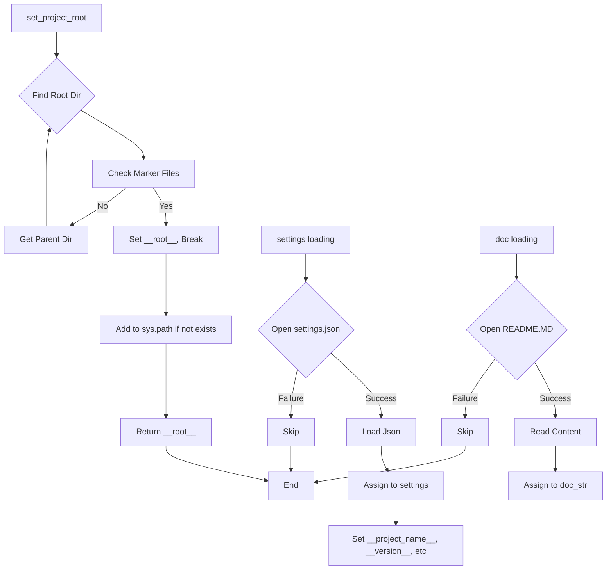

```python
## \file hypotez/src/suppliers/aliexpress/campaign/header.py
# -*- coding: utf-8 -*-\
#! venv/Scripts/python.exe
#! venv/bin/python/python3.12

"""
.. module: src.suppliers.aliexpress.campaign 
	:platform: Windows, Unix
	:synopsis:

"""
MODE = 'dev'


from pathlib import Path
import sys
import json

def set_project_root(marker_files=('pyproject.toml', 'requirements.txt', '.git')) -> Path:
    """!
    Finds the root directory of the project starting from the current file's directory,
    searching upwards and stopping at the first directory containing any of the marker files.

    Args:
        marker_files (tuple): Filenames or directory names to identify the project root.
    
    Returns:
        Path: Path to the root directory if found, otherwise the directory where the script is located.
    """
    __root__:Path
    current_path:Path = Path(__file__).resolve().parent
    __root__ = current_path
    for parent in [current_path] + list(current_path.parents):
        if any((parent / marker).exists() for marker in marker_files):
            __root__ = parent
            break
    if __root__ not in sys.path:
        sys.path.insert(0, str(__root__))
    return __root__


# Get the root directory of the project
__root__ = set_project_root()
"""__root__ (Path): Path to the root directory of the project"""

from src import gs

settings:dict = None
try:
    with open(gs.path.root / 'src' / 'settings.json', 'r') as settings_file:
        settings = json.load(settings_file)
except (FileNotFoundError, json.JSONDecodeError):
    ...

doc_str:str = None
try:
    with open(gs.path.root / 'src' / 'README.MD', 'r') as settings_file:
        doc_str = settings_file.read()
except (FileNotFoundError, json.JSONDecodeError):
    ...


__project_name__ = settings.get("project_name", 'hypotez') if settings  else 'hypotez'
__version__: str = settings.get("version", '')  if settings  else ''
__doc__: str = doc_str if doc_str else ''
__details__: str = ''
__author__: str = settings.get("author", '')  if settings else ''
__copyright__: str = settings.get("copyrihgnt", '')  if settings else ''
__cofee__: str = settings.get("cofee", "Treat the developer to a cup of coffee for boosting enthusiasm in development: https://boosty.to/hypo69")  if settings else "Treat the developer to a cup of coffee for boosting enthusiasm in development: https://boosty.to/hypo69"
```

2. **<algorithm>**



**Example Data Flow:**

* **`set_project_root`:** Input: `marker_files = ('pyproject.toml', 'requirements.txt')`.  Output: `Path` to `/path/to/project`.
* **`settings` loading:** Input: path to `settings.json` from `gs.path.root`. Output: `settings` dictionary loaded from `settings.json` or `None` if file is not found.
* **`doc_str` loading:** Input: path to `README.MD` from `gs.path.root`. Output:  `doc_str` (markdown) string from the file or `None`.


3. **<explanation>**

* **Imports:**
    * `pathlib`: Used for working with file paths in a platform-independent way.
    * `sys`:  Used to modify the `sys.path` which controls where python searches for modules.  This is crucial for accessing project modules which are not in standard Python locations.
    * `json`: Used for loading the settings from the `settings.json` file.  `json` is part of the Python standard library and is used when dealing with data in JSON format.
* **`set_project_root` function:** This function is crucial for correctly locating the project root directory, allowing the code to import modules from the correct location in the file tree.
    * **Arguments:** `marker_files`: A tuple of filenames or directory names used to locate the project root. By default, it looks for `pyproject.toml`, `requirements.txt`, and `.git` files or directories.
    * **Return Value:** A `Path` object representing the root directory of the project, or the current directory if the root cannot be found using the given marker files.
    * **Example usage:** `__root__ = set_project_root()`.
* **`settings` and `doc_str` loading:** The code attempts to load a `settings.json` file and a `README.MD` file from the project root.  These files are likely used for configuration settings and project documentation. The `try...except` block handles potential `FileNotFoundError` and `json.JSONDecodeError` which are important for robustness and graceful failure.
* **Global Variables (e.g., `__project_name__`, `__version__`, `__doc__`, ...):** These variables hold project information.  They're likely populated from the settings and used by other parts of the code. `__cofee__` is interesting because it's likely a developer-intended developer reward or motivation link to help the development process continue.
* **`gs` module:**  The `gs` module is used. The `gs` module is assumed to contain classes or functions for handling file paths (or potentially other project-specific global settings).  It is part of the `src` package structure.   Knowing its content (i.e., the `gs` package) would require looking into its definition and usage. This code effectively defines a common way to load global information from files in the `src` directory.

* **Potential Errors/Improvements:**
    * **Error Handling:** While `try...except` blocks are present for file loading, they lack specific error handling within.  The error handling is useful but could be improved.   Catching more specific exceptions or logging more informative messages is recommended.


**Relationship with other parts of the project:**
This code likely serves as an initial setup and utility for other files in the `aliexpress/campaign` directory.  `__root__` is used in the project to properly configure where all the files are (e.g., for imports from other packages or the path to the global settings). The `src.gs` module is a vital part of the project since it contains global project settings and paths.  The code heavily relies on the existence of a directory structure (`settings.json`, `README.MD`) inside of the `src` directory to work correctly.