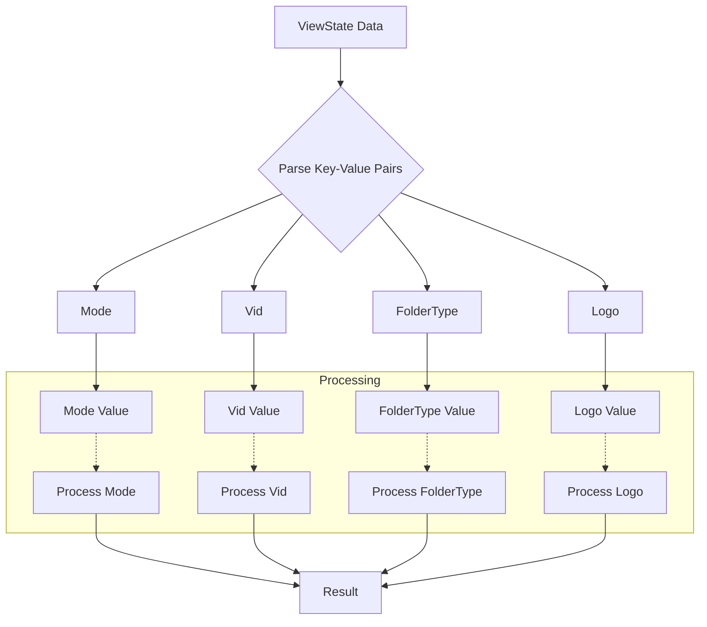

**1. <input code>**

```
[ViewState]
Mode=
Vid=
FolderType=Generic
Logo=E:\\Users\\user\\images\\LOGOS\\R.png
```

**2. <algorithm>**



**Example Data Flow:**

* **A (ViewState Data):** `[ViewState] Mode=someValue Vid=123 FolderType=Generic Logo=C:\\some\\path\\image.png`
* **B (Parse Key-Value Pairs):** Extracts `Mode`, `Vid`, `FolderType`, and `Logo` as keys and their respective values.
* **C (Mode):** The extracted key "Mode" is stored.
* **D (Vid):** The extracted key "Vid" is stored.
* **E (FolderType):** The extracted key "FolderType" is stored.
* **F (Logo):** The extracted key "Logo" is stored.
* **G (Mode Value):** `someValue`
* **H (Vid Value):** `123`
* **I (FolderType Value):** `Generic`
* **J (Logo Value):** `C:\\some\\path\\image.png`
* **K (Process Mode):** Potentially stores `someValue` in a variable for later use.
* **L (Process Vid):** Potentially converts `123` to a numerical type.
* **M (Process FolderType):** Stores `Generic` in a variable or structure.
* **N (Process Logo):** Stores the path to the image in a variable or structure.
* **O (Result):** The processed information, e.g., `Mode`, `Vid`, `FolderType`, and `Logo`, are ready for use by the calling code.

**3. <explanation>**

* **Imports:** There are no imports, so there's no relationship with other `src` packages.
* **Classes:** There are no classes.
* **Functions:** There are no functions.
* **Variables:**  The data represented in the code are key-value pairs. The keys `Mode`, `Vid`, `FolderType`, and `Logo`, represent configuration data.  Values are strings (e.g., "someValue", "123", "Generic", and "C:\\some\\path\\image.png").  The specific logic on how these variables are utilized is missing, so no processing is discussed here.
* **Potential Errors/Areas for Improvement:**
    * **No Error Handling:** There is no mechanism to handle potential errors (e.g., incorrect key names or missing values).  If a key is not found in the data, this will cause unexpected behavior.
    * **Path Validation:** The `Logo` path is not validated to ensure it's a valid file path. Incorrect paths will likely cause runtime errors.
    * **Missing Context:** The purpose of the `ViewState` data is unclear. Knowing the intended usage will allow for a more precise analysis.
    * **Implicit Data Types:** The code assumes all values are strings.  For numeric values like `Vid`, converting to the correct type (integer) would be beneficial for correctness and flexibility.


**Chain of Relationships:**

This `ViewState` data likely exists in a file that is loaded by another part of the application (e.g., a desktop application using a configuration or settings file).  The `ViewState` likely drives GUI display elements or behaviors, but the details are missing from the provided code snippet.  Additional files/classes in the `aliexpress` folder, or other parts of the `hypotez` project, are likely responsible for the following:
* Loading and parsing this `desktop.ini` file.
* Using the extracted `Mode`, `Vid`, `FolderType`, and `Logo` values to configure UI elements (e.g., window mode, video playback, display image).


**In Summary:** The provided code is a simple configuration file. It is incomplete and needs more context to fully understand how it works. It's a data structure intended to be parsed and used by another part of the program.  Explicit error handling and type checking are crucial improvements.